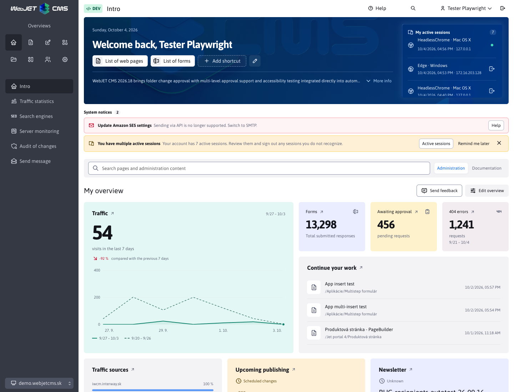
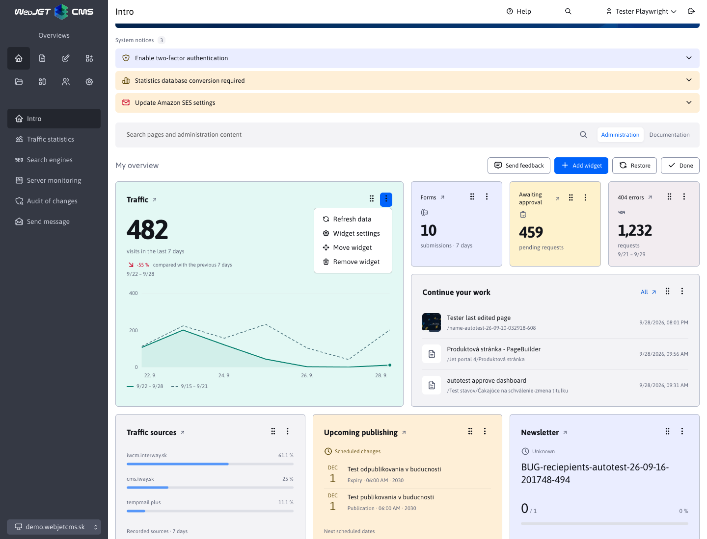
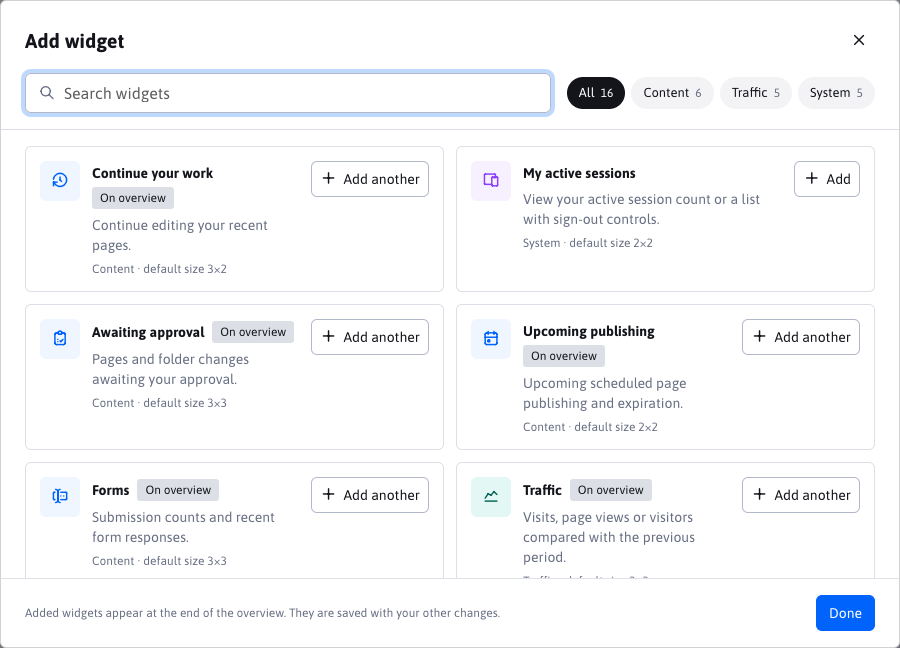
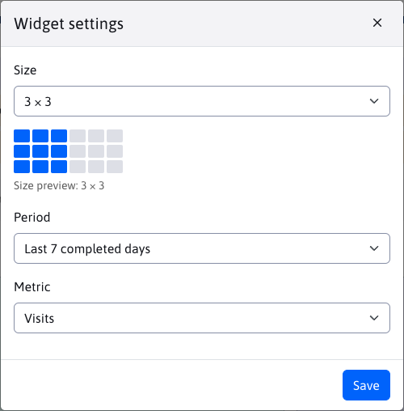
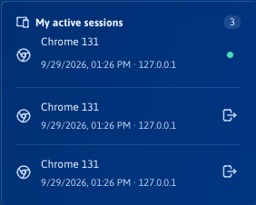
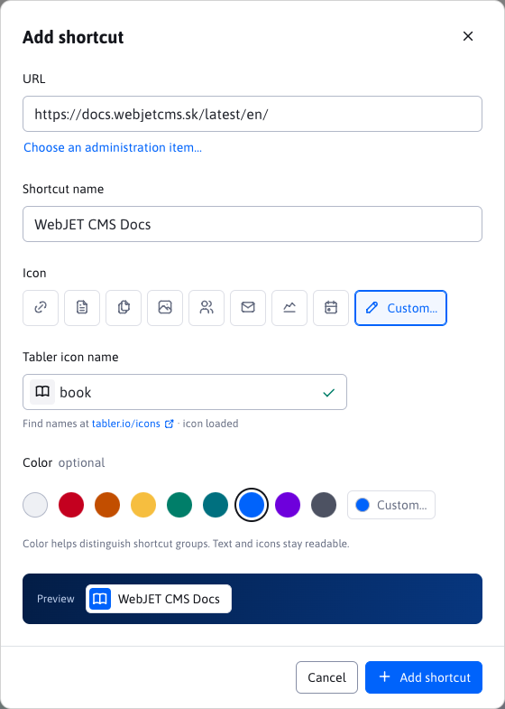
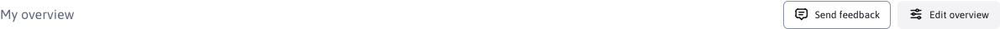
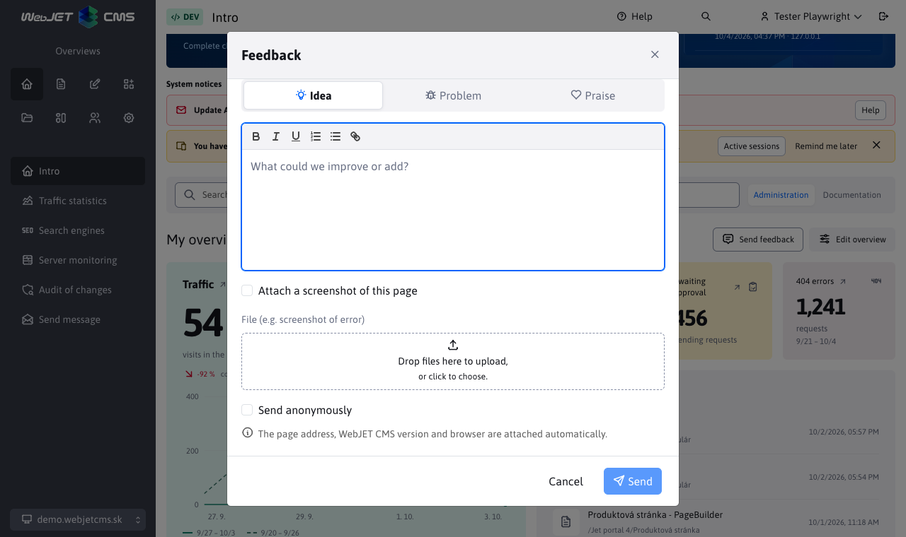

# Home screen

From the home screen, you can quickly check traffic, submitted forms, or pages awaiting approval, and return to pages in progress.

The overview is made up of **widgets**, i.e. cards with specific data, such as a traffic graph or a list of approval requests. Choose the ones you use and organize them according to what you want to monitor first. Use [shortcuts](#your-shortcuts) to open a frequently used part of the administration or a specific folder without searching in the menu.

When you first open it, the default widgets **Visit**, **Forms**, **For Approval**, **404 Errors**, **Continue Working**, **Where Visitors Came From**, **Upcoming Publish** and **Newsletter** will be displayed based on your permissions. You can add additional widgets yourself. At the top is a welcome with shortcuts and news, active logins and search.

The widget menu corresponds to your permissions. The layout is saved to your account and is common across all domains and browsers. The selection of a specific form or campaign is remembered separately for each domain.

The welcome screen also displays an environment label, such as **PROD**, **UAT**, **INT**, or **DEV**. It helps you distinguish whether you are working with a production site or a test environment. The administrator can customize its text, icon, color, and background image according to the [splash screen configuration](../../admin/setup/configuration/dashboard.md).

## Customize the report

Place widgets at the top of your report with the data you check most often. For example, if you process forms and approve content, select the **Forms** and **For Approval** widgets. You can remove widgets you don't need.

Click **Edit Report**. You will see the options **Add Widget**, **Refresh**, and **Done**.

Click the **Add widget** button to open the catalog. Search for the desired widget by name and click **Add widget** next to it.

For the widget, use the three-dot menu:

- **Widget settings**: choose an available size and other settings, such as time period or form. Not every widget offers multiple sizes.
- **Move widget**: choose which tab to move it to, or drag it to the bottom of the overview. You can also use the drag handle on a computer.
- **Remove widget**: removes the card from your dashboard. The data in the app remains intact. The **Revert** option is available immediately after removal. This option will disappear after the next successfully saved edit. You can add the widget again at any time.
- **Refresh data**: loads the current data of the given card.

In the **Widget Settings** dialog, adjust the available options and confirm them with the **Save** button. Select a larger tab when you want to see a more detailed graph or list. A smaller tab takes up less space in the overview.

When you're finished editing, click **Done**.

On a smaller screen, tabs automatically stack under each other, preserving their order. A layout can contain up to 48 items, including shortcuts, logins, news, and search.

The **Reset** button can be found in the edit bar after the **Add widget** button. After confirming in the dialog, the default widget selection, sizes, order, and settings will be restored. Widget filters across all domains and news read receipts will also be cleared. Your shortcuts and other account settings will be preserved.

If you hold down the **Shift** key while clicking **Refresh**, the overview will be replaced with all available widgets in each supported size upon confirmation. You can then remove any variants you don't need.

## Available information

Widgets from the catalog **can be added repeatedly** with different sizes or settings. For example, you can **track two different forms** or **7 and 30 day traffic** side by side. Their availability depends on your permissions.

Statistics widgets default to the last seven completed days, with the option to choose 30 or 90 days. The comparison uses the same previous period. The tab shows the actual date range. Specific rules for form and 404 error periods are listed for the respective widgets.

### Module shortcut

You can open frequently used parts of the administration without searching in the menu or in the folder tree structure. The shortcut can also point to your own URL address. You can find the procedure for adding and an example of a link to a specific folder in the [Your shortcuts](#your-shortcuts) section.

### Keep working.

You can return to a page you've been working on without having to search for its folder. The widget displays up to six of your most recently edited pages with a thumbnail image, location, and date modified. Click to open the page editor. You can scroll the list when the tab is smaller.

### For approval

Indicates content that is awaiting approval. Displays requests available in the **Unapproved** tab in Web Pages. The larger version contains the six most recent requests to change or delete a page or folder. The icon next to the title distinguishes between a page and a folder.

Clicking on an item will open its approval in a new window. For a folder, the corresponding folder in the Web pages will open along with an approval dialog. Clicking on the title or total number will open the entire list of requests.

### Upcoming publication

Check which pages are due to **publish or expire** soon. For each change, you'll see the date and time of the scheduled publication or expiration. Click on the title to open the full publishing schedule.

### Forms

Here you can review data about submitted forms, such as inquiries or contact messages. In the settings, you can **select a specific form** or all available forms.

When viewing all forms, you see **the total number of responses submitted for the entire period**. The large widget displays the ten most recently submitted forms, sorted by newest. Each form has a name and the date of the last submission. Click on a name to open its responses.

When you select a specific form, the last ten submissions **for the selected period** will be displayed in a large widget. If the list does not fit within the height of the card, you can scroll it. In the **Form** column, you will see the first name, last name, and email from the filled-in data. If the form does not have such fields, the first three filled-in data will be displayed in the order of the form columns. Click on this data to open the details of a specific submission.

### Attendance

It allows you to track how website traffic changes. In the settings, select the period and the data to be tracked: the number of views, visits, or unique visitors.

The chart compares the current and previous periods. You can find the exact values ​​in the descriptions by hovering over the chart. The data table is accessible to screen readers.

### Most visited pages

It shows the most visited pages for the selected period with the number of views. Based on the traffic, you can determine which content to pay attention to when updating. Click on a page to open its detailed statistics.

### What visitors are looking for

It shows search terms and their numbers for the selected period. You can use the terms to find out what topics visitors are interested in and check whether you have up-to-date information on them on your website.

### Where did the visitors come from?

You can compare traffic sources for a selected period and see where the most visitors come from.

The graph shows the percentage of each registered source. The exact values ​​can be found in the descriptions after hovering over the graph. The data table is accessible to screen readers.

### 404 errors

It helps find addresses that don't exist. Based on the number of errors, you can determine which links or redirects to check first.

It shows the number of error requests, not the number of different addresses. Errors are recorded by week, so full weeks spanning the selected period are included. The card displays the actual date range, and the current week contains data available up to that point.

If historical data cannot be separated by domain, the card will report that it is unavailable.

### Newsletter

It allows you to track the progress of sending mass emails and record opens or clicks. It automatically selects the active campaign, the next scheduled one, or the last completed one. You can also select a specific campaign in the settings.

When sending, the visible card data is refreshed every 30 seconds. The number of opens and clicks represents the recorded events.

### What's new

In the welcome panel you will find news of the current version of WebJET CMS. Click the **Collapse news** button to confirm reading them and leave a brief summary. Click the **More info** button to expand them again.

System alerts inform you of a condition that requires attention and remain visible until the cause is resolved. Click the alert title to expand its explanation and available corrective action.

### Search and help

Use it when you want to find a page in the administration or instructions for working with WebJET CMS. Select **In administration** or **In documentation** and enter the search term. Searching in documentation will open a new window with the entered term. You can also find help for the currently opened part of the administration via the context-sensitive Help in the header.

### My active logins

It allows you to review your active logins and log out from another device or browser that you no longer use. It is always at the top of the overview and cannot be deleted. For details, see [Logins](#logins).

### Logged in admins

Shows which administrators are currently working in the system. This allows you to find a colleague with whom you need to agree on content editing and send them an email. Availability depends on your permissions. For details, see [Logged-in administrators](#logged-in-administrators).

### Changed pages

When reviewing content work, you will find the latest edits to available pages on the current domain here, along with the author of the change.

### Audit

Displays the latest audit events from across the server, based on your permissions. Use it to review recent operations or to find out what preceded a problem.

### Memory usage

Displays a graph and numerical values ​​of server memory usage. This allows the administrator to monitor its occupancy, for example, when checking for system slowdowns. The data in the visible widget is updated every 5 seconds. For details, see [Changed pages, auditing, and monitoring](#changed-pages-auditing-and-monitoring).

### CPU load

Displays a graph and numerical values ​​of the server's CPU load. The administrator can monitor whether the CPU load also increases during slow responses. The visible widget data is updated every 5 seconds. For details, see [Changed pages, auditing, and monitoring](#changed-pages-auditing-and-monitoring).

## Logins

At the top of the overview, you can check your active logins and log out from another device or browser. The list of other logged in administrators is a separate **Logged in admins** widget, available by permissions.

### My active logins

The **My Active Logins** panel shows all your active sessions, i.e. logins under your account, with browser, time and IP address. You can scroll through the list if the list is long. Your current session is the first and has a green dot with the description **This login**. You can log out of other sessions directly in the list, for example if you forgot to log out on another computer. This panel is always at the top and cannot be removed.

For another custom session, you can select **Logout this session**. The cluster will be terminated immediately on the current node, while on another node, information about waiting for synchronization between nodes will be displayed (typically within a minute). The domain and node are listed in the help text when you hover over the entry.

The data is updated after the user logs in. If you need more frequent updates, the administrator can add a [background job](../../admin/settings/cronjob/README.md) named `sk.iway.iwcm.stat.SessionClusterService` and set an interval, for example every 10 minutes.

The background job deletes records older than 60 minutes from the database. If not set, records older than 24 hours are deleted when the user logs in.

### Logged in administrators

If you have the "Home - View logged in administrators" right, you can add the **Logged in admins** widget via the catalog with a list of all logged in administrators. This gives you an overview of how many users are currently working in the administration.

Click on the icon<i class="ti ti-mail fs-6"></i> you can send an email to the administrator.

## Your shortcuts

Shortcuts under the welcome page also open a nested section of the administration or a specific folder in the website. This way, you don't have to search for frequently used places in the menu or expand the folder tree every time you return.

The shortcut can point to an available administration module or to a custom URL including parameters. When linking with parameters, it will open the target in the state specified by the address, for example with a selected folder. Shortcuts are saved to your account and are available in all browsers.

By default, shortcuts point to web pages and forms based on your permissions. If those modules are not available, a shortcut to the first available module will be displayed.

To add a new shortcut:

1. Click **Edit Shortcuts** and then **Add Shortcut**.
2. In the **Shortcut Target** field, select **Administration Page** or **Custom URL**. For an administration page, select the main section, section, and possibly a tab. For a custom address, fill in the **URL** field.
3. Fill in **Custom name**, which will help you recognize the abbreviation. For a custom URL, the name is required.
4. Set the **Icon** and **Background Color** as needed to make the shortcut easier to find in the list.
5. Click **Save**. When you are finished editing the shortcuts, click **Done**.

If you want a shortcut to a specific folder, open it in Web Pages and copy the address from the browser's address bar, including the `groupid` parameter. When adding a shortcut, select **Custom URL**, paste the copied address, and enter a name, such as **News**.

For example, the address may be in the form `/admin/v9/webpages/web-pages-list/?groupid=123`, where `123` is the ID of the desired folder. Use the ID from your copied address. Clicking on such a shortcut will open the folder directly, even if it is nested deeper in the website structure.

The **Reset** button in the shortcuts editor will restore the default links and preserve widgets, their filters, and news status. After deleting all shortcuts, the list will remain empty until you add a new shortcut or restore the default links.

## Changed pages, auditing and monitoring

When checking content work and server status, you can use the **Changed Pages**, **Audit**, **Logged in Admins**, **Memory Usage** and **CPU Usage** widgets. Add them via the catalog according to your permissions. The **Reset** button in the report editor will set the default widget selection listed in the introduction.

**Changed Pages** shows the latest changes to available pages in the current domain, including the change author. **Audit** shows the latest audit events. Audit, logged in administrators, and monitoring show server-wide data according to their respective permissions.

The memory and CPU graphs have a color-coded background and a default size of **3×3**. You can also choose a smaller size of **3×2** in the widget settings. Both the graphs and the numerical values ​​of the visible widget are updated every 5 seconds, so you can continuously monitor load changes. Click on the widget name to open the full overview.

Live samples are collected from the time the widget is opened, even if historical monitoring storage is disabled. Regular loading is paused when the browser tab or widget is hidden.

## Feedback

You can use the feedback form to send a comment, suggestion for improvement, or compliment to the WebJET CMS development team. Click **Send Feedback** in the top bar of the initial overview. The completed form will be sent by email.

We will consider your comments when planning further development. You can find the planned changes in the [development map](../../ROADMAP.md).

In the dialog box, describe what you need to change or what work you're having trouble with. You can also attach files, such as a screenshot or a document describing the request.

If you select the **Send anonymously** option, the email sent will not include your name and email address in the sender information.
