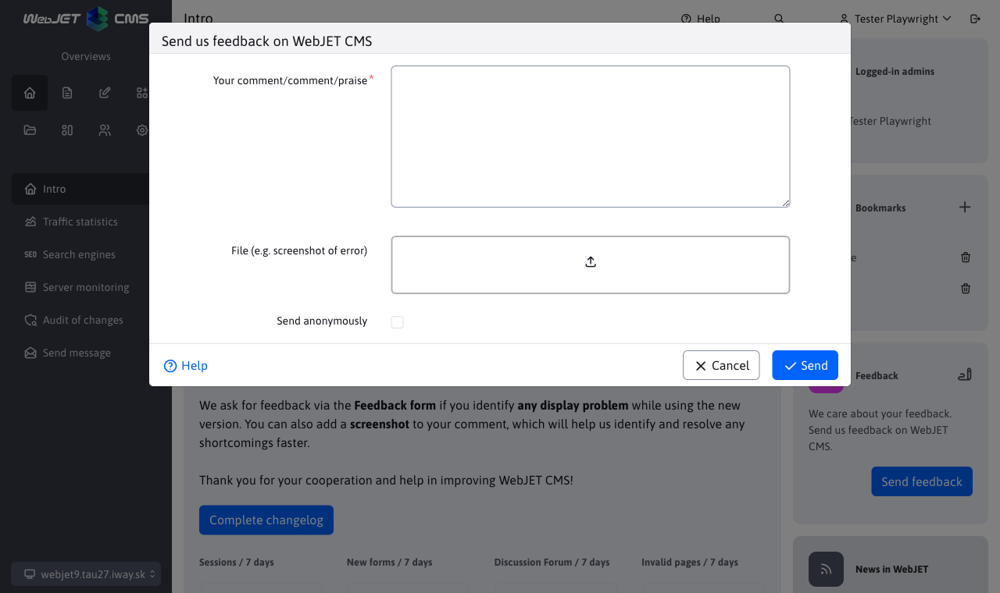

# Home screen

## Login

Displays a list of your logins (if you are allowed to log in on multiple devices at once) and a list of logged-in administrators.

### My active logins

Mini application **My active logins** displays a list of all active logins to the WebJET CMS administration under your user account. Your current login is marked with an icon <i class="ti ti-current-location fs-6" ></i>.

Individual logins have a tooltip that displays additional information.

Click on the icon <i class="ti ti-logout fs-6" ></i> you can terminate the login. If it is within your current cluster node, the login will be terminated immediately. If it's a login within another node, the login will be terminated after synchronization between cluster nodes (typically within a minute).

Note: the data is updated when the user logs in. You can set a new record to [background tasks](../../admin/settings/cronjob/README.md) for more frequent data updates, where you enter a value as the task name `sk.iway.iwcm.stat.SessionClusterService`. Specify the interval as required, e.g. every 10 minutes. A background task deletes records older than 60 minutes from the database. If a background task is not set up, records are deleted when the user logs in if they are older than 24 hours.

### Logged in administrators

If you have the "Home - view logged in administrators" right, you will also see a list of all logged in administrators. This gives you an overview of how many users are currently working in the administration.

Click on the icon <i class="ti ti-mail fs-6" ></i> you can send an email to the administrator.

## Bookmarks

You can add links to frequently used sections in the administration to the bookmarks mini-application. After logging in, you don't have to search for the section in the menu, but you can directly click on the link in the bookmarks.

Click the orange icon to the left of the Bookmarks text to open a dialog box in which you specify the name of the bookmark and the address to open when you click the bookmark name.

By default, bookmarks are displayed to list web pages and forms. These will be displayed even if you delete all bookmarks.

Note: the bookmarks list is stored in the browser, if you use multiple browsers set your bookmarks in all of them.

  <iframe width="560" height="315" src="https://www.youtube.com/embed/G5Ts04jSMX8" title="YouTube video player" frameborder="0" allow="accelerometer; autoplay; clipboard-write; encrypted-media; gyroscope; picture-in-picture" allowfullscreen></iframe>

## Feedback

By clicking on the Send Feedback button you can send us, the programmers, your feedback on the use of WebJET CMS. The comment will be sent by email after filling out the form.

We will consider your comments and add them to [development maps](../../ROADMAP.md). You can also improve the functioning of WebJET CMS with your opinion.

In the dialog box you can enter the text of your comment, comment or praise. If necessary, you can also attach files (e.g. a screenshot or a document describing your request).

If you select the Send anonymously option, your name and email address will not be entered in the sent email as the sender's name and email.
