# Using AI assistants

The logic of using AI assistants is consistent across the entire CMS so that the user has a consistent experience regardless of context. In this chapter, you will find an overview of assistant behavior in data tables, the Web page editor, PageBuilder, text markup, and the image editor.

## Text fields

Text field assistant (single-line field and `textarea`) is used to generate new content or edit existing content. It is launched via the button <button class="btn btn-outline-secondary btn-ai" type="button"><i class="ti ti-sparkles" ></i></button> at the end of the field.

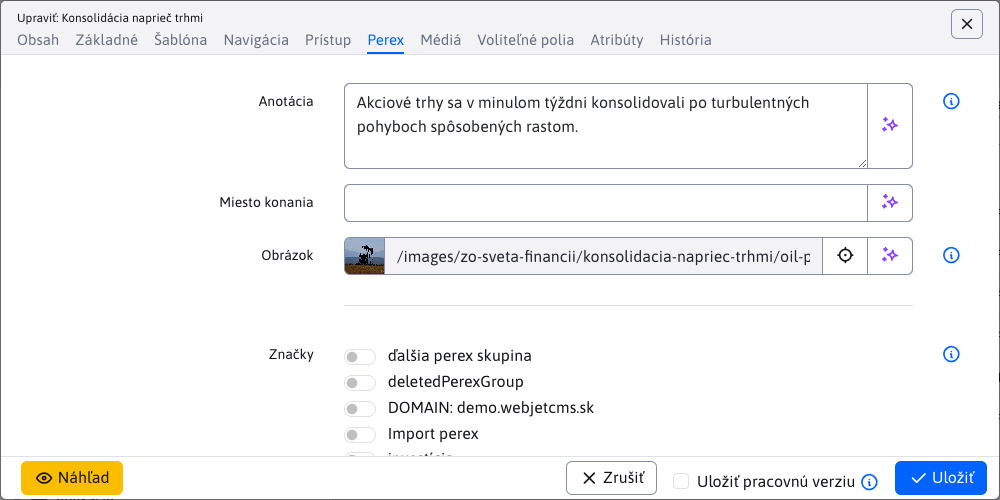

When clicked, a window will open with all available assistants for the field. They are clearly divided into groups (e.g. **Generating**, **Enhance**). For each there is a name, icon and provider.

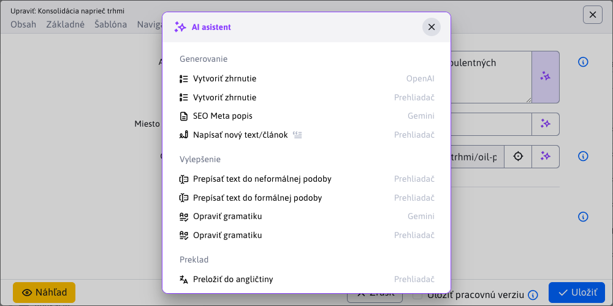

Clicking on the assistant will start its execution. If sequential loading is enabled, the result will be displayed in parts; otherwise, it will be displayed only after completion.

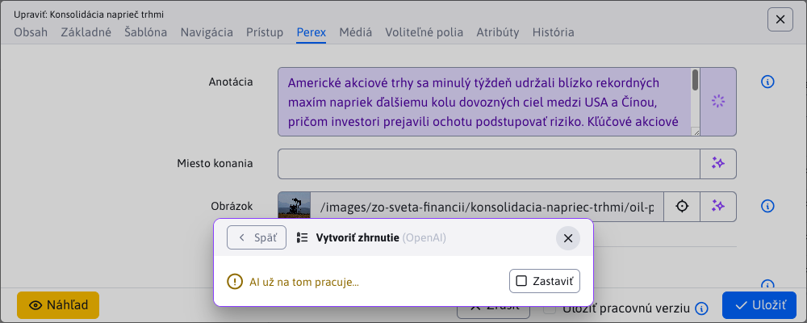

When successfully completed, the resulting text is automatically inserted into the field. A confirmation and token consumption information will be displayed in the window. If the result does not match, use the <button class="btn btn-outline-secondary btn-ai-undo" type="button"><i class="ti ti-arrow-back" ></i> Cancel change</button> return to the original value.

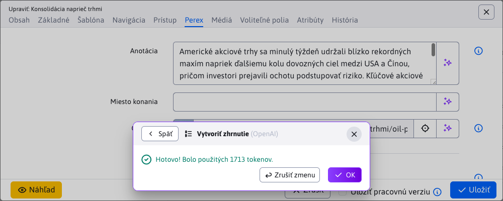

### Input from the user

If the assistant requires additional instructions, when you select it, it will first display a form to enter the input instead of starting it immediately.

Assistants that need user input have an icon next to their name <i class="ti ti-blockquote has-user-prompt" ></i> for easy resolution.

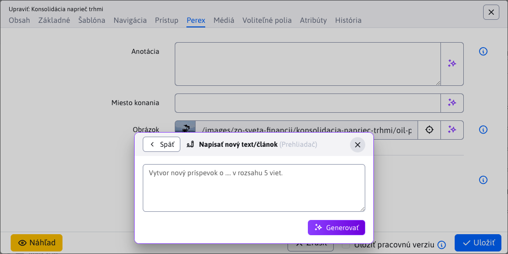

The field can have placeholder text (`placeholder`) with instructions on how to enter the request correctly. If the field is empty and you click into it 2 times (or press the `TAB`), this placeholder text is transferred as editable text to the field. You can thus easily edit the necessary parts and use it as the basis of your request.

After entering the instructions, press **Generate**. The rest of the workflow (loading, inserting the result, reverting) is the same as for the assistant without user input.

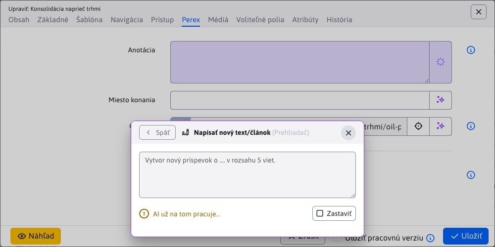

### Quill

Since even an array of type `Quill` belongs to text fields, AI assistants work for it in the same way as for classic text fields. The only difference is the location of the icon, which is not at the end of the field, but in the header between the tools.

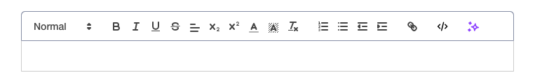

## Image fields

The image field assistant is used to generate or edit an image. It is launched via the button <button class="btn btn-outline-secondary btn-ai" type="button"><i class="ti ti-sparkles" ></i></button> at the end of the field.

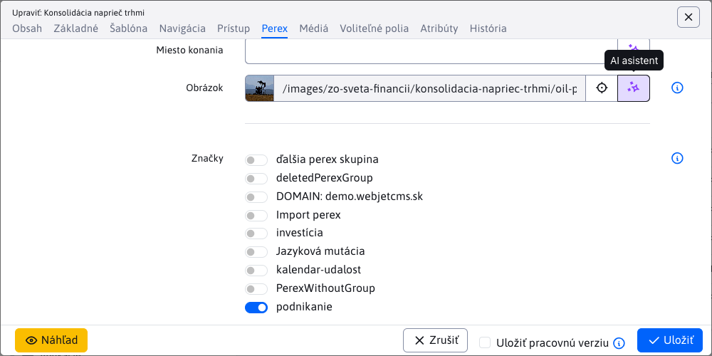

When clicked, a window will open with all available assistants for the field. They are clearly divided into groups (e.g. **Generating**, **Edit by**). For each there is a name, icon and provider.

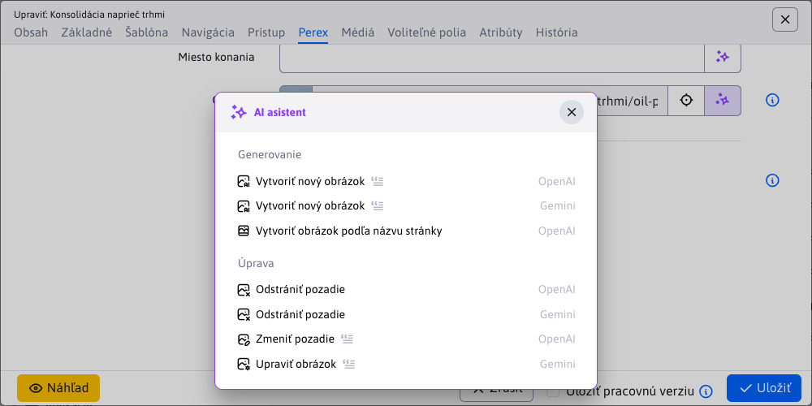

Clicking on the assistant will start its execution. If you select an assistant to edit an existing image (e.g. **Remove background**), but the image field has no image set, an error message is returned.

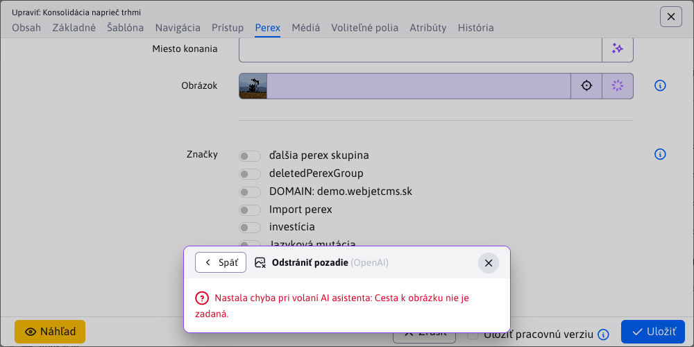

If the field contains an image, processing starts and a progress indication is displayed.

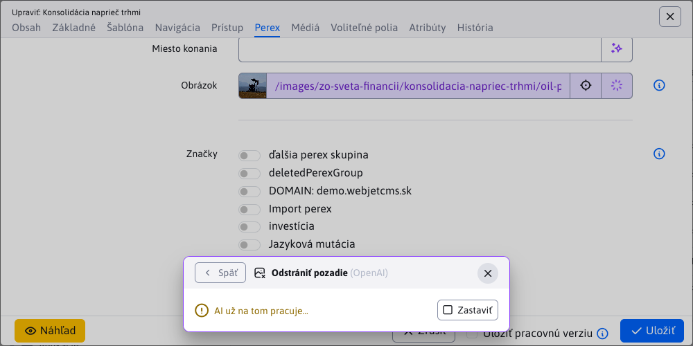

Once completed, you will see a confirmation, token consumption information and a preview of the result. Using the button <a target="_blank" class="zoom-in"><i class="ti ti-zoom-in" ></i></a> you can open the image in full size in a new tab.

The image is not saved automatically. First fill in or edit the fields **Image title** a **Location**. The values will be filled according to the original image, but you can change them. Field **Location** allows folder selection via a tree structure.

To save, press **Save Image**.

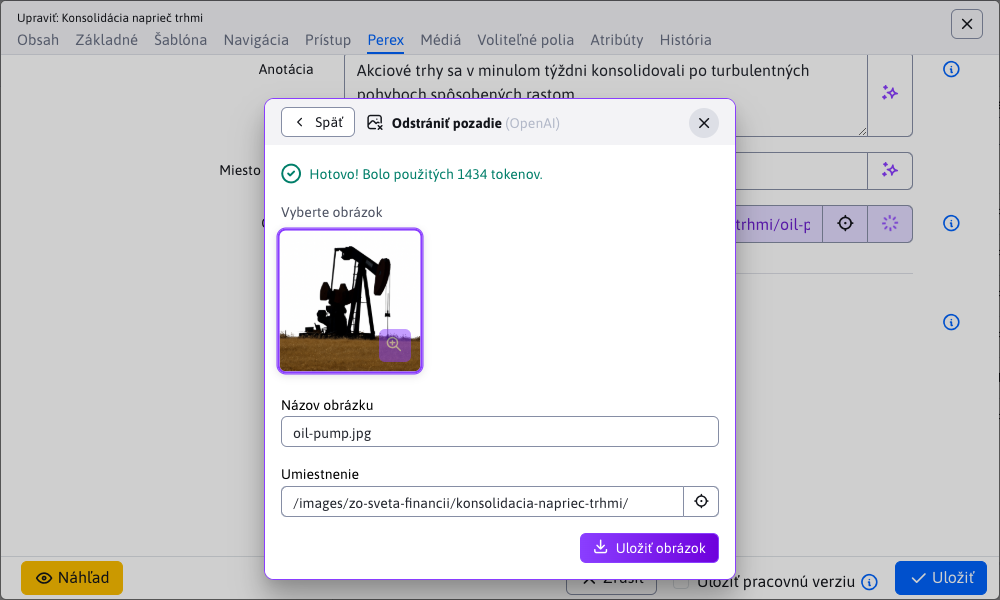

If you have not changed the name or location, or the combination already exists, a dialog with options will appear:
- **Overwrite file** - the original file is replaced by a new one
- **Rename file** - the system will offer a recommended (AI generated) new name
- **Cancel save** - undo without saving

When choosing **Overwrite file** or **Rename file** the image in the field is immediately updated.

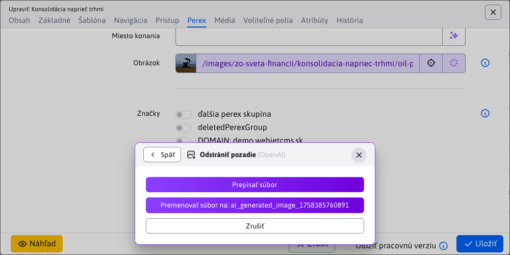

### Input from the user

If the assistant requires additional instructions, a form will be displayed. The additional fields are specific to the particular **Provider**, so they may vary. For providers `OpenAI` for example:
- Number of images
- Dimension
- Quality

Assistants that need user input have an icon next to their name <i class="ti ti-blockquote has-user-prompt" ></i>.

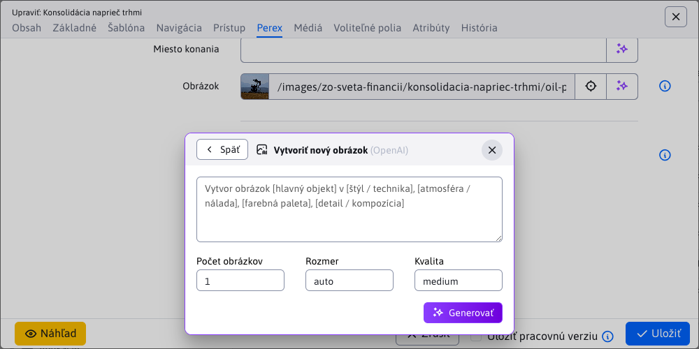

After confirmation, processing proceeds as standard with one exception for `OpenAI`: allows you to generate multiple images at once (according to **Number of images**). In the example below, the number 3 has been set.

You can select and save only one result - click to select it. All views can be opened via <a target="_blank" class="zoom-in"><i class="ti ti-zoom-in" ></i></a>.

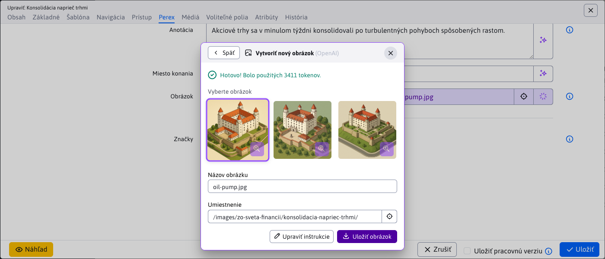

### Problems with content

The provider may refuse the request if the instructions contain a protected or sensitive entity (known person, character, licensed brand, etc.). The specific rules vary according to **Provider**. In this case, an error message may be returned `PROHIBITED_CONTENT`.

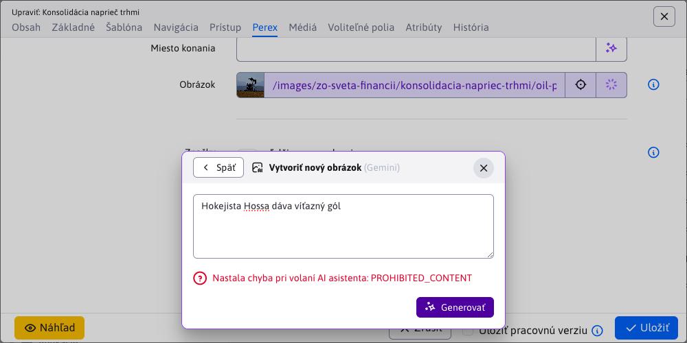

## Website Editor

Assistants also work in the web page editor and are used to generate new content or edit existing content on a page. They are launched via the icon <button class="btn-ai" type="button"><i class="ti ti-sparkles" ></i></button> located in the web editor toolbar.

When clicked, a window will open with all available assistants for the field. They are clearly divided into groups (e.g. **Generating**, **Copywriting**, **Enhance**). For each there is a name, icon and provider.

Clicking on the assistant will start its execution. If sequential loading is enabled, the result will be displayed in parts; otherwise, it will be displayed only after completion. If the content loads in parts, it may give the impression that the page structure has gone wrong, but everything will return to normal when the entire content is loaded.

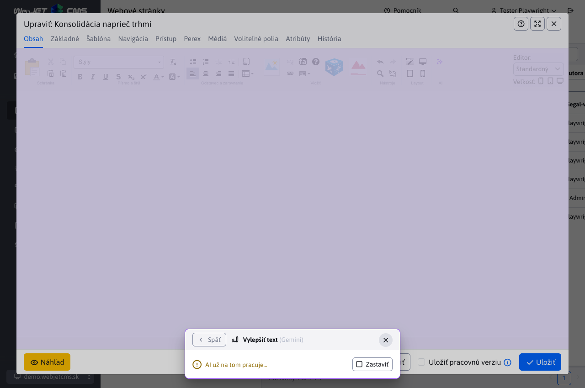

Once successfully completed, the resulting content is automatically inserted into the page. A confirmation and token consumption information will be displayed in the window. If the result is not satisfactory, use the <button class="btn btn-outline-secondary btn-ai-undo" type="button"><i class="ti ti-arrow-back" ></i> Cancel change</button> return to the original value.

In this case, the assistant is set up (and we recommend it when editing the page content) to still describe in the window all the changes it has made to the page content, offering feedback on what needed to be edited.

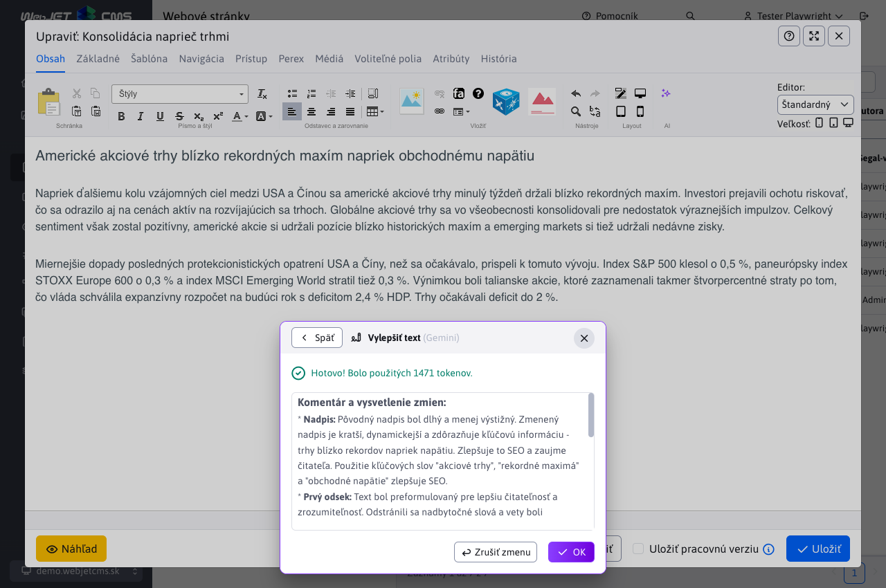

### Only part of the text

You don't have to edit the entire content of the page. Assistant working with `CKEditor` also supports editing only a selected part. If you select only part of the content and then call the assistant, it will edit only the selected part.

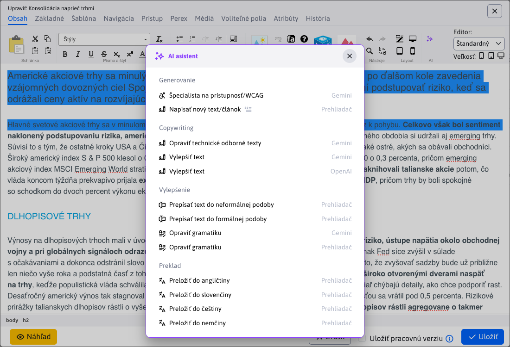

## PageBuilder

Assistants also work in `PageBuilder` and are used to generate new content or modify existing page content embedded in `PageBuilder`. They are launched via the icon <button class="btn-ai" type="button"><i class="ti ti-sparkles" ></i></button> located in the toolbar.

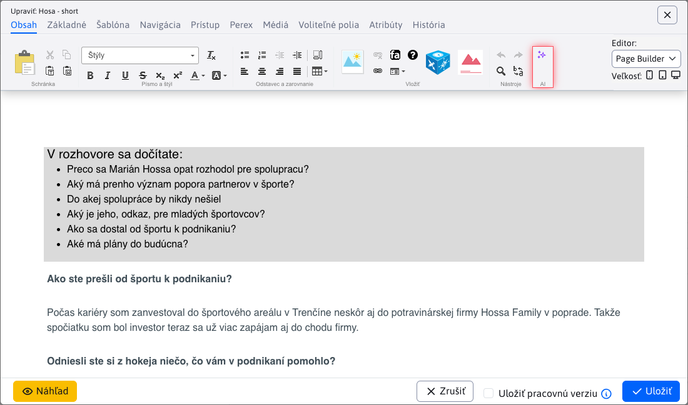

When clicked, a window will open with all available assistants for the field. They are clearly divided into groups (e.g. **Generating**, **Copywriting**, **Enhance**). For each there is a name, icon and provider.

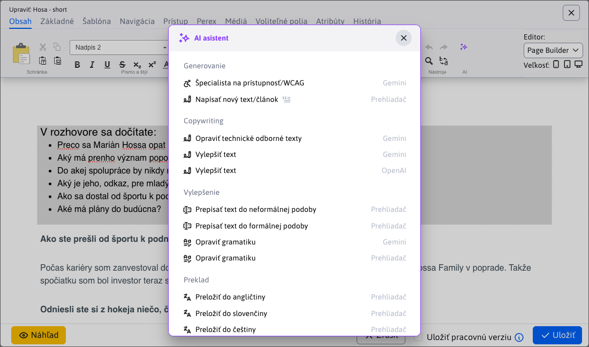

Clicking on the assistant will start its execution. Each block is treated as a separate text/content and processed separately. The window will gradually update the status of how many blocks out of the total number have already been processed.

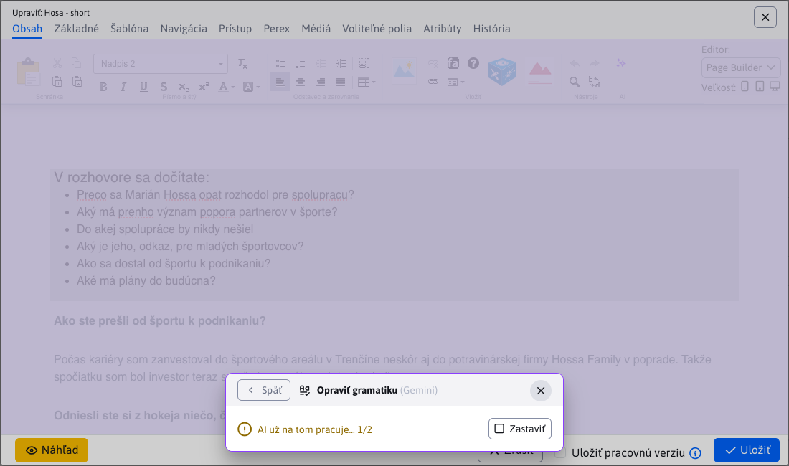

Once successfully completed, the resulting content is automatically inserted into the page. A confirmation and token consumption information will be displayed in the window. If the result is not satisfactory, use the <button class="btn btn-outline-secondary btn-ai-undo" type="button"><i class="ti ti-arrow-back" ></i> Cancel change</button> return to the original value.

In this case, the assistant is set up (and we recommend it when editing the page content) to still describe in the window all the changes it has made to the page content, offering feedback on what needed to be edited.

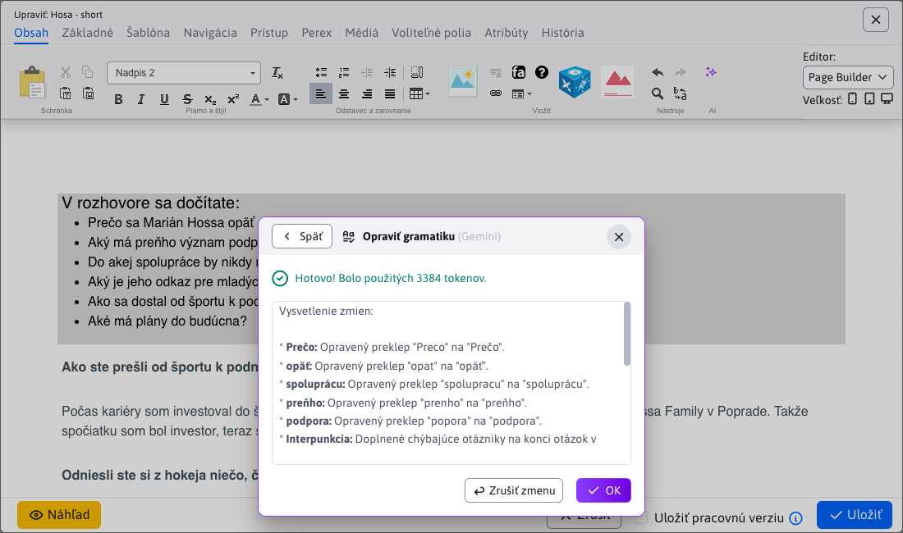

### Only part of the text

You don't have to edit the entire content of the page. Assistant working with `PageBuilder` also supports editing only a selected part. If you select only part of the content and then call the assistant, it will edit only the selected part.

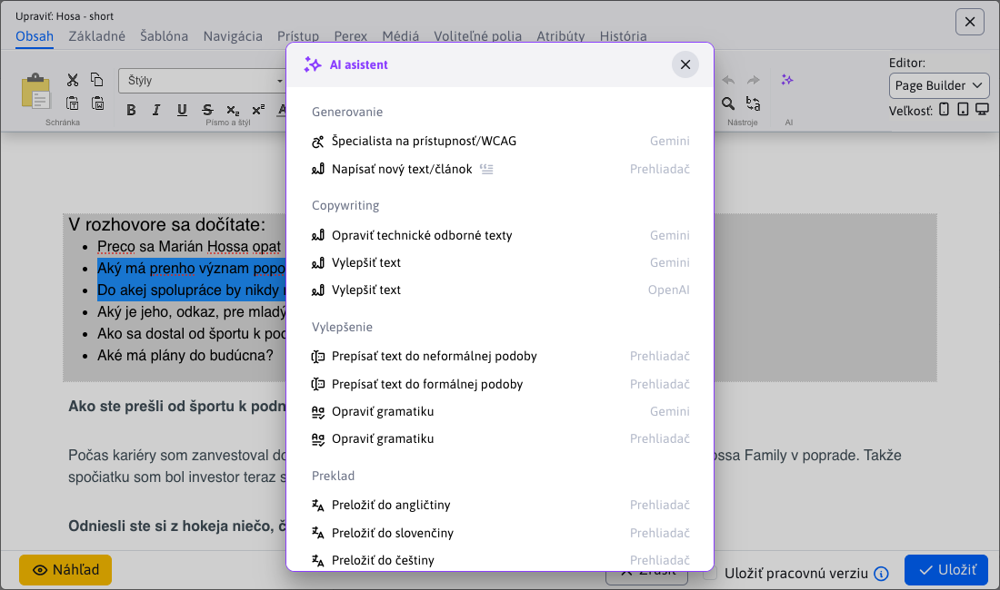

## Chat mode

If the assistant is set to chat mode, changes in PageBuilder are applied to the entire structure, not just the text/editable content. The assistant can thus generate new blocks, edit existing ones, and so on. You can make requests to it to edit text in the page and generate new blocks. You activate the mode by setting the Request Type field to `Chat` in the characteristics of the assistant.

The request window contains new fields for setting the mode:
- **Add** - adds the output HTML code from the request to the end of the page. It does not send the actual page content to the assistant, so execution is cheaper (less tokens are consumed).
- **Edit by** - together with the instruction and your request, the actual HTML code of the page is sent, in which the assistant can edit texts, blocks, HTML code. More tokens are consumed to execute the request.
- **Replace** - similar to add, the actual page code is not sent with the request. As a result, the current page is replaced. Useful if you want to start over and delete all the current content.

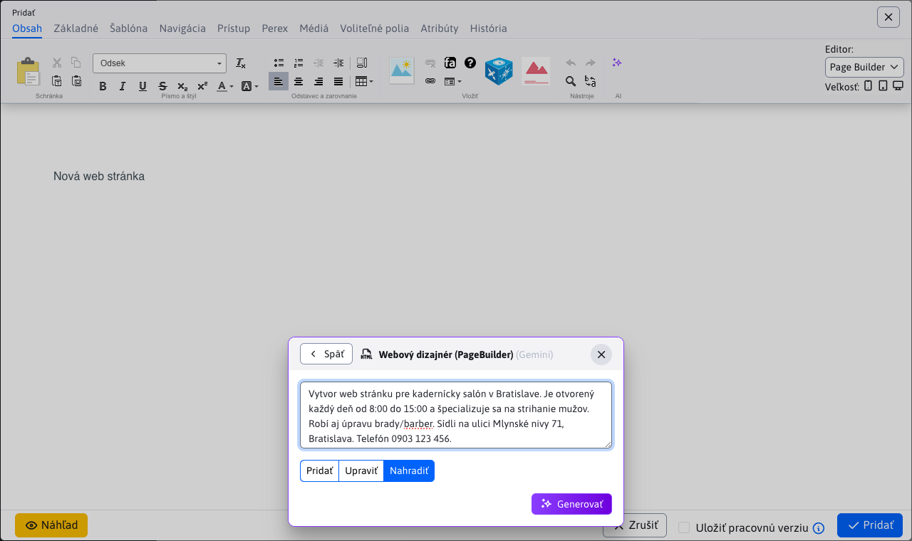

After the request is executed, a window with the status and the number of tokens used is displayed. Additionally, in this window there is an option **Continue**, which redisplays the window for entering the request.

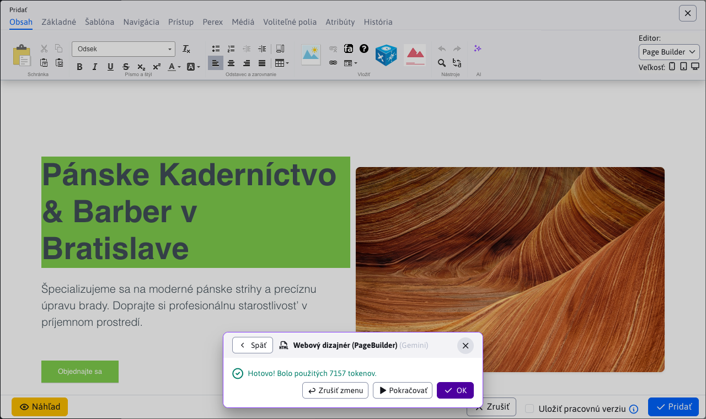

You can then continue editing the web page and submit a request to edit the text of the page. By selecting the option **Edit by** the actual HTML code of the page is sent along with your request, so the assistant can make changes to it.

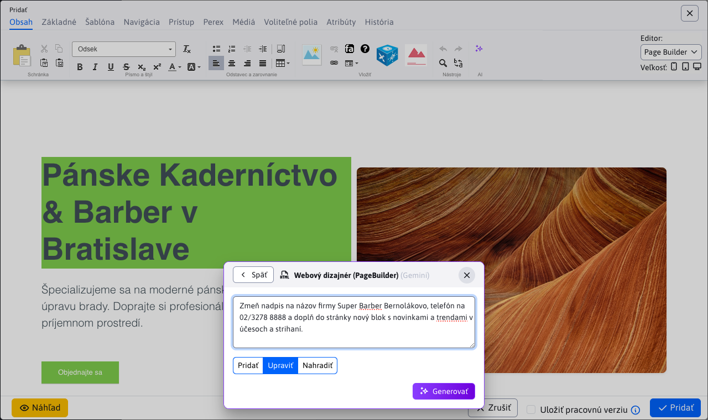

The edits you have made will be displayed in the web page and you can click Continue again to enter another request, or click **OK** assistant to terminate. Note in the photo that the title has been modified from the previous version according to the request.

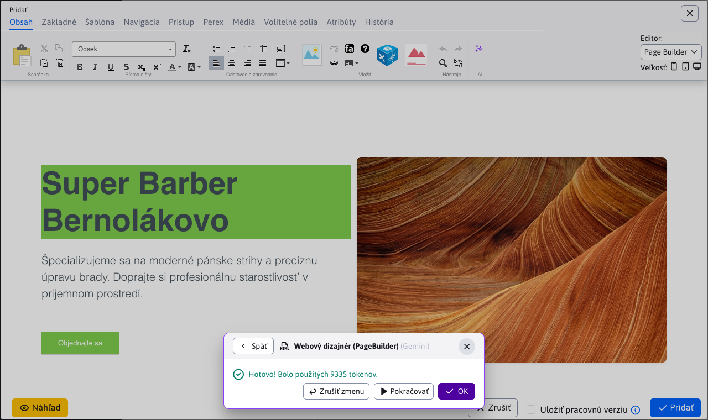

## Pictures in the page

You can also use the AI assistant to embed images into a web page. The assistant button is located in the bottom right corner at the end of the image address field.

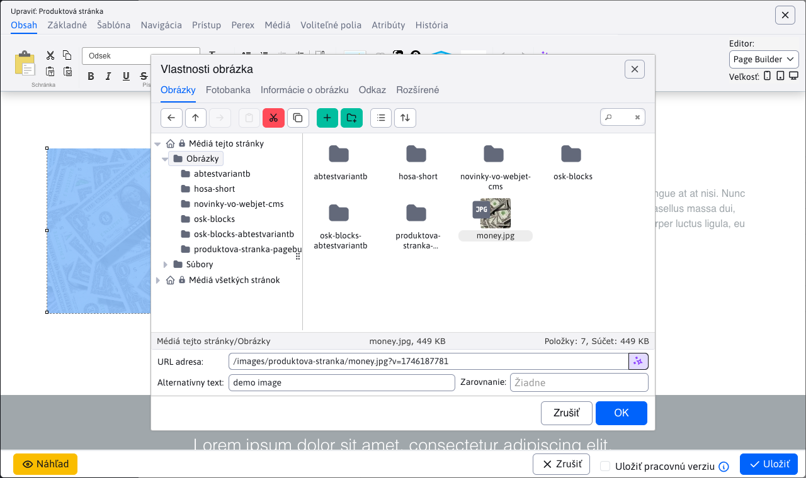

When clicked, a window opens with all available assistants, which are worked with in the same way as described in [Image fields](./README.md#image-fields)

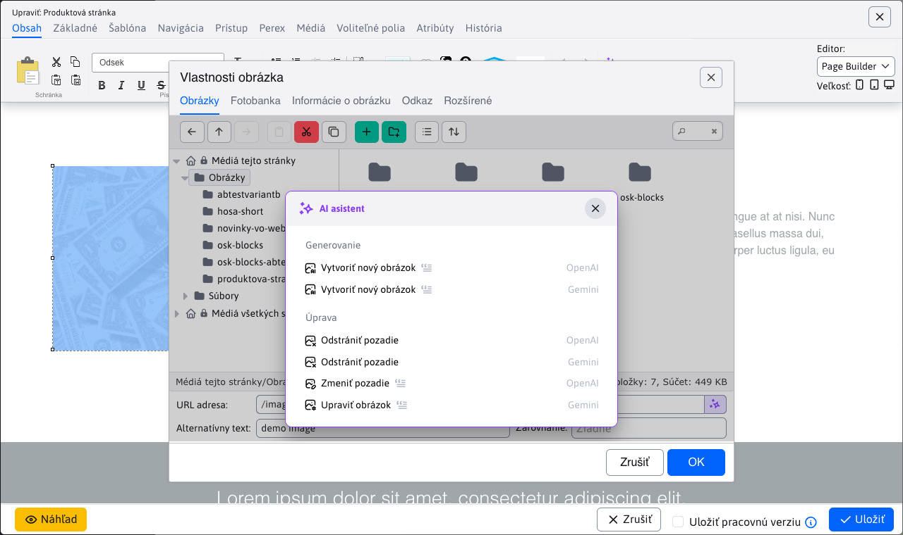

## Empty field

Assistants often use the contents of a given field as input; if the field is empty, they will not be displayed. For example, Translate to English does not make sense to display if the field is empty. There may be a situation where no assistant is available for an empty field, in which case an error message will be displayed. You need to enter the text in the field first, then display the assistants.

However, the same field is not always used for the input value. For example, in editing a web page, there is an assistant to generate the Title of the web page from its text. If the text of the web page is blank for now this option may not be displayed.

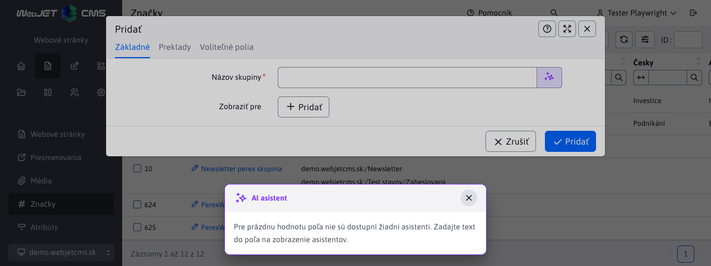
