# Using AI assistants

The logic for using AI assistants is consistent across the entire CMS to provide a consistent user experience regardless of context. In this chapter, you will find an overview of the assistant's behavior in data tables, the website editor, the PageBuilder, when marking up text, and the image editor.

## Text fields

The text field assistant (single-line field and `textarea`) is used to generate new content or edit existing content. It is launched via the button <button class="btn btn-outline-secondary btn-ai" type="button"><i class="ti ti-sparkles"></i></button> at the end of the field.

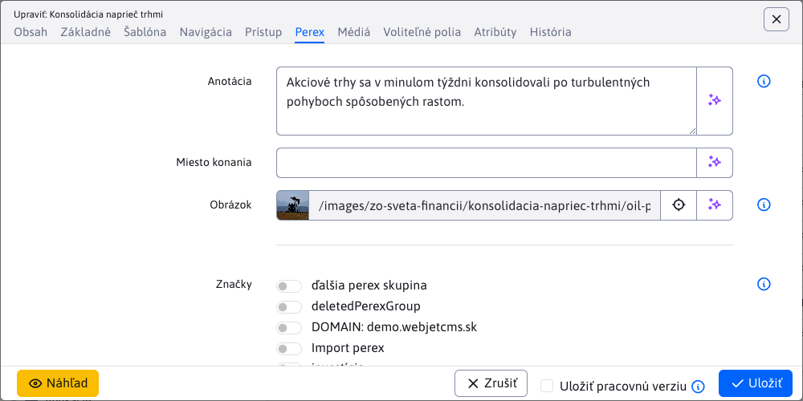

Clicking on it will open a window with all available assistants for the given field. They are clearly divided into groups (e.g. **Generation**, **Improvement**). Each one has a name, icon and provider.

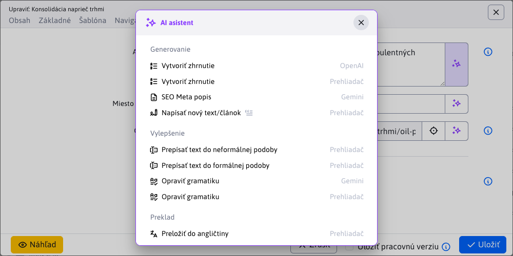

Clicking on the assistant will start its execution. If it has progressive loading enabled, the result will be displayed in parts; otherwise, it will only be displayed when it is complete.

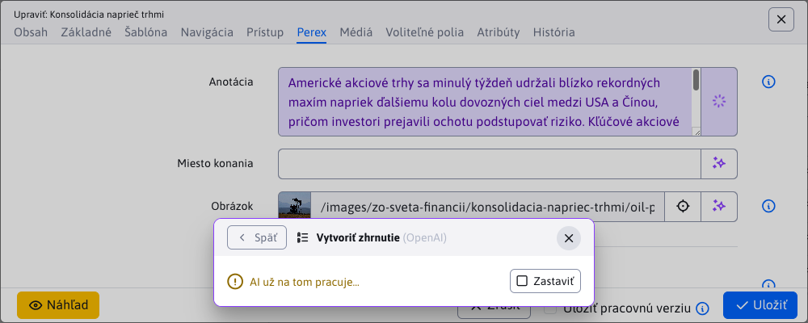

Upon successful completion, the resulting text will be automatically inserted into the field. A confirmation window will appear with information about token consumption. If the result is not satisfactory, use the button<button class="btn btn-outline-secondary btn-ai-undo" type="button"><i class="ti ti-arrow-back"></i>Cancel the change</button> to return to the original value.

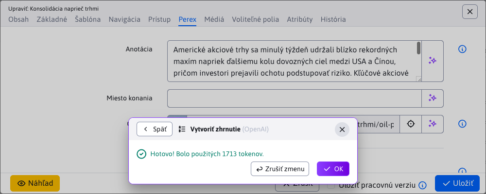

### User input

If the assistant requires additional instructions, after selecting it, an input form will first be displayed instead of launching immediately.

Assistants that require user input have an icon next to their name.<i class="ti ti-blockquote has-user-prompt"></i> for easy distinction.

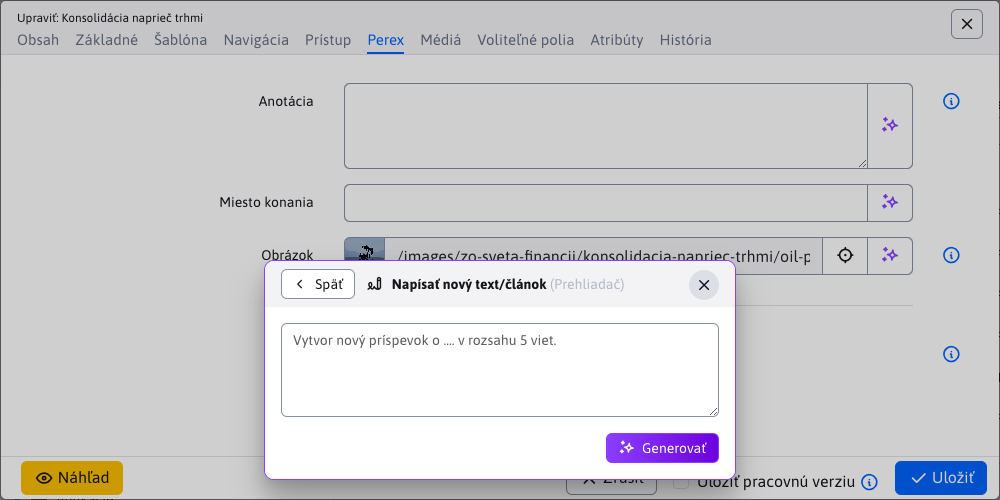

A field can have placeholder text (`placeholder`) with instructions on how to correctly enter the request. If the field is empty and you double-click on it (or press the `TAB` key), this placeholder text will be transferred as editable text to the field. You can then easily edit the necessary parts and use it as the basis for your request.

After entering the instructions, press **Generate**. The next process (loading, inserting the result, the option to return) is the same as with the assistant without user input.

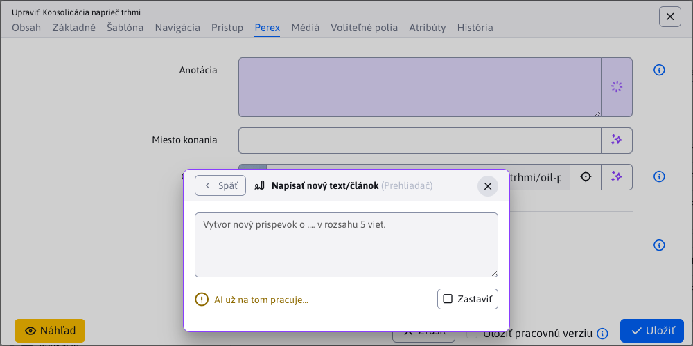

### Quill

Since the field of type `Quill` is also a text field, AI assistants work for it in the same way as for classic text fields. The only difference is the location of the icon, which is not at the end of the field, but in the header between the tools.

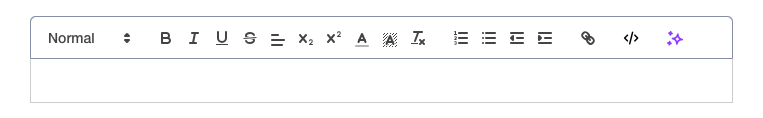

## Image fields

The image field assistant is used to generate or edit an image. It is launched via the button <button class="btn btn-outline-secondary btn-ai" type="button"><i class="ti ti-sparkles"></i></button> at the end of the field.

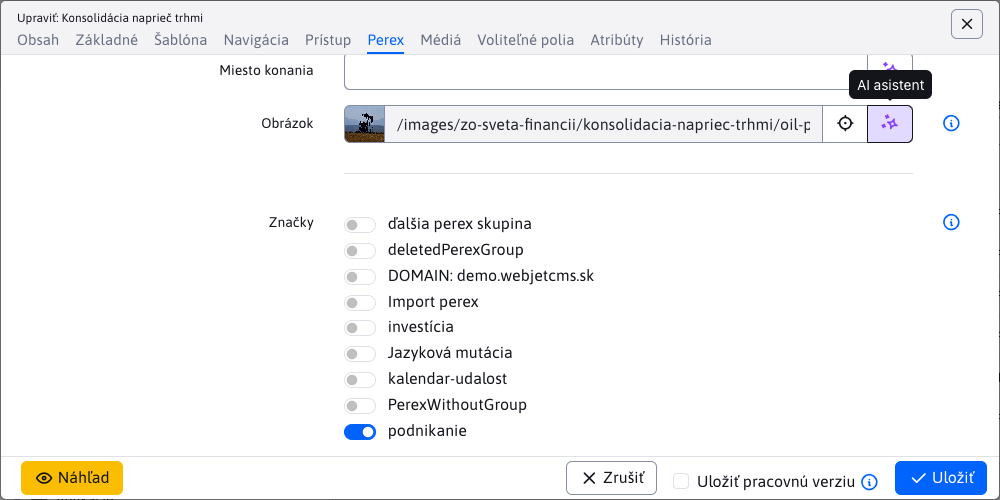

After clicking, a window will open with all available assistants for the given field. They are clearly divided into groups (e.g. **Generate**, **Edit**). Each has a name, icon, and provider.

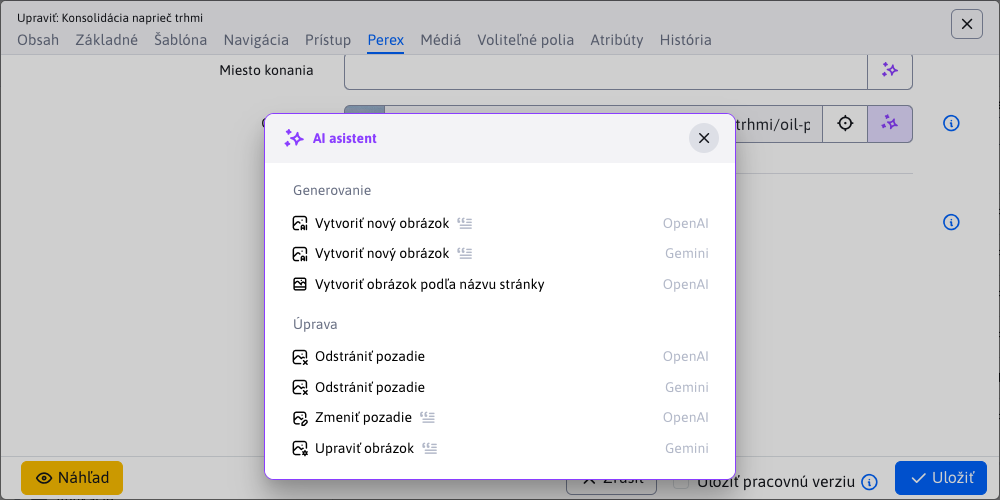

Clicking on the wizard will start its execution. If you select a wizard that is supposed to edit an existing image (e.g. **Remove Background**), but the image field does not have an image set, an error message will be returned.

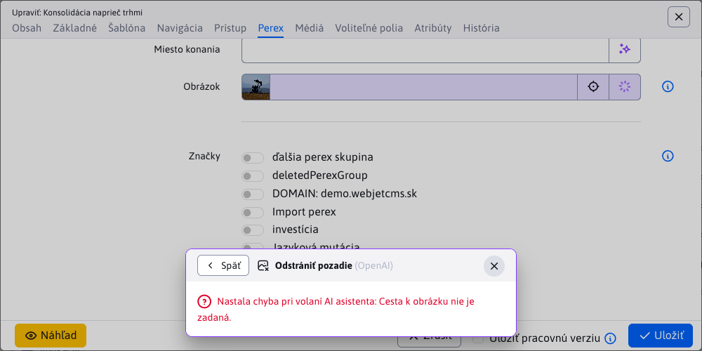

If the field contains an image, processing will begin and a progress indication will be displayed.

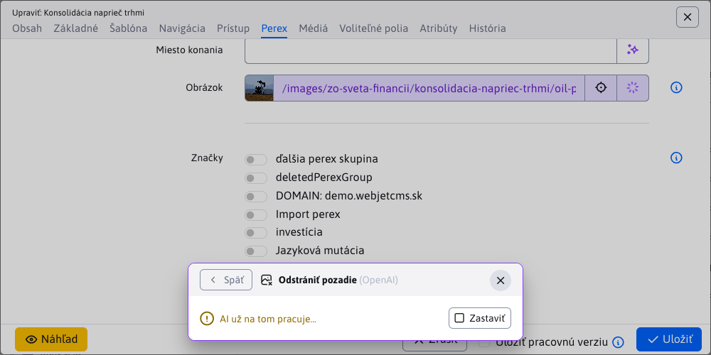

Once completed, a confirmation, token consumption information, and a preview of the result will be displayed. Use the button<a target="_blank" class="zoom-in"><i class="ti ti-zoom-in"></i></a> you can open the image in full size in a new tab.

The image is not saved automatically. First, fill in or edit the **Image Name** and **Location** fields. The values ​​are filled in according to the original image, but you can change them. The **Location** field allows you to select a folder via a tree structure.

Press **Save image** to save.

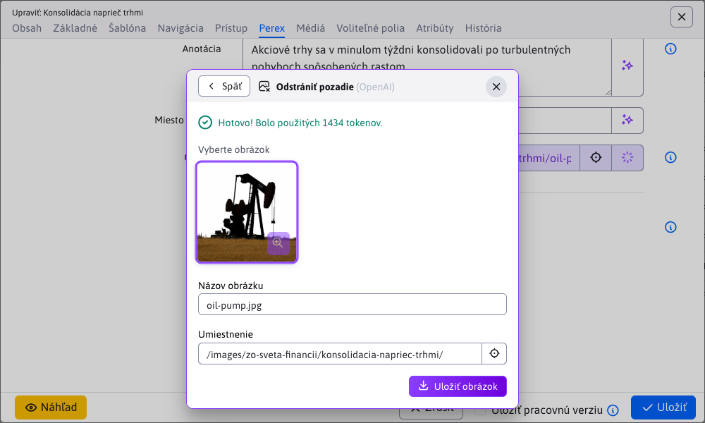

If you have not changed the name or location or the combination already exists, a dialog with options will appear:

- **Overwrite file** – the original file will be replaced with the new one
- **Rename file** – the system will offer a recommended (AI generated) new name
- **Cancel Save** – go back without saving

When you select **Overwrite file** or **Rename file**, the image in the field is updated immediately.

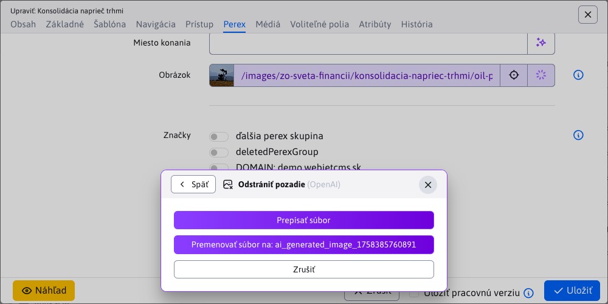

### User input

If the assistant requires additional instructions, a form will be displayed. The additional fields are specific to a particular **provider** and may vary. For example, for provider `OpenAI`, these are:

- Number of images
- Dimension
- Quality

Assistants that require user input have an icon next to their name.<i class="ti ti-blockquote has-user-prompt"></i> .

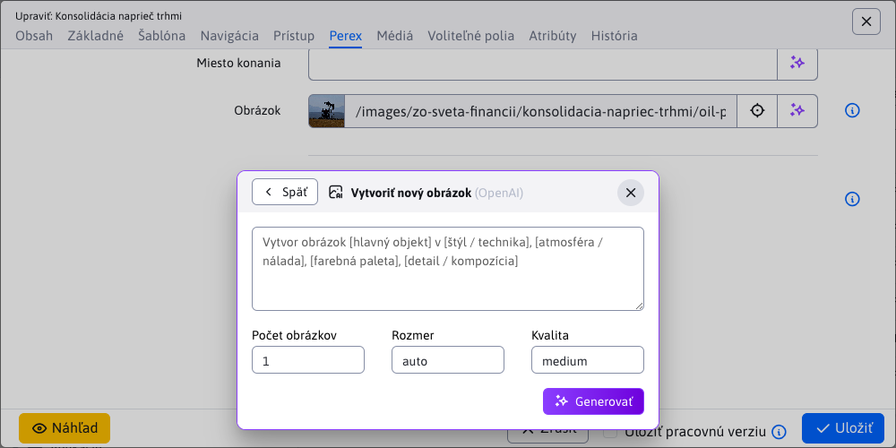

After confirmation, processing proceeds as usual with one exception for `OpenAI`: it allows multiple images to be generated at once (according to **Number of images**). In the example below, the number 3 was set.

You can only select and save one result - you select it by clicking on it. All previews can be opened via<a target="_blank" class="zoom-in"><i class="ti ti-zoom-in"></i></a> .

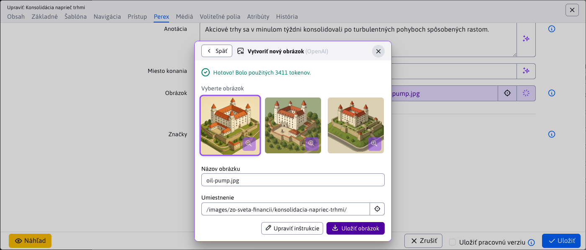

### Content issues

The provider may reject the request if the instructions contain a protected or sensitive entity (a famous person, character, licensed brand, etc.). Specific rules vary by **provider**. In such a case, an error message `PROHIBITED_CONTENT` may be returned.

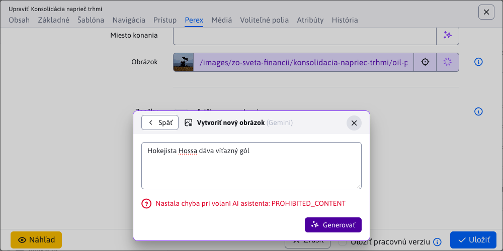

## Website editor

Assistants also work in the website editor and are used to generate new content or edit existing page content. They are launched via the icon<button class="btn-ai" type="button"><i class="ti ti-sparkles"></i></button> located in the web editor toolbar.

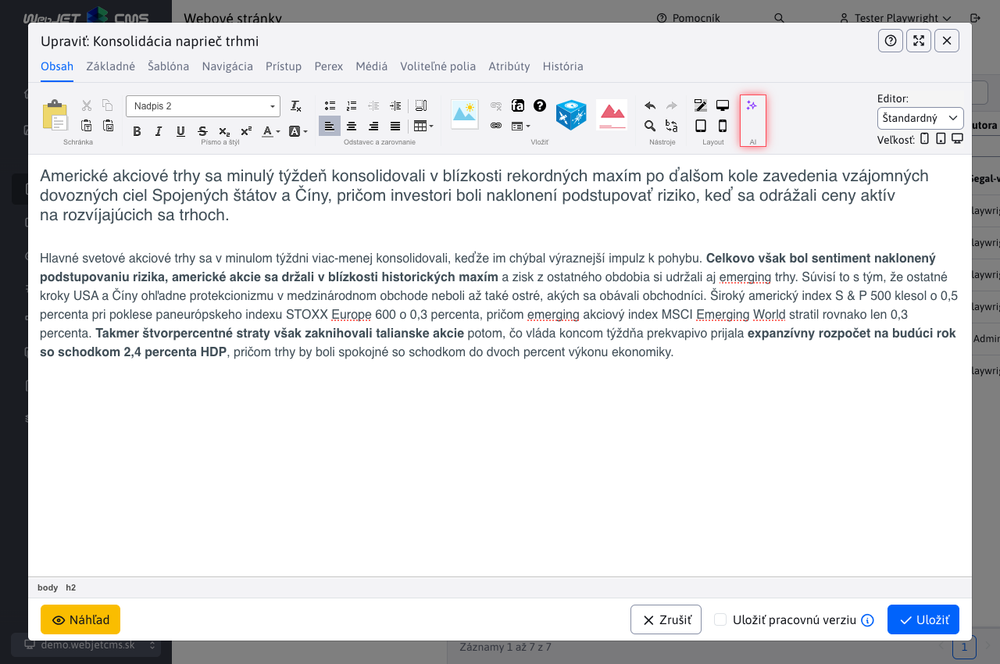

Clicking on it will open a window with all available assistants for the given field. They are clearly divided into groups (e.g. **Generation**, **Copywriting**, **Improvement**). Each one has a name, icon, and provider.

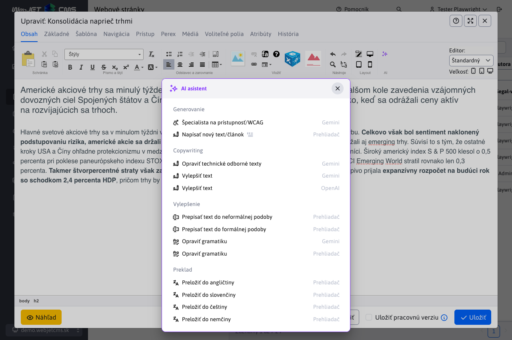

Clicking on the assistant will start its execution. If it has progressive loading enabled, the result will be displayed in parts; otherwise, it will be displayed only when it is complete. If the content is loaded in parts, it may give the impression that the structure of the page has been broken, but everything will return to normal when the entire content is loaded.

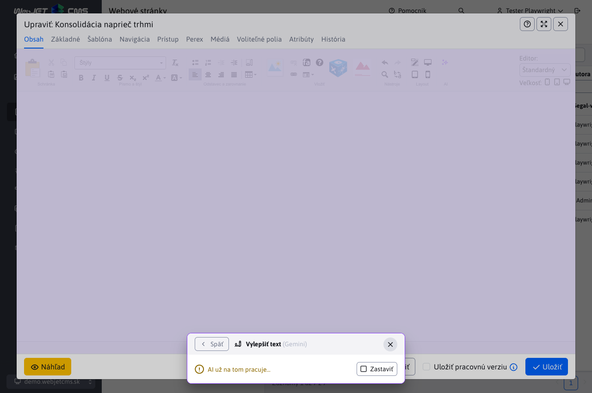

Upon successful completion, the resulting content will be automatically inserted into the page. A confirmation window will appear with information about token consumption. If the result is not satisfactory, use the button<button class="btn btn-outline-secondary btn-ai-undo" type="button"><i class="ti ti-arrow-back"></i>Cancel the change</button> to return to the original value.

In this case, the assistant is set up so that (and we also recommend this when editing page content) it will also describe all the changes it made to the page content in the window, thus offering feedback on what needed to be edited.

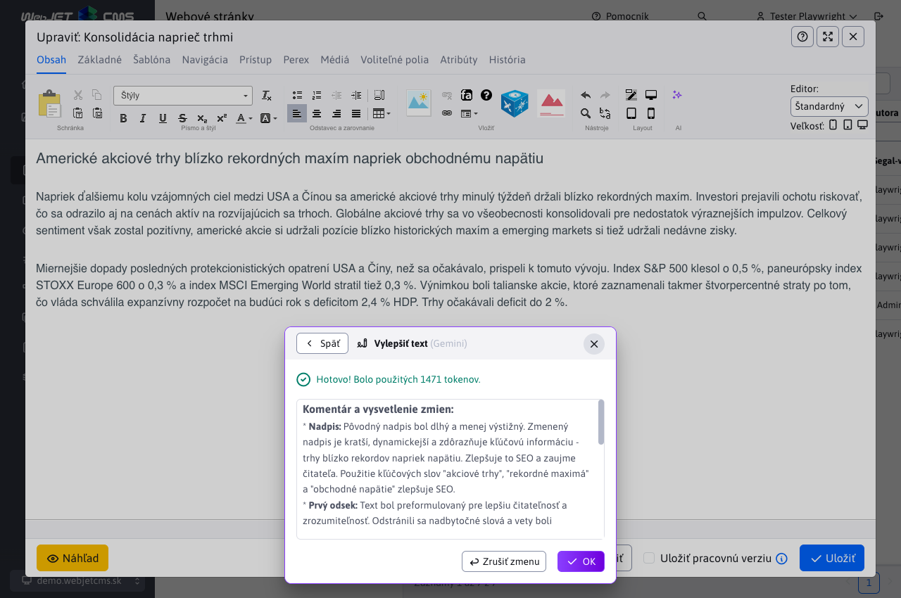

### Only part of the text

You don't have to edit the entire page content. The assistant working with `CKEditor` also supports editing only a selected part. If you select only a part of the content and then call the assistant, it will edit only that selected part.

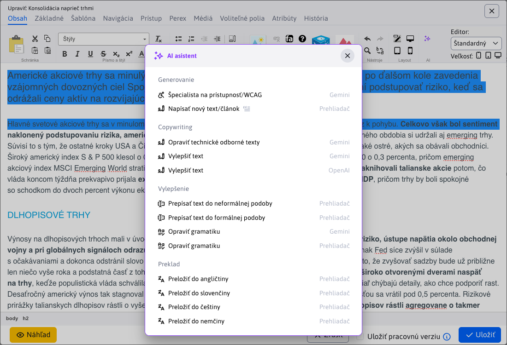

## PageBuilder

Assistants also work in `PageBuilder` and are used to generate new content or edit existing page content inserted in `PageBuilder`. They are launched via the icon<button class="btn-ai" type="button"><i class="ti ti-sparkles"></i></button> located in the toolbar.

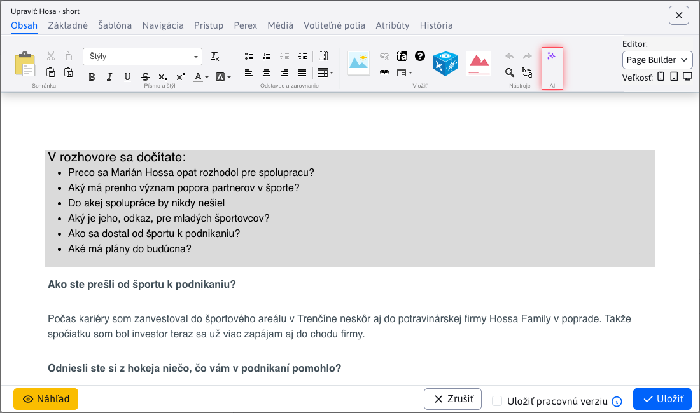

Clicking on it will open a window with all available assistants for the given field. They are clearly divided into groups (e.g. **Generation**, **Copywriting**, **Improvement**). Each one has a name, icon, and provider.

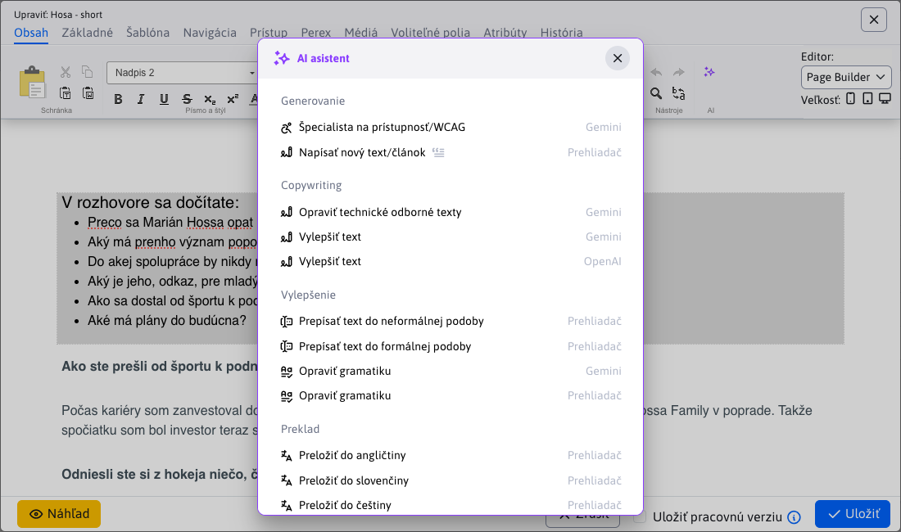

Clicking on the assistant will start its execution. Each block is considered a separate text/content and is processed separately. The window will gradually update the status of how many blocks out of the total number have already been processed.

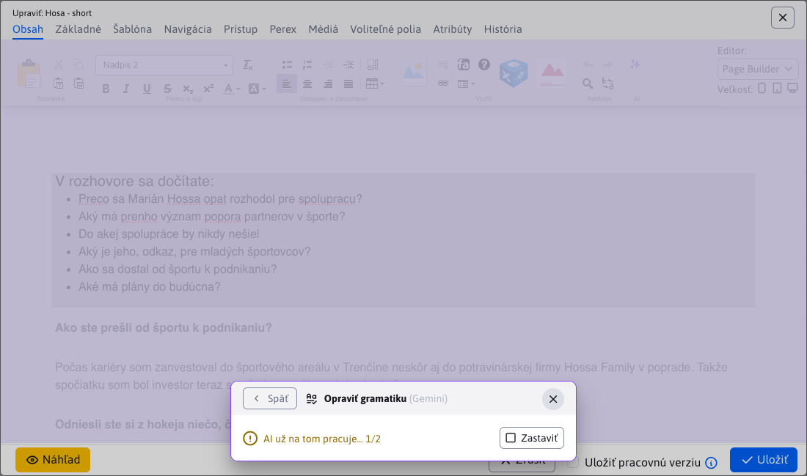

Upon successful completion, the resulting content will be automatically inserted into the page. A confirmation window will appear with information about token consumption. If the result is not satisfactory, use the button<button class="btn btn-outline-secondary btn-ai-undo" type="button"><i class="ti ti-arrow-back"></i>Cancel the change</button> to return to the original value.

In this case, the assistant is set up so that (and we also recommend this when editing page content) it will also describe all the changes it made to the page content in the window, thus offering feedback on what needed to be edited.

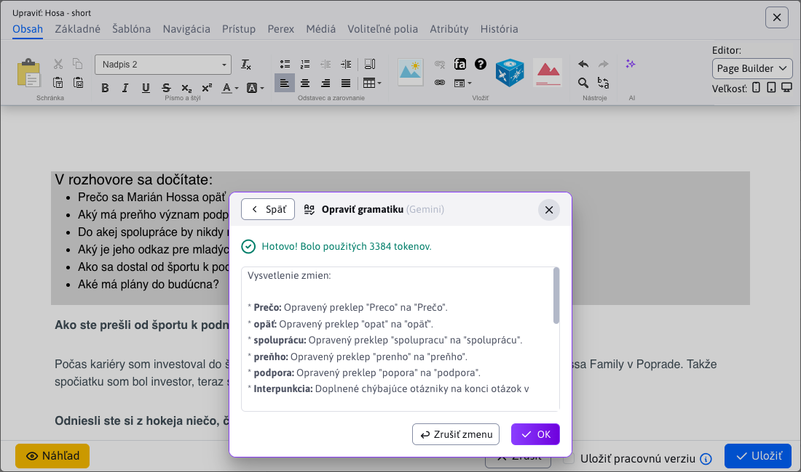

### Only part of the text

You don't have to edit the entire page content. The assistant working with `PageBuilder` also supports editing only a selected part. If you select only a part of the content and then call the assistant, it will edit only that selected part.

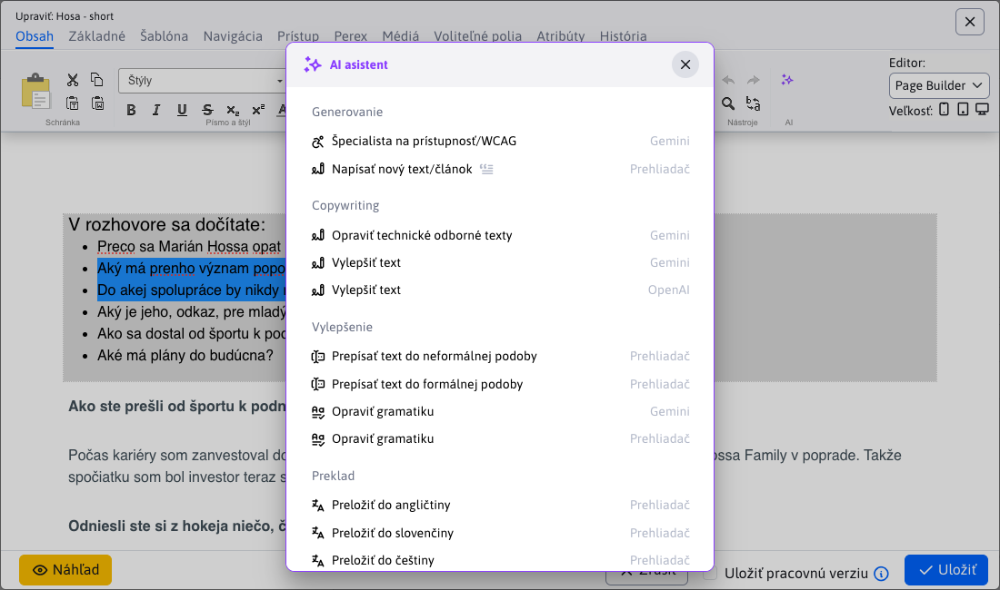

## Chat mode

If the assistant is set to chat mode, changes in PageBuilder are applied to the entire structure, not just text/editable content. The assistant can then generate new blocks, edit existing ones, and so on. You can give it requests to edit text on the page and generate new blocks. You activate the mode by setting the Request type field to the value `Chat` in the assistant properties.

The request entry window includes new fields for setting the mode:

- **Append** - adds the output HTML code from the request to the end of the page. It does not send the current page content to the assistant, so it is cheaper to execute (fewer tokens are consumed).
- **Edit** - along with the instruction and your request, the current HTML code of the page is also sent, in which the assistant can edit texts, blocks, HTML code. More tokens are consumed to execute the request.
- **Replace** - similar to add, the current page code is not sent with the request. The result is a replaced current page. Suitable if you want to start over and delete all current content.

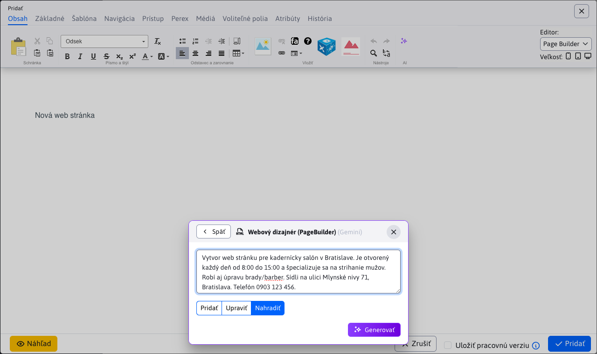

After the request is made, a window will appear with the status and number of tokens used. In addition, there is an option **Continue** in this window, which will display the window for entering the request again.

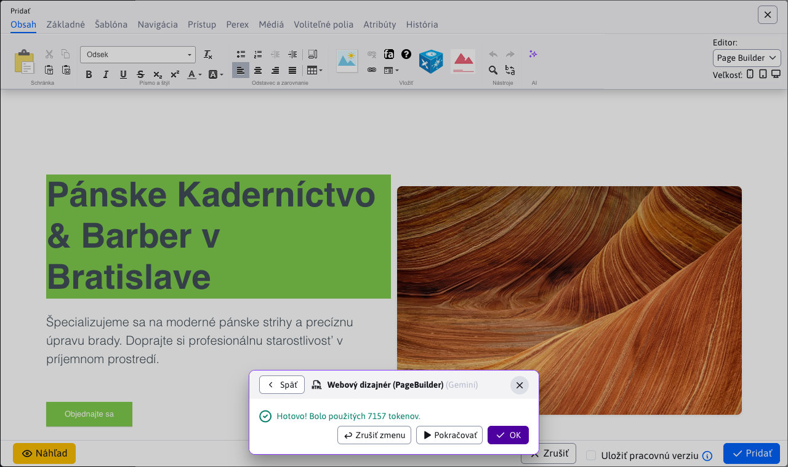

You can then continue editing the website and submit a request to edit the text of the page. Selecting **Edit** will send the current HTML code of the page along with your request, so the assistant can make changes to it.

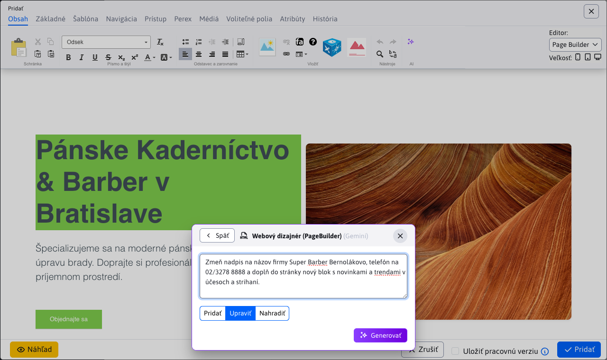

The changes you made will be displayed on the web page and you can click Continue again to enter another request, or click **OK** to exit the assistant. Note in the photo that the title has been modified compared to the previous version according to the entered request.

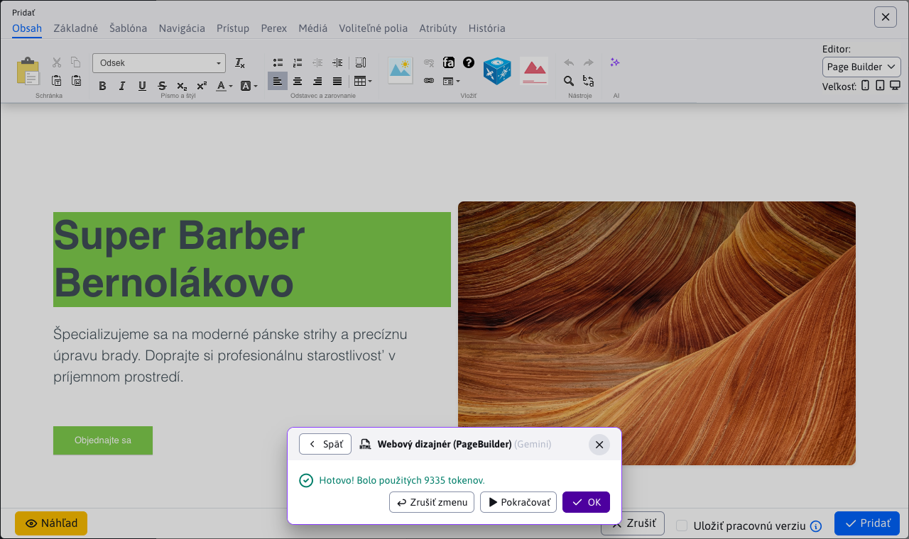

## Images on the page

You can also use the AI ​​assistant when inserting images into a web page. The assistant button is located in the lower right corner at the end of the image address field.

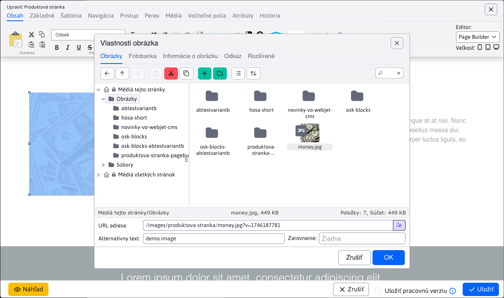

After clicking, a window will open with all available assistants, which are worked with in the same way as described in the [Image fields](./README.md#image-fields) section.

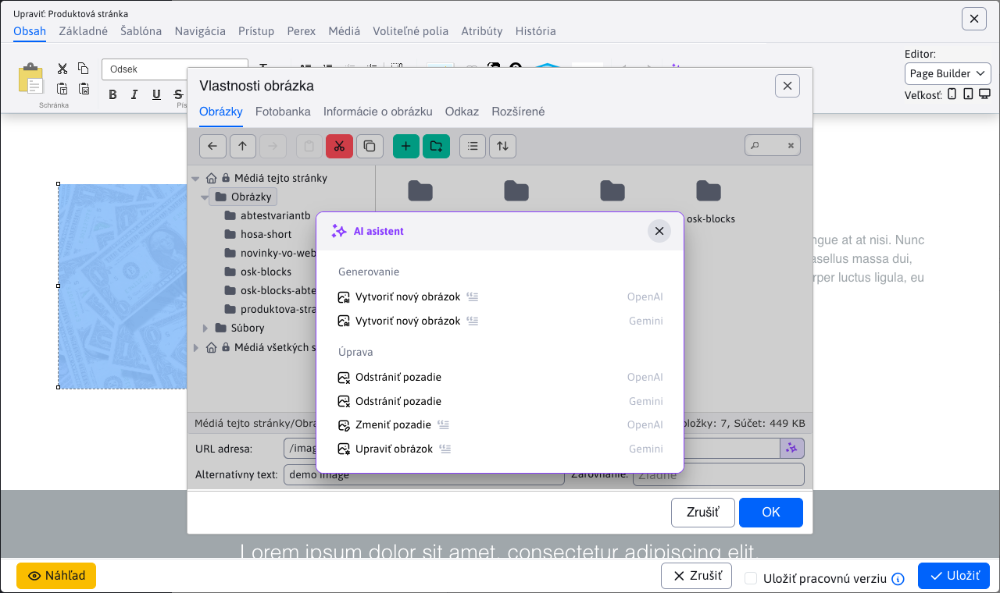

## Empty field

Assistants often use the contents of a given field as an input value, if the field is empty, they will not be displayed. For example, Translate to English does not make sense to display if the field is empty. It may happen that no assistant is available for an empty field, in which case an error message will be displayed. You must first enter text into the field before displaying assistants.

However, the same field is not always used for the input value. For example, in editing a web page, there is an assistant for generating the Web page name from its text. If the web page text is currently empty, this option may not be displayed.

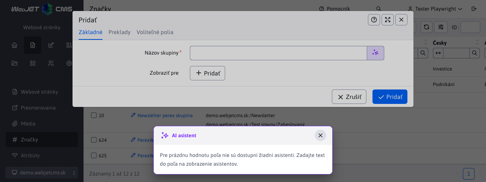