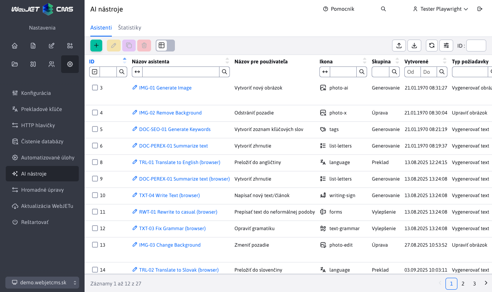
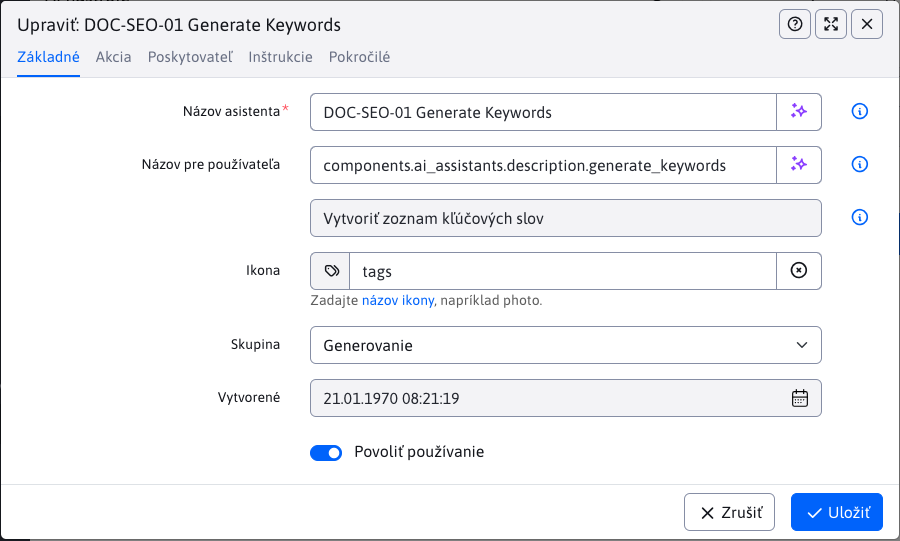
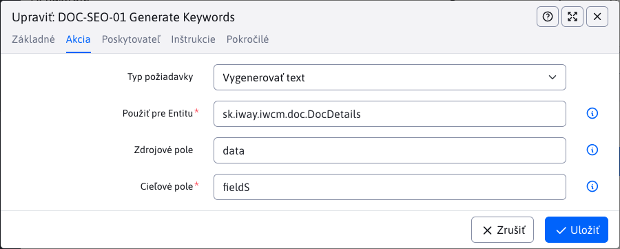
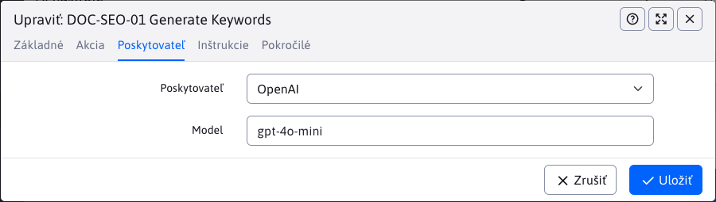
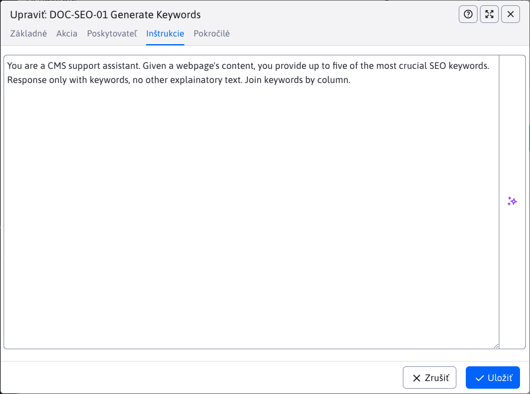
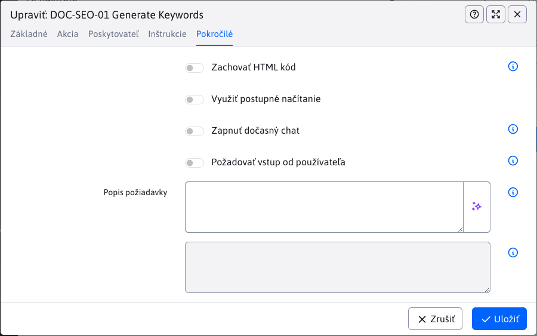
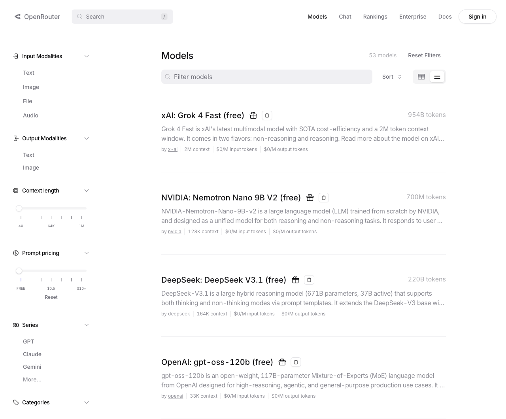

# Settings

This document describes how to manage and configure AI assistants in WebJET CMS. In the section **AI assistants** You can create and edit individual assistants, with each record representing a specific type of action with the selected AI service provider. The settings allow you to specify where (in which table) and for which field or fields a given assistant will be available, that is, will perform the configured action.



!>**Warning:** Setup should only be done by a person who has sufficient knowledge of how AI assistants work and understands the capabilities of each provider. Incorrect settings can lead to suboptimal assistant behaviour or limited functionality. We recommend that configuration be performed by an administrator or technically proficient user who can correctly enter instructions and parameters for a specific AI provider.

## Basic information

In this section we will discuss how to add/set up a new **AI assistant**. The following cards are available for this event:
- Basic
- Action
- Provider
- Directions
- Advanced

### Tab - Basic

This tab contains basic information about the assistant, such as its name, icon or creation date. It contains fields:
- **Name of assistant** - The internal identifier of the assistant (not visible to the user). It must be unique in combination with the value **Provider** (i.e. you can use the same name for multiple assistants, but each must have a different provider).
- **Name for user** - the displayed name in the interface. It does not have to be unique. If it is not filled in, the value from the field **Name of assistant**. You can also enter a translation key (the value of the key is displayed in the field below it).
- **Icon** - icon name from https://tabler.io/icons. It is displayed together with the field **Name for user**. Enter the icon identifier only (without the URL).
- **Group** - A logical or visual grouping of assistants in an interface. It does not affect the processing or the result.
- **Retrieved from** - system-generated creation date. It cannot be edited and is only displayed when editing an existing assistant.
- **Allow use** - if not enabled, the assistant is not displayed to users and cannot be triggered (serves as a quick disable).



### Card - Action

In this tab, you set what action the AI assistant should perform, where it will get data from, and where it will be available. The following fields are available:
- **Type of request** - you specify what type of task you want the assistant to perform:
  - Generate text
  - Generate image
  - Edit image
  - Chat
- **Use for Entity** - you select the entity (table) in which the assistant will be available. When you type, all supported entities are automatically displayed.
- **Source field** - you specify an array from the selected entity from which the assistant should draw data when performing the action. This field is optional; select it only if input data is required. All fields of the entity are displayed.
- **Target field** - you select the field in the entity where the result of the assistant action will be stored or where the assistant will be available. Again, all fields of the entity are displayed.



Type values can also be specified for the entity, source and destination fields:
- `value1,value2,value3` - applied to multiple values
- `*` - applied to all values
- `%value!` - is applied if it contains a value anywhere `value`
- `%value` - is applied if it starts with the value `value`
- `value!` - is applied if it ends with the value `value`

For the target field it is possible to specify not only the name of the attribute in the entity, but also the CSS class and value `renderFormat`. It is therefore possible to enter a value `dt-format-text,dt-format-text-wrap` for application to all types of text fields.

Optional fields (i.e. fields whose name is `fieldX`) can change dynamically, for example according to the selected template in the website. When AI assistants are generated, only the main type is detected on the server side, regardless of the page template used. Therefore, the assistant may not be displayed correctly if the pages have different templates. Optional fields are initialized when the web page is refreshed according to the template of the folder you are in, so refreshing the page can retrieve the correct values. However, switching to a different page with a different template does not change the assistants.

At the same time, if a specific assistant is set for an optional field (the field name matches the value in the Target field of the assistant definition), other general assistants defined e.g. by field type and so on are not displayed. Presumably, if you define an assistant for a specific optional field, you don't need the other general assistants (such as Correct Grammar). If you do need such an assistant, just add the name of the optional field to those general assistants as well.

If you don't want to display AI tool options for a field in an entity, just set the attribute in the annotation `ai=false` or add a CSS class `ai-off`. In this case, the button for the AI assistant will appear next to the field only if it is specified exactly for the entity and field.

```java
	@Lob
	@Column(name = "description")
	@DataTableColumn(inputType = DataTableColumnType.OPEN_EDITOR, renderFormat = "dt-format-text", tab="description", ai=false, editor = {
			@DataTableColumnEditor(type = "textarea", attr = {
					@DataTableColumnEditorAttr(key = "class", value = "textarea-code") }) })
	private String description;
```

### Card - Provider

This tab is used to select the AI service provider that will be used to process the assistant's request. All available and correctly configured providers (for example, those that have the specified API key) will be displayed in the selection box. After selecting a specific provider, other specific settings can be displayed according to the capabilities of that provider. For example, for a provider `OpenAI` a specific model can be selected to handle the request, while other providers may offer different or limited configuration options.



### Tab - Instructions

This card is crucial for the proper functioning of the assistant. It contains one field where you enter detailed instructions on what to do when the assistant starts. The instructions should be clear, specific and understandable so that the assistant knows exactly what task to perform. Correctly entered instructions will ensure that the assistant performs the required actions efficiently and as expected. Read more [writing instructions](../instructions/README.md).



### Card - Advanced

On this tab, you will find advanced configuration options for the assistant that allow you to tailor its behaviour in more detail to your needs. The available settings may vary depending on the AI service provider you select. We recommend changing these settings only if you know exactly how they will affect the assistant's performance, as they may affect its results or the way it interacts with the user.

- **Preserve HTML code** - if enabled, HTML tags are not removed from the source field and are sent to the provider as is. Only turn on if the model needs to work with structured HTML (e.g. parsing or editing content). Otherwise leave off for cleaner input.
- **Use sequential loading** - the answer will be displayed in parts (streaming) instead of one block. Useful for longer generated texts to give the user immediate feedback. Only works for text output.
- **Enable temporary chat** - context and message exchange are not saved after the session is over. Use for sensitive or one-time queries. History will not be available to continue.
- **Request input from the user** - the user must provide custom input (e.g., a topic, additional instructions, or keywords) before the assistant can be started. If disabled, the assistant runs without additional input.
- **Description of requirement** - a short help displayed next to the input field (makes it easier for the user to understand what to type). A translation key can also be entered; its evaluated value is displayed in the field below it.



## Providers

A provider is an external service or platform that provides the AI tools, models and functionality used in CMS query processing. In order to use a provider, it must first be properly implemented and configured in the system (for example, by specifying an API key). Individual providers may differ in capabilities, price, quality of results, or specialization for specific types of tasks. Choosing the right provider depends on your needs and requirements for specific AI functionality.

### OpenAI

OpenAI is one of the best known and most widely used AI service providers. In WebJET CMS its API is already integrated - to activate it, just enter your API key in the configuration variable `ai_openAiAuthKey`. When entering the key, we recommend using the **Encrypt** for greater security.

Integration is currently supported for the following types of requests:
- Text generation
- Image generation
- Editing images

You can get the API key by registering at [OpenAI](https://platform.openai.com/signup). After logging in to your account, go to the `API Keys` where you can generate a new key. This key is then inserted into the CMS settings according to the above procedure.

### Gemini

Gemini, like OpenAI, is one of the best known and most widely used AI service providers. In WebJET CMS, its API is already integrated via the tool [AI Studio](https://aistudio.google.com/) - to activate, just enter your API key in the configuration variable `ai_geminiAuthKey`. When entering the key, we recommend using the **Encrypt** for greater security.

Integration is currently supported for the following types of requests:
- Text generation
- Image generation
- Editing images

To get the API key:
- Open page [Google AI Studio](https://aistudio.google.com/apikey).
- Log in to your account `Google` (the key will be bound to this account).
- Click on `Create API key`.
- Select an existing one or create a new one `Google Cloud` the project to which the key is assigned.
- Confirm the generation - the generated key will be displayed, which you then enter into the CMS settings according to the above procedure.

The newly generated key works in free (limited) mode at first - limits on the number of requests per minute/hour/day apply. For higher limits and stable operation, set up billing via the link `Set up billing` at the key. Once the payment method is added, the limits will be made available according to the company's current terms and conditions `Google`.

Advanced settings (quotas, billing, key rotation, statistics) can be found in [Google Cloud Console](https://console.cloud.google.com/).

### OpenRouter

Service [OpenRouter](https://openrouter.ai) connects different AI service providers into one common API. Technically your request is directed to the API of that provider, the advantage is that you don't need to have accounts with multiple providers, but have one account in OpenRouter that you use for multiple AI service providers. Many models are available for free, so the service is also convenient for testing/trying out the capabilities of AI models.

You can add a fixed credit to the service to use paid models, or set the service to automatically top up the credit when it is used up. Usage statistics for each model are also available.

Set the generated API key in the configuration variable `ai_openRouterAuthKey`.



### Browser

AI directly in the browser is up to date [forthcoming standard](https://developer.chrome.com/docs/ai/get-started) created by Google. It is currently supported in Google Chrome using a secure (HTTPS) connection. Once the API is standardized, it is expected to be available in other browsers as well. You can disable the availability of AI in the browser by setting a configuration variable `ai_browserAiEnabled` to the value of `false` when the options stop appearing.

To run AI in the browser you need to meet:
- [HW requirements](https://developer.chrome.com/docs/ai/get-started#hardware) computers.
- The connection to WebJET CMS must be secure (HTTPS protocol used).

If you meet the requirements, we recommend trying the translation assistant first and then the text summarizer - these are the simplest services AI supports in the browser. This will verify the model has been downloaded and installed on your computer and is functional in the browser.

Some interfaces are [so far in experimental mode](https://developer.chrome.com/docs/ai/built-in-apis#api_status). To use them, you need to open the Experiments page in your browser by typing the address `chrome://flags/#prompt-api-for-gemini-nano` and set the value `Enabled` for items `Prompt API for Gemini Nano`, `Summarization API for Gemini Nano`, `Writer API for Gemini Nano`, `Rewriter API for Gemini Nano`. Then click Restart to restart the browser. We recommend typing the phrase at the top of the page `gemini` for filtering options and finding them more easily. Without enabling these options, only the translation and summarization API will be available.


You can check the status of AI models by typing the following address in the browser bar: `chrome://on-device-internals/`.

Some APIs do not yet support working in all languages, so automatic translation may occur after use. However, the translator also needs to be downloaded the first time you use it, so we recommend trying the AI translation tool first to get the translator installed. After that, it will be possible to use it after other AI assistants have been executed to translate the output text.

## Connect

Calling AI services requires an internet connection. Make sure that your server has access to external services and that firewall or other security measures do not block API requests to that provider. The following domain names are used:
- OpenAI: `api.openai.com`
- Gemini: `generativelanguage.googleapis.com`
- OpenRouter: `openrouter.ai`

these need to be enabled in outgoing requests to any proxy server or firewall.
