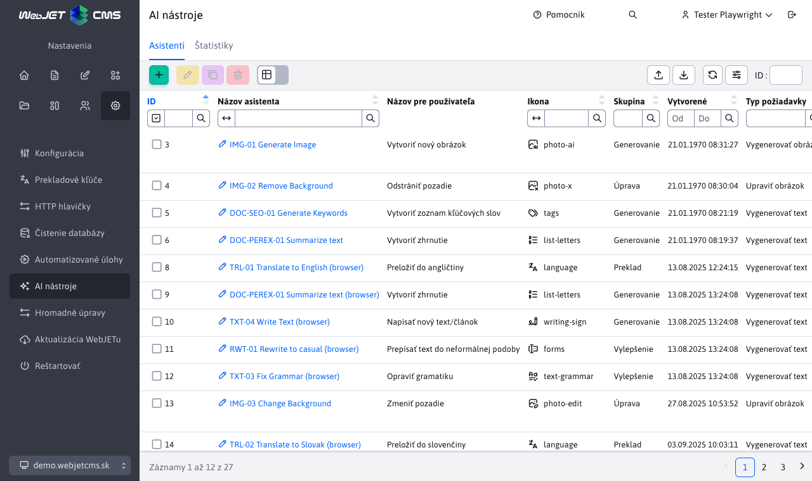
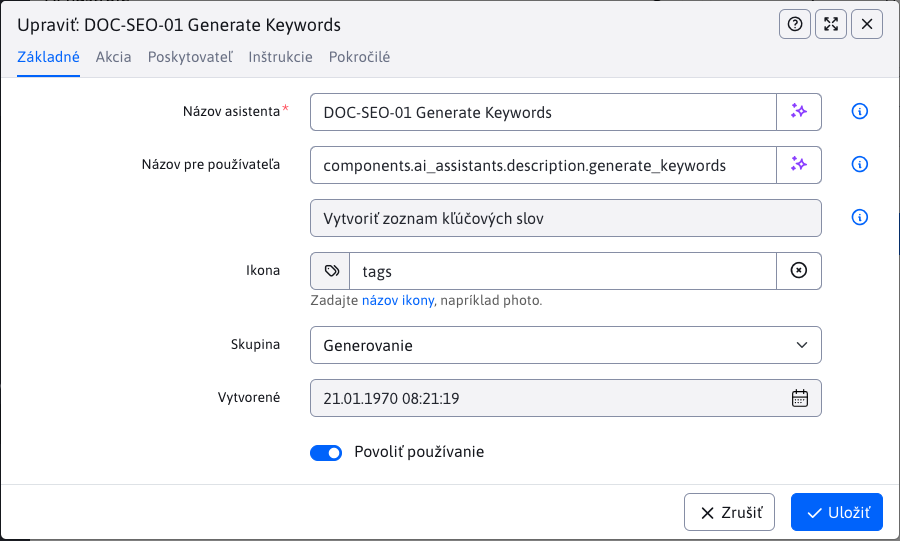
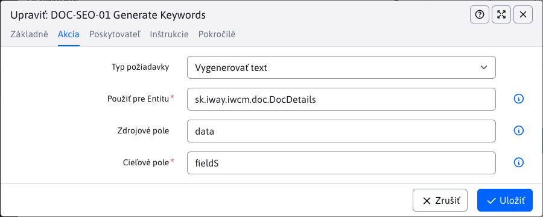
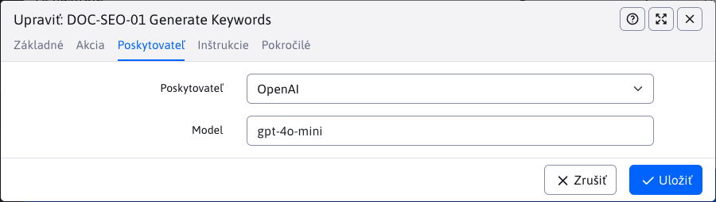
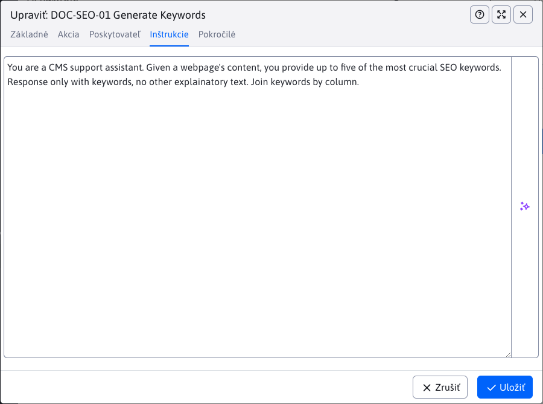
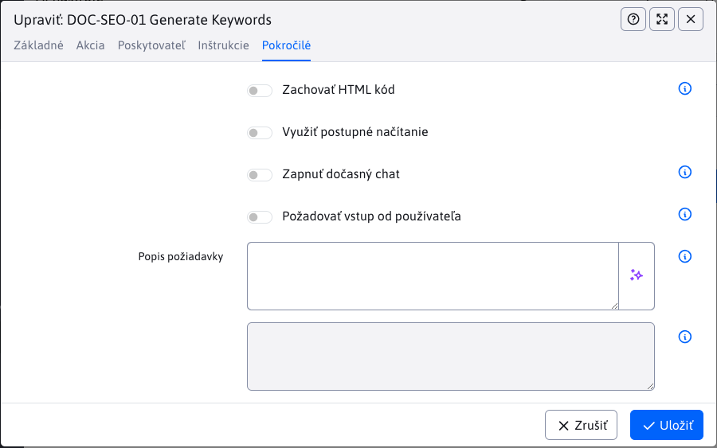
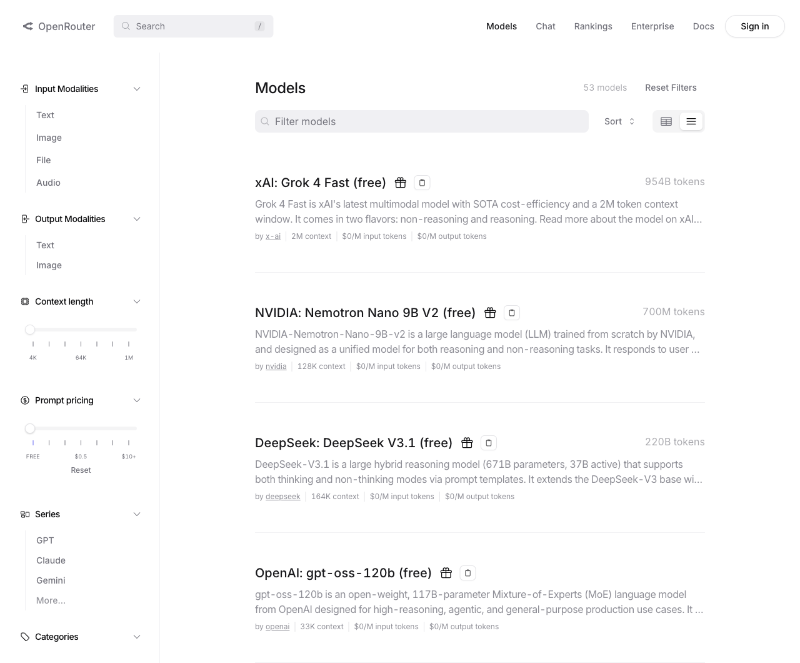
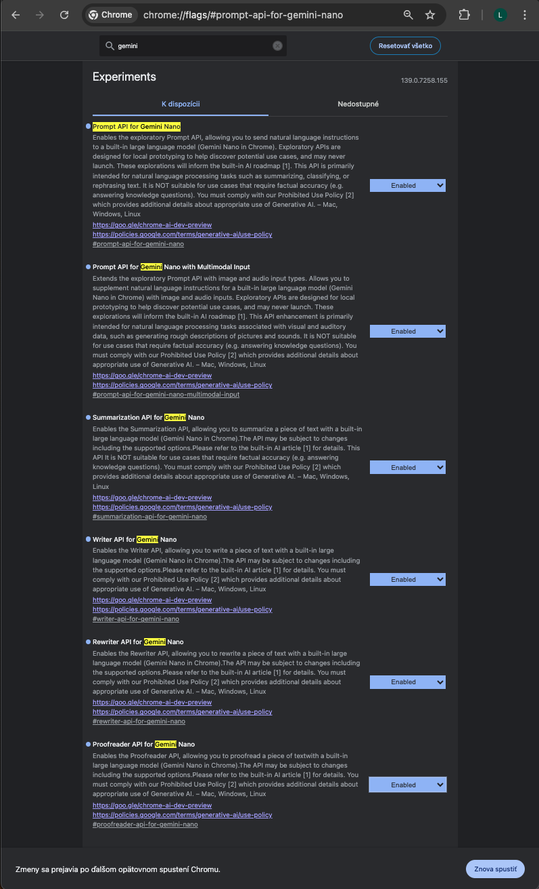

# Setting

This document describes the management and configuration of AI assistants in WebJET CMS. In the **AI assistants** section, you can create and edit individual assistants, with each entry representing a specific type of action with a selected AI service provider. The settings allow you to specify where (in which table) and for which field or fields the given assistant will be available, i.e. it will perform the set action.



!>**Warning:** Settings should only be performed by a person who has sufficient knowledge of how AI assistants work and understands the capabilities of individual providers. Incorrect settings may lead to suboptimal behavior of the assistant or limited functionality. We recommend that the configuration be performed by an administrator or a technically savvy user who knows how to correctly enter instructions and parameters for a specific AI provider.

## Basic information

In this section, we will discuss how to add/set up a new **AI assistant**. The following cards are available for this action:

- Basic
- Action
- Provider
- Instructions
- Advanced

### Tab - Basic

This tab contains basic information about the assistant, such as its name, icon, or creation date. It contains the following fields:

- **Assistant Name** – internal identifier of the assistant (not visible to the user). It must be unique in combination with the **Provider** value (i.e. you can use the same name for multiple assistants, but each must have a different provider).
- **User Name** – the name displayed in the interface. It does not have to be unique. If it is not filled in, the value from the **Assistant Name** field will be used. You can also enter a translation key (the key value will be displayed in the field below it).
- **Icon** – the name of the icon from https://tabler.io/icons. It is displayed together with the **User Name** field. Enter only the icon identifier (without the URL).
- **Group** – a logical or visual grouping of assistants in the interface. It has no effect on processing or result.
- **Created** – system-generated creation date. Cannot be edited and only appears when editing an existing assistant.
- **Allow use** – if not enabled, the assistant is not displayed to the user and cannot be launched (serves as a quick deactivation).



### Card - Action

On this tab, you set what action the AI ​​assistant should perform, where it will get data from, and where it will be available. The following fields are available:

- **Request type** – you specify what type of task the assistant should perform:
  - Generate text
  - Generate image
  - Edit image
  - Chat
- **Use for Entity** – you select the entity (table) in which the assistant will be available. All supported entities will automatically appear as you type.
- **Source Field** – you specify the field from the selected entity from which the assistant should draw data when performing the action. This field is not required; select it only if input data is required. All fields of the given entity will be displayed.
- **Target Field** – you select the field in the entity where the result of the assistant action will be stored or where the assistant will be available. All fields of the given entity will be displayed again.



For the entity, source and target fields, it is also possible to enter values ​​of the type:

- `value1,value2,value3` – applies to multiple values
- `*` – applies to all values
- `%value!` – applied if it contains the value `value` anywhere
- `%value` – applies if it starts with the value `value`
- `value!` – applies if it ends with the value `value`

For the target field, it is possible to specify not only the name of the attribute in the entity, but also the CSS class and the value `renderFormat`. Thus, it is possible to specify the value `dt-format-text,dt-format-text-wrap` to apply to all types of text fields.

Optional fields (i.e. fields whose name is `fieldX`) can change dynamically, for example according to the selected template in web pages. When generating AI assistants, only the main type is detected on the server side, regardless of the page template used. Therefore, the assistant may not be displayed correctly if the pages have different templates. Optional fields are initialized when the web page is refreshed according to the template of the folder you are in, so refreshing the page can load the correct values. However, switching to another page with a different template will not change the assistants.

At the same time, if a specific assistant is set for an optional field (the field name matches the value in the Target Field field of the assistant definition), other general assistants defined, e.g. by field type, etc., will not be displayed. It is assumed that if you define an assistant for a specific optional field, you do not need other general assistants (such as Correct Grammar). If you need such an assistant, you just need to add the name of the optional field to these general assistants as well.

If you don't want AI tools options to appear for a field in an entity, simply set the `ai=false` attribute to the annotation or add the `ai-off` CSS class. In this case, the AI ​​assistant button will only appear for the field if it is specified for the specific entity and field.

```java
	@Lob
	@Column(name = "description")
	@DataTableColumn(inputType = DataTableColumnType.OPEN_EDITOR, renderFormat = "dt-format-text", tab="description", ai=false, editor = {
			@DataTableColumnEditor(type = "textarea", attr = {
					@DataTableColumnEditorAttr(key = "class", value = "textarea-code") }) })
	private String description;
```

### Card - Provider

This tab is used to select the AI ​​service provider that will be used to process the assistant request. The selection field displays all available and correctly configured providers (for example, those with a specified API key). After selecting a specific provider, additional specific settings may appear according to the capabilities of that provider. For example, with provider `OpenAI`, it is possible to select a specific model for processing the request, while other providers may offer different or limited configuration options.



### Card - Instructions

This tab is crucial for the assistant to function properly. It contains a single field where you enter detailed instructions for what the assistant should do when it starts. The instructions should be clear, specific, and understandable so that the assistant knows exactly what task it is supposed to perform. Properly entered instructions will ensure that the assistant performs the required actions efficiently and as expected. You can read more in the [writing instructions](../instructions/README.md) section.



### Tab - Advanced

This tab provides advanced configuration options for the Assistant, allowing you to further customize its behavior to suit your needs. The available settings may vary depending on the AI ​​service provider you choose. We recommend that you only change these settings if you know exactly how they will affect the Assistant's performance, as they may affect its results or the way it interacts with the user.

- **Preserve HTML code** - if enabled, HTML tags from the source field will not be stripped and will be sent to the provider as is. Enable only if the model needs to work with structured HTML (e.g. parsing or editing content). Otherwise, leave disabled for cleaner input.
- **Use progressive loading** – the answer will be displayed in parts (streaming) instead of in one block. Suitable for longer generated texts so that the user has immediate feedback. Works only for text outputs.
- **Enable temporary chat** - Context and message exchange are not saved after the session ends. Use for sensitive or one-time requests. History will not be available for future continuation.
- **Require user input** – Before running the assistant, the user must provide their own input (e.g., entering a topic, additional instructions, or keywords). If disabled, the assistant runs without additional input.
- **Request Description** – a short hint displayed next to the input field (makes it easier for the user to understand what to type). A translation key can also be entered; its evaluated value will be displayed in the field below it.



## Providers

A provider is an external service or platform that provides AI tools, models, and functionality used to process requests in a CMS. In order to use a provider, it must first be properly implemented and configured in the system (for example, by providing an API key). Individual providers may vary in capabilities, price, quality of results, or specialization in specific types of tasks. Choosing the right provider depends on your needs and requirements for a specific AI functionality.

### OpenAI

OpenAI is one of the most well-known and widely used AI service providers. Its API is already integrated in WebJET CMS - to activate it, just enter your API key in the `ai_openAiAuthKey` configuration variable. When entering the key, we recommend using the **Encrypt** option for higher security.

Integration is currently supported for the following request types:

- Text generation
- Image generation
- Image editing

You can get an API key by registering on the [OpenAI](https://platform.openai.com/signup) website. After logging into your account, go to the `API Keys` section, where you can generate a new key. Then insert this key into the CMS settings as described above.

### Gemini

Gemini, like OpenAI, is one of the most well-known and widely used AI service providers. Its API is already integrated into WebJET CMS via the [AI Studio](https://aistudio.google.com/) tool - to activate it, just enter your API key in the `ai_geminiAuthKey` configuration variable. When entering the key, we recommend using the **Encrypt** option for higher security.

Integration is currently supported for the following request types:

- Text generation
- Image generation
- Image editing

You can get an API key as follows:

- Open the [Google AI Studio](https://aistudio.google.com/apikey) page.
- Log in to account `Google` (the key will be bound to this account).
- Click on `Create API key`.
- Select an existing or create a new `Google Cloud` project to which the key will be assigned.
- Confirm generation – the generated key will be displayed, which you can then insert into the CMS settings according to the procedure above.

The newly generated key initially works in free (limited) mode - there are limits on the number of requests per minute / hour / day. For higher limits and stable operation, set up billing via the `Set up billing` link next to the key. After adding a payment method, the limits will be available according to the current terms and conditions of the company `Google`.

Advanced settings (quotas, billing, key rotation, statistics) can be found in the [Google Cloud Console](https://console.cloud.google.com/).

### OpenRouter

The [OpenRouter](https://openrouter.ai) service connects various AI service providers to a single common API. Technically, it directs your request to the API of the given provider, the advantage is that you do not need to have accounts created with multiple providers, but you have one account in OpenRouter, which you use for multiple AI service providers. Many models are available for free, so the service is also useful for testing/examining the capabilities of AI models.

To use paid models, you can add a fixed amount of credit to the service, or set up automatic credit replenishment when it runs out. Usage statistics for individual models are also available.

Set the generated API key to the configuration variable `ai_openRouterAuthKey`.



### Browser

AI in the browser is currently a [working standard](https://developer.chrome.com/docs/ai/get-started) created by Google. It is currently supported in Google Chrome using a secure (HTTPS) connection. Once the API is standardized, it is expected to be available in other browsers. You can disable AI in the browser by setting the configuration variable `ai_browserAiEnabled` to `false`, at which point the options will no longer be displayed.

To run AI in the browser, you must:

- [HW requirements](https://developer.chrome.com/docs/ai/get-started#hardware) of the computer.
- The connection to WebJET CMS must be secure (HTTPS protocol used).

If you meet the requirements, we recommend first trying the translation assistant and then the text summarization assistant – these are the simplest services that AI in the browser supports. This will verify the model has been downloaded and installed on your computer and its functionality in the browser.

Some interfaces are [still in experimental mode](https://developer.chrome.com/docs/ai/built-in-apis#api_status). To use them, you need to open the Experiments page in your browser by entering `chrome://flags/#prompt-api-for-gemini-nano` and set the value `Enabled` for items `Prompt API for Gemini Nano`, `Summarization API for Gemini Nano`, `Writer API for Gemini Nano`, `Rewriter API for Gemini Nano`. Then click Restart to restart the browser. We recommend entering the term `gemini` at the top of the page to filter the options and find them easier. Without enabling these options, only the translation and summarization API will be available.



You can check the status of AI models by entering the following address into your browser's address bar: `chrome://on-device-internals/`.

Some APIs do not yet support working in all languages, so automatic translation may occur after use. However, the translator also needs to be downloaded when used for the first time, so we recommend that you first try the AI ​​translation tool to install the translator. It can then be used after executing other AI assistants to translate the output text.

## Connection

Calling AI services requires an internet connection. Make sure your server has access to external services and that a firewall or other security measures are not blocking requests to the provider's API. The following domain names are used:

- OpenAI: `api.openai.com`
- Gemini: `generativelanguage.googleapis.com`
- OpenRouter: `openrouter.ai`

these need to be enabled in outgoing requests on any proxy server or firewall.