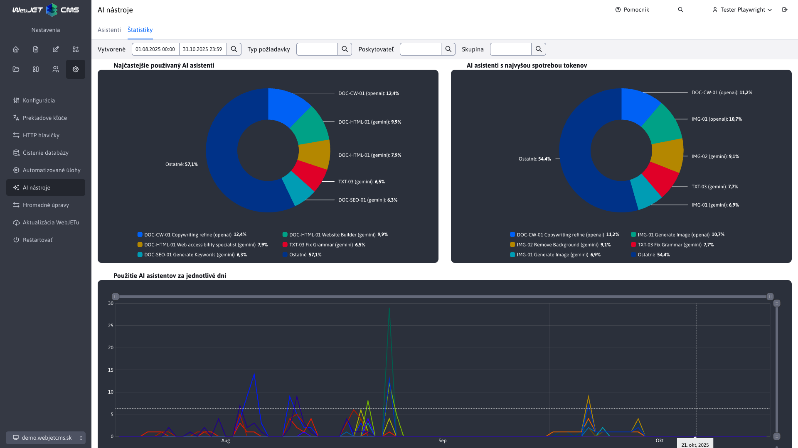
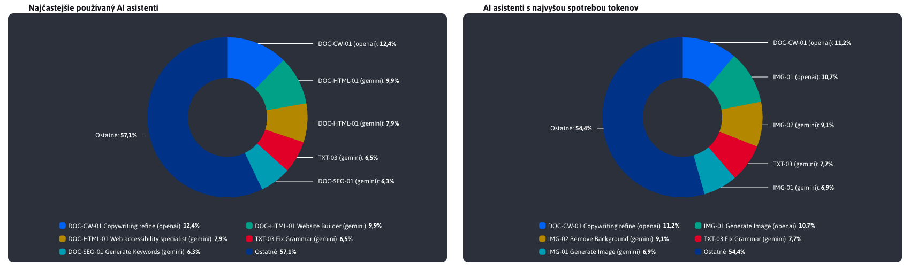
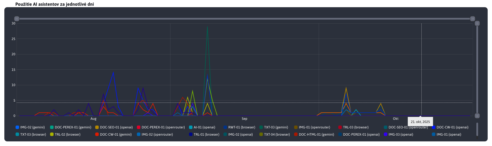
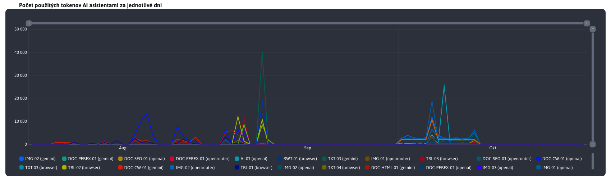
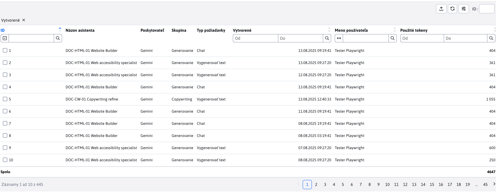
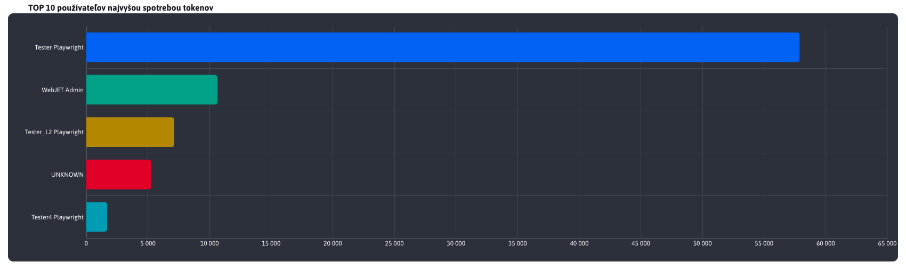
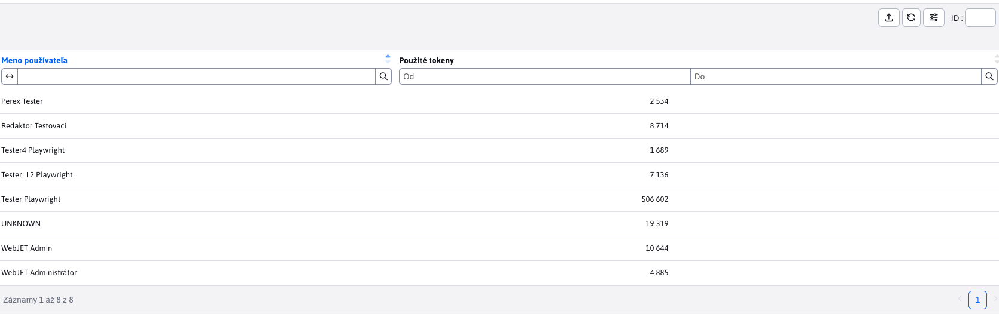

# Statistics

Section **Statistics** provides an overview of the use of AI assistants in the system. You will find visual reports that show the most frequently used assistants, the assistants with the highest token consumption (i.e. the highest cost), as well as detailed information about the usage of each AI assistant and their token consumption on specific days.

The data is displayed for the period you choose (the default range is the last 30 days). The filter in the header allows you to restrict the display by:
- **Type of request** (e.g. Generate Text, Generate Image, Chat)
- **Provider** (e.g. Browser, OpenAI, Gemini)
- **Group** (e.g. Generation, Analysis, Editing)

You can combine the filters freely to focus on a specific part of the usage. All graphs and the table are updated immediately when you change the filters.

For more on the parameters, see [Settings](../settings/README.md).

## Pie charts

The pie charts show the distribution of the TOP 5 (including the rest as a combination of **Other**) the most frequently used AI assistants and those with the highest token consumption within the selected period. These visualizations allow you to quickly identify the most used assistants and the areas with the highest resource consumption.

## AI assistant usage per day

This chart shows the number of times each AI assistant was used on specific days during the selected period. It allows you to track trends in the use of assistants and evaluate how their usage changes over time.

## Number of tokens used by AI assistants per day

This chart shows how many tokens (resources) each AI assistant consumed on each day during the period. Token consumption may not be directly related to the number of uses - but the chart will help you spot assistants with excessive consumption and consider optimizing their instructions to reduce costs.

## Table 1

The statistics section also offers a table with an overview of all assistant calls for the selected period. It also includes a user column, so you can see who is using AI assistants most often and for what.

## TOP 10 users with the highest token consumption

This chart shows the ten users with the highest token consumption within the selected period. It allows you to identify the users that contribute the most to the cost of using AI assistants and consider ways to optimize their usage.

## Table 2

Finally, there is a table with a summary of all users who have used AI assistants in the selected period, along with the total token consumption. This table gives you a detailed view of how individual users contribute to the overall AI assistant usage in the system.

