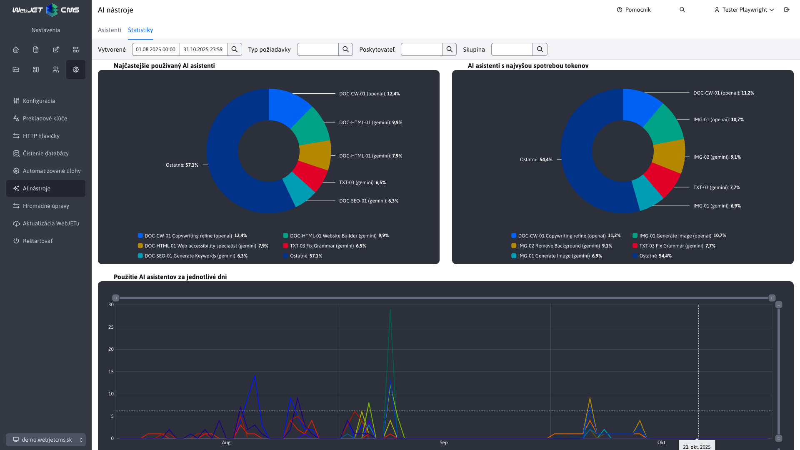
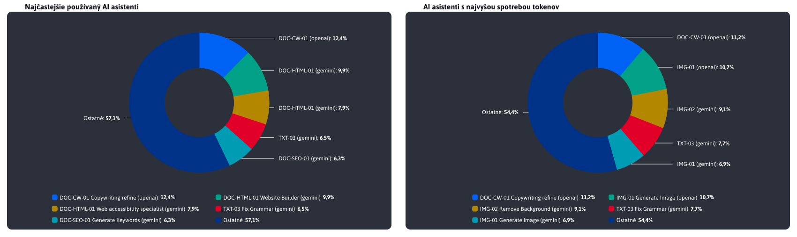
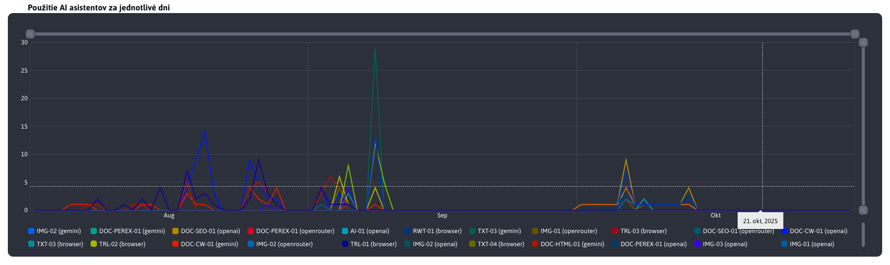
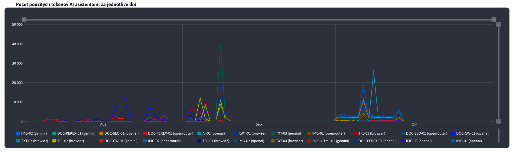
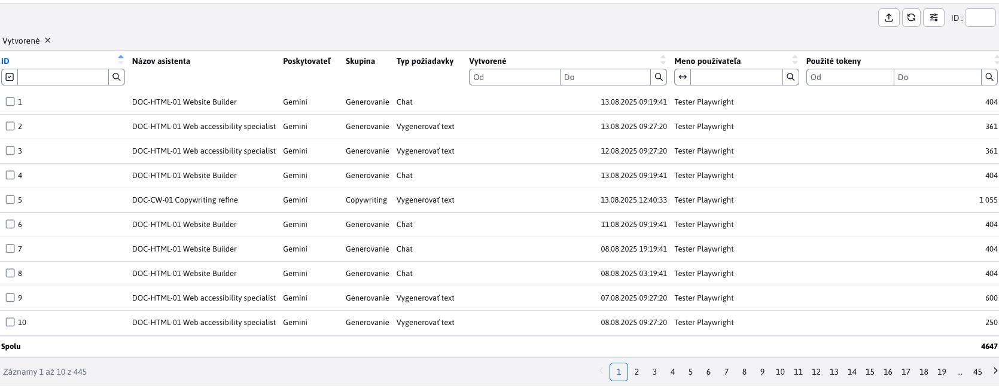
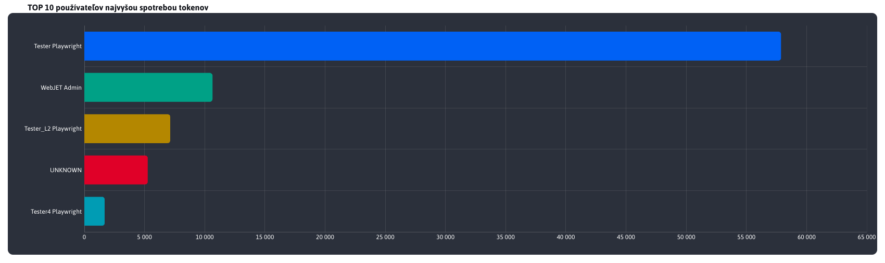
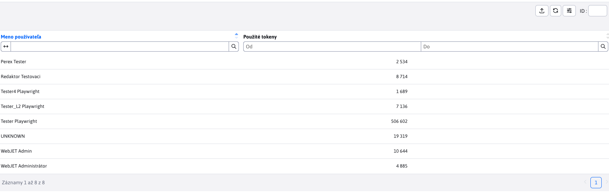

# Statistics

The **Statistics** section provides an overview of the use of AI assistants in the system. Here you will find visual reports that show the most frequently used assistants, assistants with the highest token consumption (i.e. with the highest costs), as well as detailed information about the use of individual AI assistants and their token consumption on specific days.

The data is displayed for the period you choose (the default range is the last 30 days). The filter in the header allows you to limit the display by:

- **Request type** (e.g. Generate text, Generate image, Chat)
- **Provider** (e.g. Browser, OpenAI, Gemini)
- **Group** (e.g. Generation, Analysis, Editing)

You can combine filters as you like to focus on a specific part of your usage. All graphs and the table are updated immediately after changing the filters.

You can find more about parameters in the [settings](../settings/README.md) section.

## Pie charts

Pie charts show the breakdown of the TOP 5 (including the remaining as a combination of **Other**) most used AI assistants and those with the highest token consumption within the selected period. These visualizations allow you to quickly identify the most used assistants and areas with the highest resource consumption.

## Usage of AI assistants per day

This graph shows the number of uses of individual AI assistants on specific days during the selected period. It allows you to track trends in assistant usage and evaluate how their usage changes over time.

## Number of tokens used by AI assistants per day

This chart shows how many tokens (resources) each AI assistant consumed on each day during the given period. Token consumption may not be directly related to the number of uses - but the chart can help you identify over-consumers and consider optimizing their instructions to reduce costs.

## Table 1

The statistics section also offers a table with an overview of all assistant calls for the selected period. It also includes a user column, so you can see who uses AI assistants most often and for what.

## TOP 10 users with the highest token consumption

This chart shows the top ten users with the highest token consumption over the selected period. It allows you to identify the users who contribute the most to the cost of using AI assistants and consider options for optimizing their usage.

## Table 2

Finally, there is a table with an overview of all users who used AI assistants in the selected period, along with the total token consumption. This table gives you a detailed view of how individual users contribute to the overall use of AI assistants in the system.

