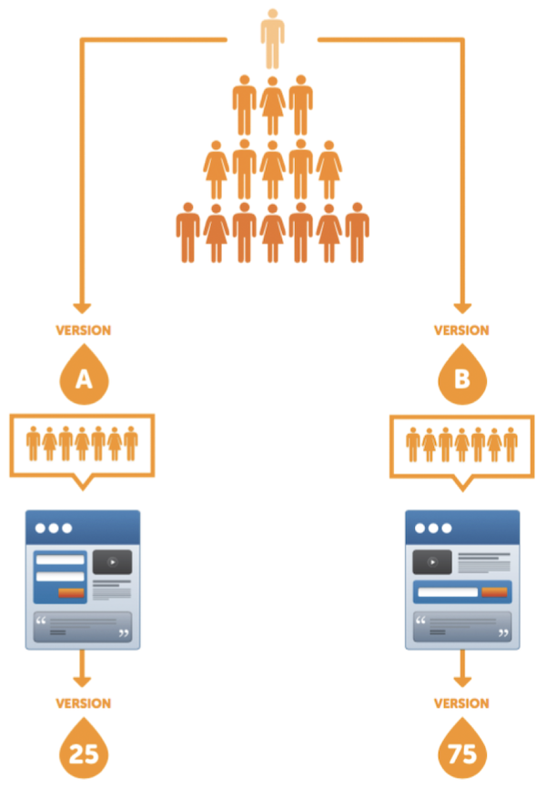

# AB testing

The AB testing application allows you to perform AB testing of a version of a page. It is possible to create a B version of the page by clicking the Save as AB test button. A copy of the page with a modified URL address will be created in which you can test the B version of the page. WebJET will then automatically ensure that the A and B versions of the page are displayed on the original URL address in a defined ratio. The visitor will still see the original URL, but instead of the A version, the B version of the page will automatically be displayed.

## What is AB testing?

- comparison of one fundamental change
- we measure the conversion of the action
- recommended sufficient sample of at least 1000 visitors/views
- ```split``` test = testing a complex change



**Benefits:**

- the test is simple and quick
- will identify important objects for us
- is easily measurable

**Disadvantages:**

- can often disappoint
- it is necessary to correctly design what we are testing and what the result should be
- we will test a big change in stages for a longer period of time

## How to prepare for the test

Prepare a hypothesis that should improve the condition

- use statistics (high bounce rate page)
- brainstorming
- survey

**What is appropriate to test:**

- title (pages, buttons)
    - concise vs descriptive
    - feature or benefit oriented
- pictures
    - smiling people vs product photo
    - color, size
    - video
- page text
    - under headings, word highlighting
    - bullets vs paragraphs
    - benefits vs features
- color
    - buttons, links, headings
- forms
    - number of fields
    - mandatory vs optional
    - division into multiple steps
- ```CTA``` elements (elements that the visitor clicks on to perform an action)
    - text, color, position, method of performing the action
- change the layout of objects
- usability
    - what would be better?
- let's not forget the post-conversion page
    - let's get more from the visitor
    - social icons, newsletter
    - bonus offer

## Creating a test

You create a version of the page by selecting the original version of the page and clicking the icon<i class="ti ti-a-b"></i> Save as AB test. This will create a copy of the page, which will display the icon in the Status column.<i class="ti ti-a-b"></i> In the VB version, you can edit the text of the page to test the impact of the changes.


It is also possible to test the so-called ```split``` tests. The visitor is generated ```cookie``` on first access, which determines which version of the page will be displayed. If the B version is generated, all subsequent pages that have the B version will also be displayed in the B version. The visitor can thus navigate between multiple pages of the B version.

In the AB testing application, it is possible to set the ratio between A and B versions, the technical names of the URL ```suffixu``` and the cookie name, the cookie validity, and most importantly, to turn AB testing on and off.

## Measuring results

- we measure the page/action after conversion
- split test will allow B versions of the thank you page
- before the test, let's clarify what and how we will measure
- even a decrease in conversion is a success of the test

In the AB testing application, a table displays a list of pages that have a B version with the option to display a version comparison graph. If you do not have a 50:50 AB version ratio, WebJET will automatically perform a proportional conversion of visits to individual versions so that the numbers can be compared.

