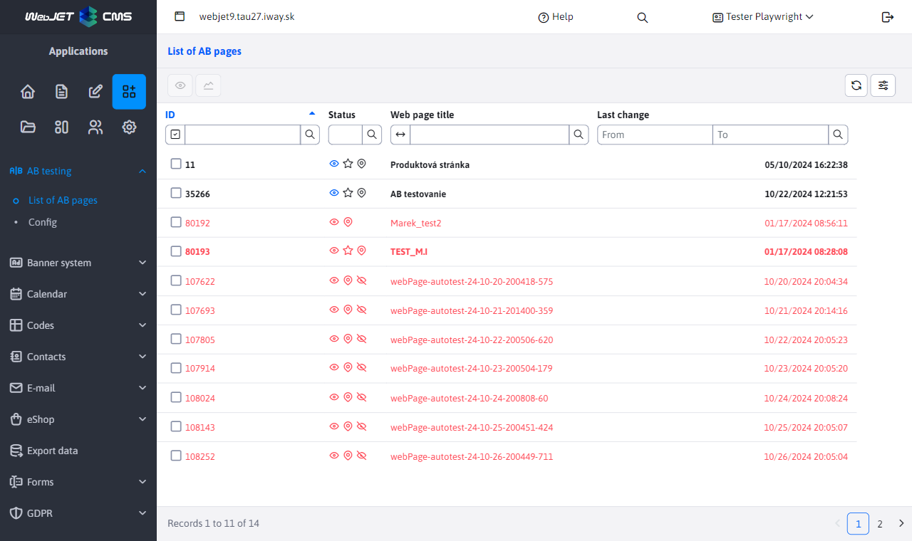
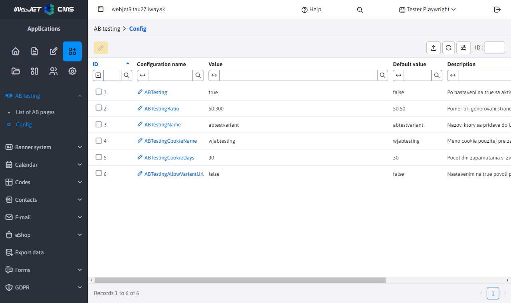
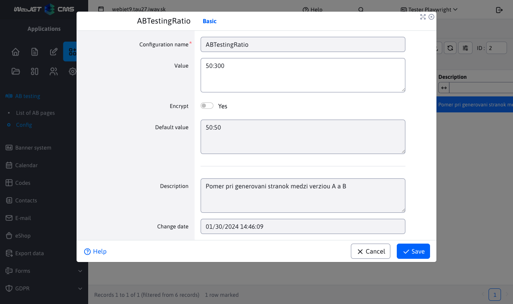

# AB testing application

The AB Testing application provides you with an overview of the AB pages and the management of the relevant configuration variables:
- List of AB pages
- Configuration

## List of AB pages

The List of AB sites section offers a list of sites that have created a B variant. These pages cannot be edited, added or deleted in any way.

You have the option to view the page and also view the Page Stats using the buttons on the table toolbar. The important thing in the statistics is to measure the results by percentage conversion according to the A/B version ratio:

## Configuration

The Configuration section allows you to view and edit the relevant configuration variables for AB testing.

The actual modification of these configuration variables is limited to modifying the value of the variable and the encryption, no other changes or actions over the variables are allowed.

### Possible configuration variables

- `ABTesting` (default `false`) - after setting to `true` AB website testing is activated
- `ABTestingRatio` (default `50:50`) - ratio of page generation between version A and B
- `ABTestingName` (default `abtestvariant`) - a name that is added to the URL of the B version of the page to distinguish it - also used to trace the B version of the page
- `ABTestingCookieName` (default `wjabtesting`) - name `cookie` used to remember the version of the test when `split` tests - if the display decides for option B, it is remembered in `cookie` with this name and accordingly the B versions of the pages will be provided hereafter
- `ABTestingCookieDays` (default `30`) - number of days to remember the selected version in AB testing - cookie expiration time
- `ABTestingAllowVariantUrl` (default `false`) - by setting to `true` enables direct display of the variant URL to non-administrators, e.g. calling `/investicie/abtestvariantb.html`.
