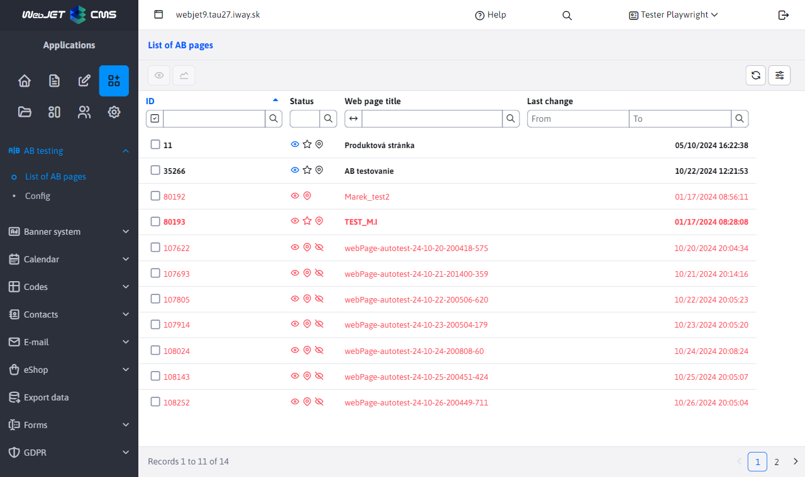
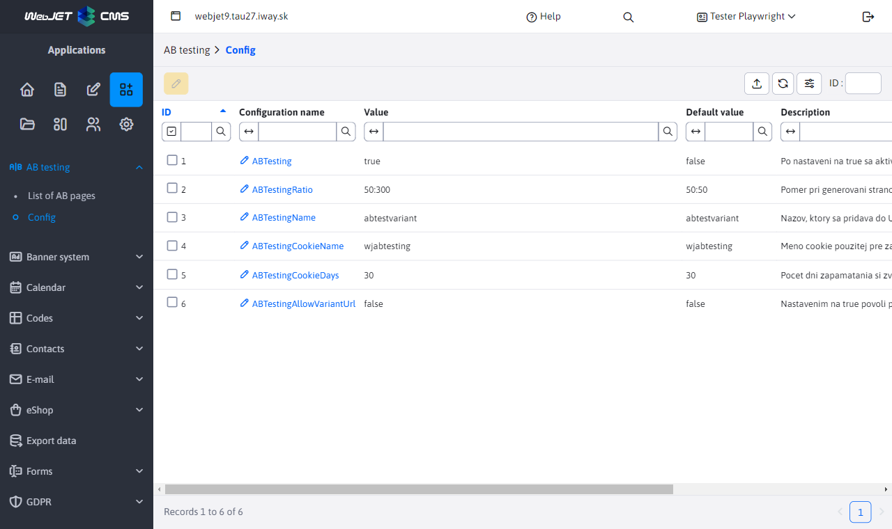
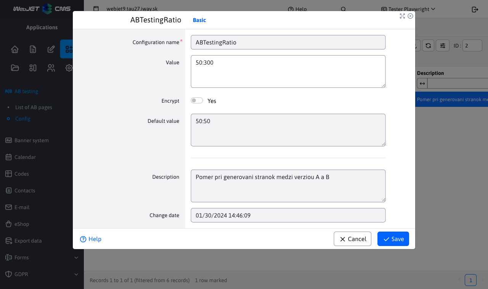

# AB testing management

The AB Testing application provides you with an overview of AB pages and management of relevant configuration variables:

- List of AB sites
- Configuration

## List of AB sites

The List of AB pages section offers a list of pages that have a B variant created. These pages cannot be edited, added or deleted in any way.

You have the option to view the page and view the Page Statistics using the buttons on the table toolbar. Important in statistics is the measurement of results by percentage conversion according to the A/B version ratio:

## Configuration

The Configuration section allows you to review and edit relevant configuration variables for AB testing.

Editing these configuration variables is limited only to editing the variable value and encryption, no other changes or actions on the variables are allowed.

### Possible configuration variables

- `ABTesting` (default `false`) - when set to `true`, AB testing of websites is activated.
- `ABTestingRatio` (default `50:50`) - ratio when generating pages between version A and B.
- `ABTestingName` (default `abtestvariant`) - name that is added to the URL of the B version of the page to distinguish it - also used to find the B version of the page.
- `ABTestingCookieName` (default `wjabtesting`) - name `cookie` used to remember the test version during `split` tests - if the B variant is chosen when displayed, it will be remembered in `cookie` with this name and B versions of the pages will be provided accordingly.
- `ABTestingCookieDays` (default `30`) - number of days to remember the selected version during AB testing - cookie expiration time.
- `ABTestingAllowVariantUrl` (default `false`) - setting to `true` allows direct display of the variant URL address even to non-administrators, e.g. calling `/investicie/abtestvariantb.html`.
- `ABTestingForLoggedUser` (default `false`) - setting it to `true` starts a mode where an unlogged visitor is always shown the A variant of the website and a logged-in visitor is always shown the B variant of the website.