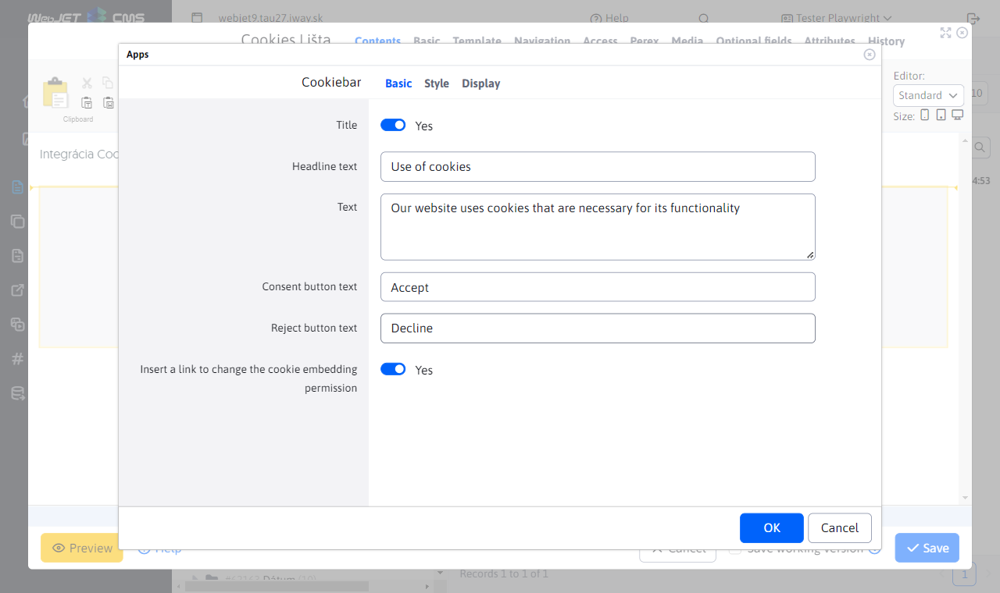
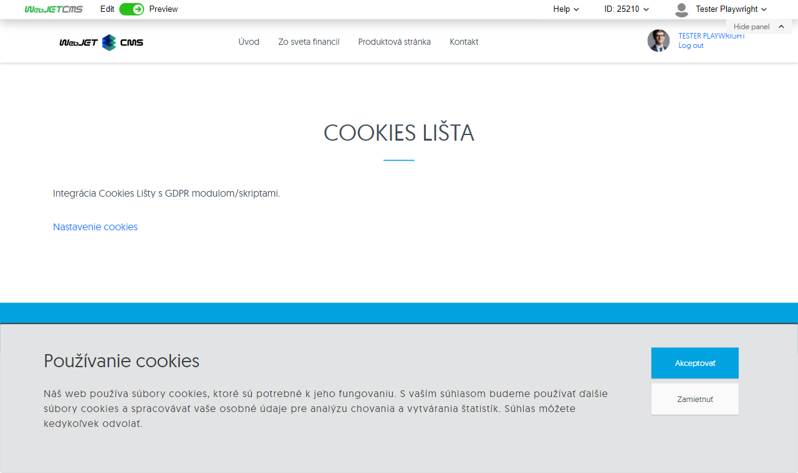

# Cookie bar

Add a predefined cookie consent panel to your site where visitors can confirm their consent to the storage of cookies on their device. We recommend placing this app in the footer so that it automatically appears on every page. Once consent has been granted, the panel will not reappear for 30 days.

The cookie bar is most commonly used on websites that do not use tracking or marketing tools and where the sole purpose of the cookie is to provide basic site functionality. Unlike [GDPR cookie consent](/redactor/apps/gdpr/README) where the user has the possibility to modify their cookie settings in detail (e.g. accepting only necessary or marketing cookies), the Cookies bar is only intended to inform the user and does not allow active control over what types of cookies are stored.

## Application settings

In this section it is possible to set:

### Basic tab:
- **Title text**: Enter the text that will appear as the main heading on the tab. For example, it can be "Use of cookies".
- **Text**: Description of the information you want to show users, for example "Our website uses cookies".
- **Accept button text**: Text for the button that the user clicks to accept cookies, for example "Accept".
- **Reject button text**: Text for the button that the user clicks to reject cookies, for example "Reject".
- **Insert link to change cookie permission**: A link that will allow users to change their decision about cookies in the future.

### Style tab:
- **Background colour**: Set the background colour for the notification.
- **Title colour**: Specify the colour of the heading.
- **Text colour**: The colour of the text itself.
- **Button colour**: Buttons background color.
- **Button text colour**: Text colour on buttons.
- **Location**: Define the location of the notification, "Down" or "Up".
- **Internal offset from top in px**: For example `25px` to set the correct offset from the top of the element.
- **Internal offset from bottom in px**: For example `25px` for internal indentation from the bottom of the notification.

## View application

