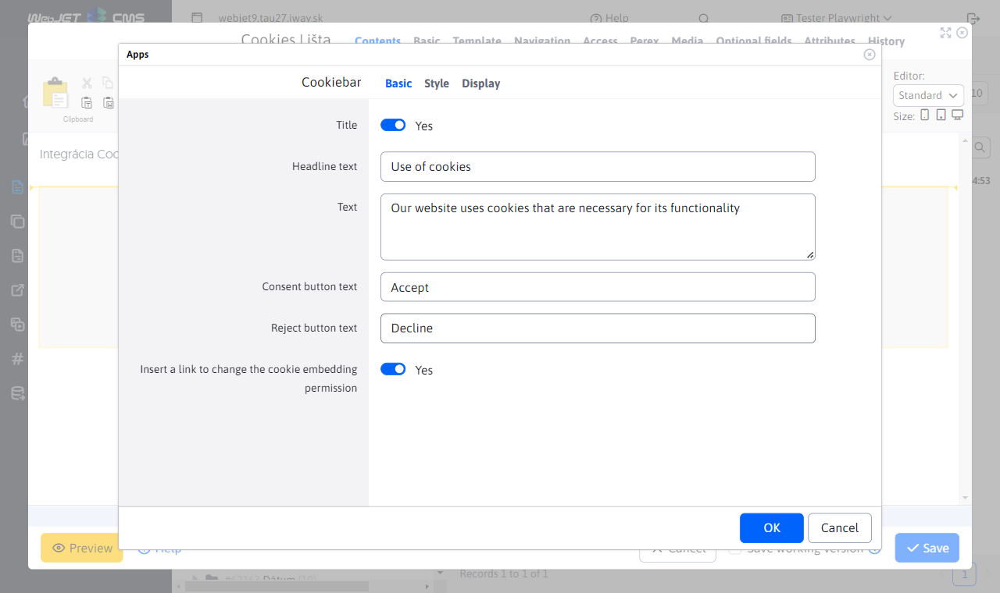
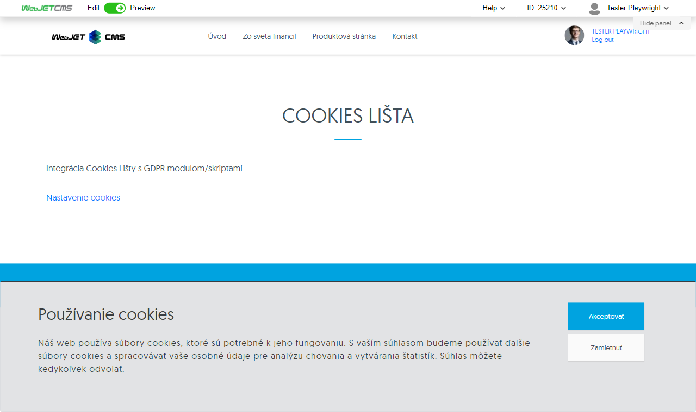

# Cookie bar

Add a pre-defined cookie consent panel to your site where visitors can confirm their consent to cookies being stored on their device. We recommend placing this application in the footer so that it automatically appears on every page. Once consent is granted, the panel will not appear again for 30 days.

The cookie bar is most often used on websites that do not use tracking or marketing tools and where the sole purpose of cookies is to ensure basic site functionality.
Unlike [GDPR cookies consent](/redactor/apps/gdpr/README), where the user has the option to adjust their cookie settings in detail (e.g. accepting only necessary or marketing cookies), the Cookies bar is intended only to inform the user and does not allow active control over what types of cookies are stored.

## Application settings

In this section you can set:

### Basic tab:

- **Headline text**: Enter the text that will appear as the main title on the card. For example, this could be "Using Cookies".
- **Text**: A description of the information you want to display to users, for example "Our website uses cookies".
- **Accept button text**: Text for the button that the user clicks to accept cookies, for example "Accept".
- **Reject button text**: Text for the button that the user clicks to reject cookies, for example "Reject".
- **Insert link to change cookie consent**: A link that will allow users to change their cookie preferences in the future.

### Style tab:

- **Background color**: Set the background color for the notification display.
- **Title Color**: Enter the title color.
- **Text color**: The color of the text itself.
- **Button color**: Background color of the buttons.
- **Button text color**: Color of the text on the buttons.
- **Location**: Define the location of the notification, "Bottom" or "Top".
- **Inner top padding in px**: For example `25px`, to set the correct padding from the top of the element.
- **Inner padding from bottom in px**: For example `25px` for inner padding from the bottom of the announcement.

## View the application

