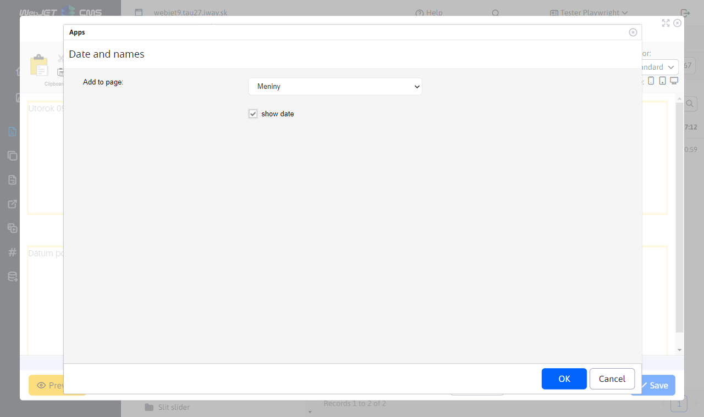
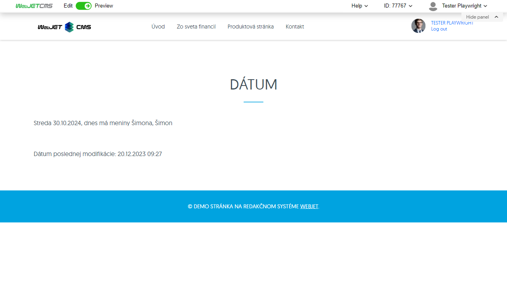

# Date

The application will insert the current date, the name of the date, or the date of the last change to the web page.

## Application settings

In this section it is possible to set:
- The format of the application as it appears
- For some formats, you can choose whether to display the date or time

## View application

