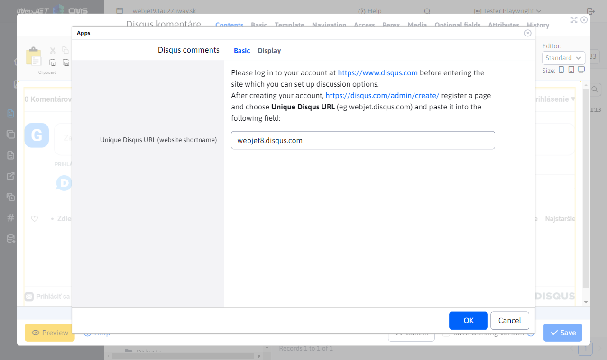
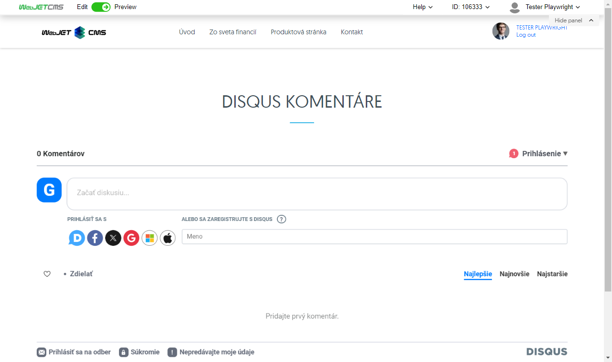

# Disqus comments

Embed Disqus Comments on your website. Before adding it to your site, register for a free account at https://www.disqus.com to set up discussion options.

## Application settings

After creating an account, register a site at https://disqus.com/admin/create/ and choose a Unique Disqus URL (e.g. webjet.disqus.com) and enter it in the following field:
- Unique Disqus URL (website shortname)

## View application

