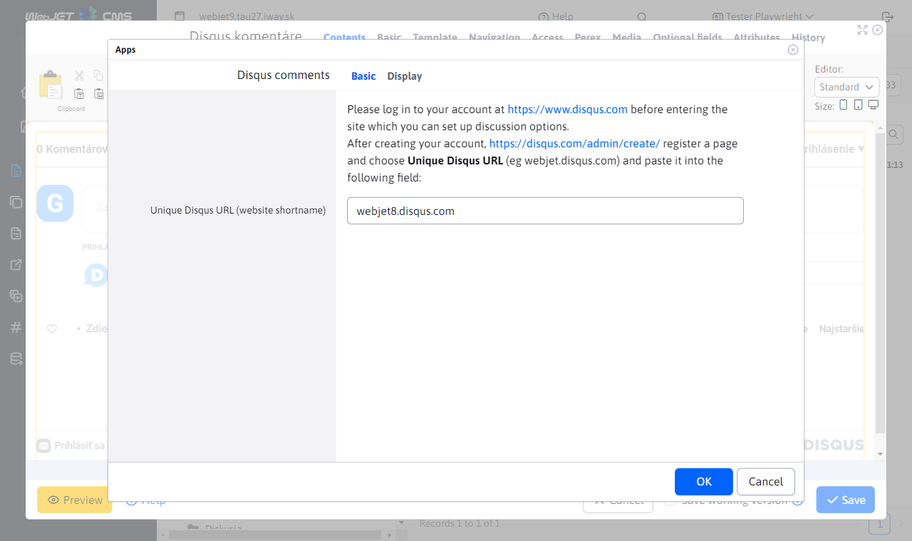
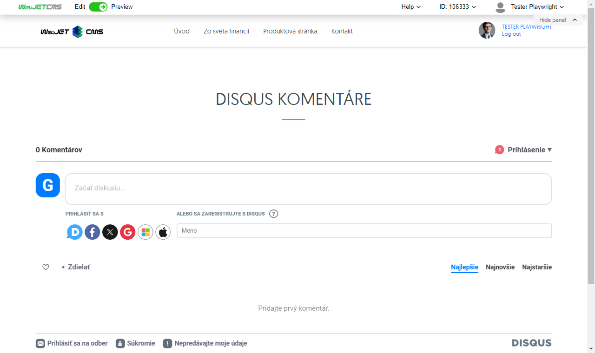

# Disqus comments

Add Disqus comments to your website. Before adding them to your site, register a free account at https://www.disqus.com through which you will set up discussion options.

## Application settings

After creating an account, register a page at https://disqus.com/admin/create/ and choose a Unique Disqus URL (e.g. webjet.disqus.com) and paste it into the following field:

- Unique Disqus URL (website shortname)

## View the application

