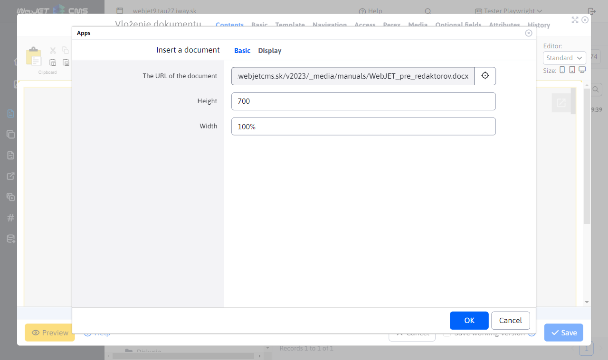

# Inserting a document

Offer visitors the ability to view documents directly on your site without the need to download them. Insert a preview of doc, xls, ppt, or pdf documents using Google Docs Viewer and ensure convenient and fast viewing of content.

## Application settings

In the settings you can set:
- Document URL
- Width
- Height

## View the application

