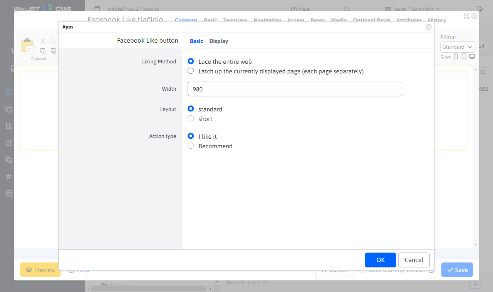
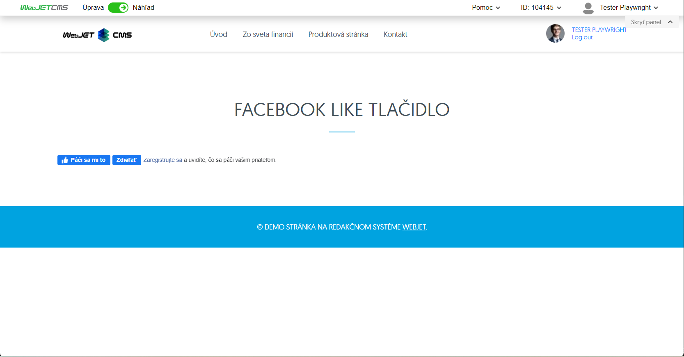

# Facebook Like button

The Facebook Like/share button allows you to set a "Like" or share the page content with the page visitor's friends.

## Application settings

- **Method of liking**: Select your preferred method of liking:
  - Like the whole site
  - Like the currently displayed page (each page separately)
- **Width**: Specify the width to display, for example `980`.
- **Layout**: Select a layout type:
  - Standard
  - Short
- **Type of action**: Select the type of action you want to perform:
  - I like
  - Recommend

## View application

