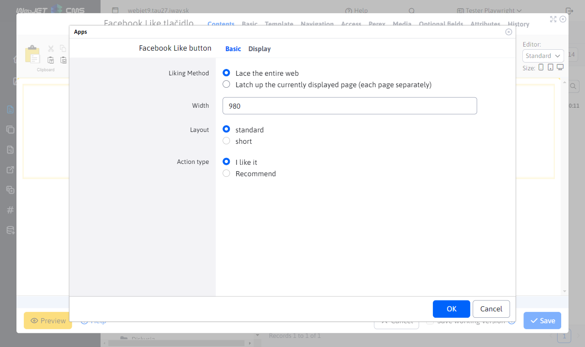
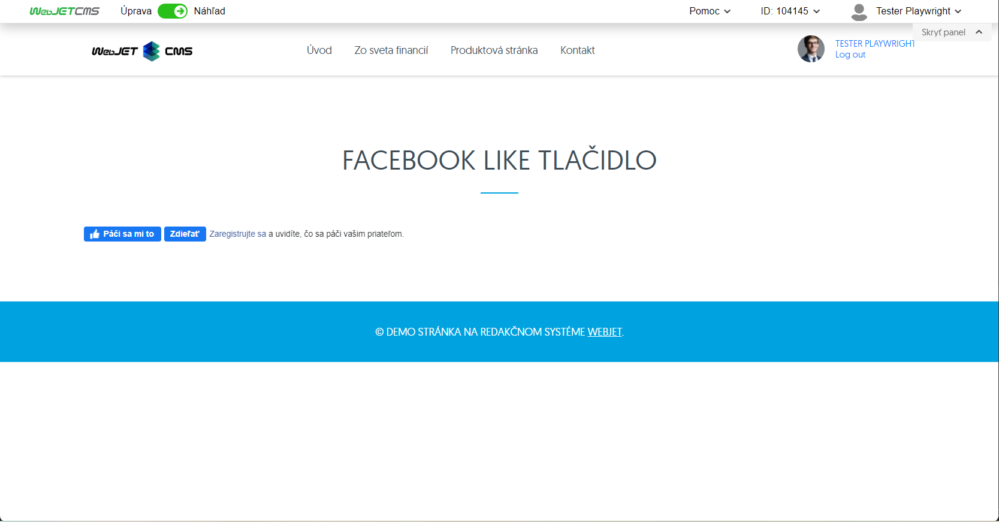

# Facebook Like button

The Facebook Like/share button allows you to "Like" or share page content with the page visitor's friends.

## Application settings

- **Like Method**: Select your preferred like method:
  - Like the entire website
  - Like the currently displayed page (each page separately)
- **Width**: Enter the width for the display, for example `980`.
- **Layout**: Select layout type:
  - Standard
  - Short
- **Action type**: Select the type of action you want to perform:
  - I like it.
  - Recommend

## View the application

