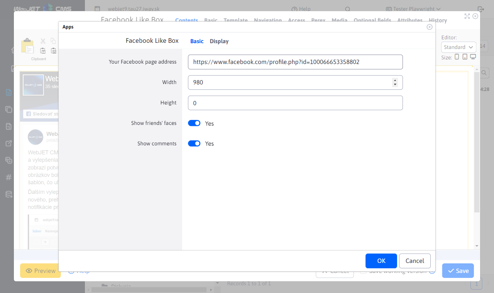
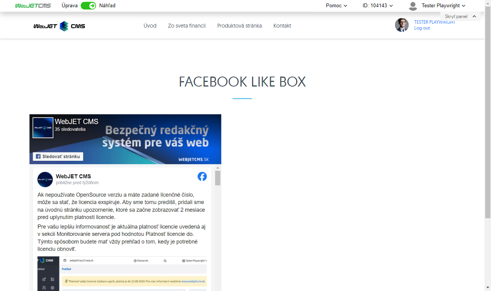

# Facebook Like Box

The Facebook Like Box app allows you to promote your Facebook Page (it cannot be used for groups and personal profiles). The app displays the posts on the board and the friends list of the page.

## Application settings

- **Your Facebook page address**: Enter the address of a Facebook page, for example `https://www.facebook.com/interway.sk/`.
- **Width**: Specify the width to display the page, for example `980`.
- **Height**: Specify the height to display the page, for example `600`.
- **Show your friends' faces**: Enable to show friends' faces.
- **Show comments**: Enable to show comments.

## View application

