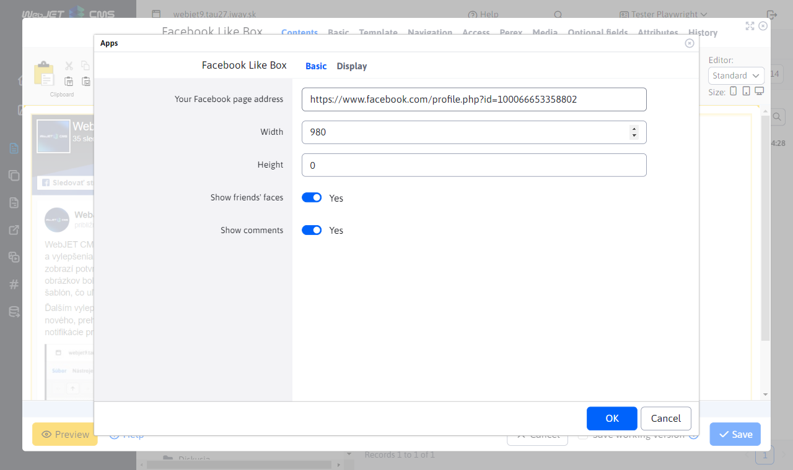
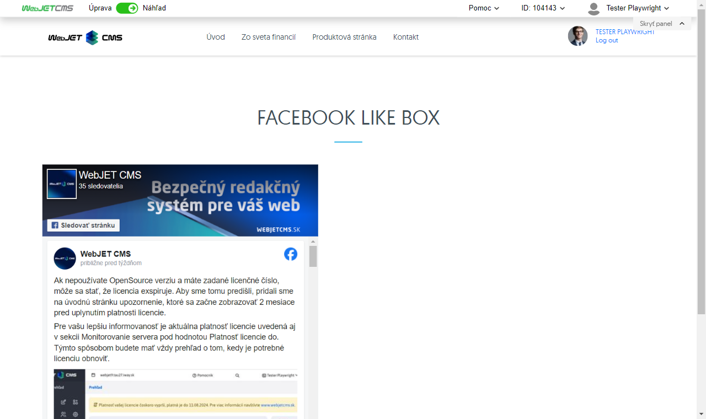

# Facebook Like Box

The Facebook Like Box app allows you to promote your Facebook page (cannot be used for groups or personal profiles). The app will display posts on the wall and the page's friends list.

## Application settings

- **Your Facebook Page Address**: Enter the address of your Facebook Page, for example `https://www.facebook.com/interway.sk/`.
- **Width**: Enter the width for the page display, for example `980`.
- **Height**: Enter the height for the page display, for example `600`.
- **Show friends' faces**: Enable the display of friends' faces.
- **Show comments**: Enable viewing of comments.

## View the application

