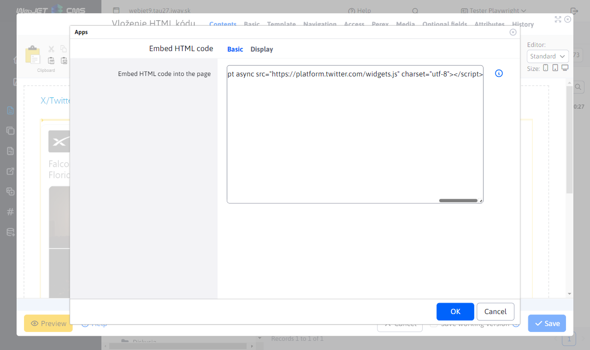

# Inserting HTML code

Add external HTML code to your page for apps that aren't directly supported, like a TikTok video or a post from X/Twitter. Enrich your content with interactive elements and engage your visitors.

## Application settings

In the settings you can:

- Insert HTML code into the page

## View the application

