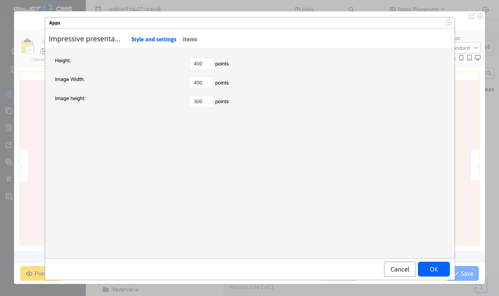
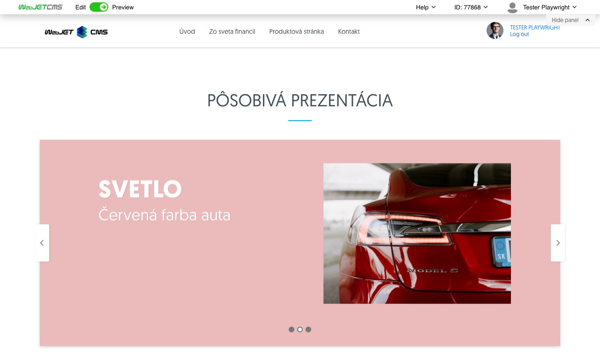

# Impressive presentation

Animated presentation view with 3D effect of transition between slides. You can define title, subtitle, font and background color, illustration photo for each slide.

## Application settings

# Style and settings

In this section it is possible to set:
- Height
- Image width
- Image height

# Items

This section is to add or remove an item: When adding, the heading, subheading, redirect, heading color, subheading color, background color can be filled in. At the same time, the font style (bold, italic, indent, size and style) can be adjusted for the heading and subheading using the advanced settings. For headings, the order can be changed by dragging and dropping. You can remove an item by clicking on the red cross.

## View application

