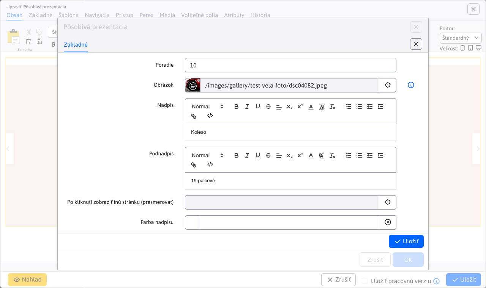

# Impressive presentation

Animated presentation view with 3D effect of transition between slides. You can define title, subtitle, font and background color, illustration photo for each slide.

## Application settings

Settings tabs **Style and settings** a **Items**.

### Style and settings

In this section it is possible to set:
- Height
- Image width
- Image height

### Items

In this section you can see and manage the application items, so classic actions like add/edit/delete...

You can set the following parameters for each item:
- **Image**, image selection using the explorer is supported, as well as direct entry of the image path
- **Title**, image caption (text styling is also possible)
- **Subtitle**, image subtitle (text styling is also possible)
- **Click to view another page (redirect)**, select the page you will be redirected to (direct path entry is also supported)
- **Title colour**
- **Colour of the subtitle**
- **Background colour**

## View application

