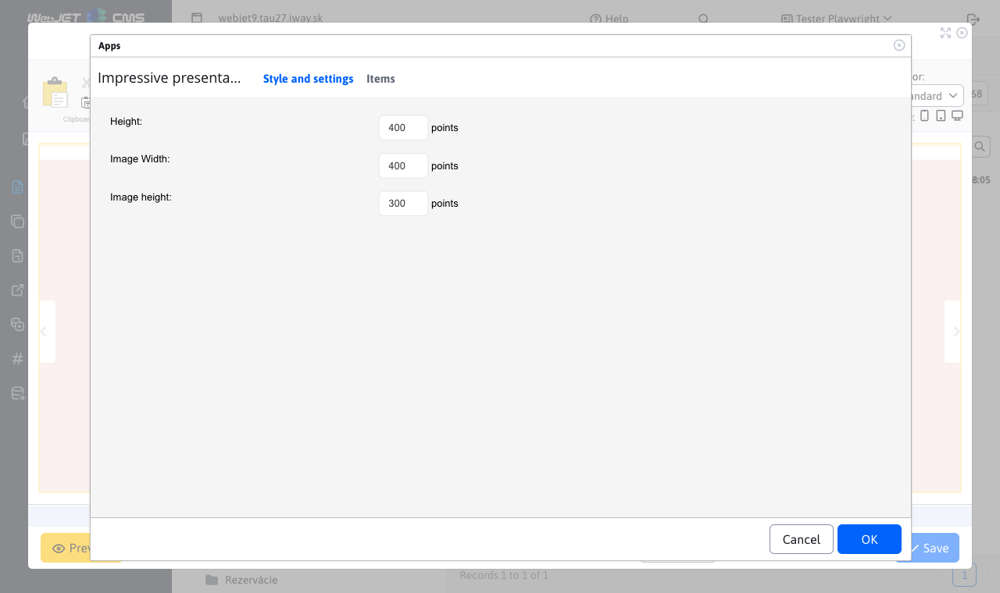
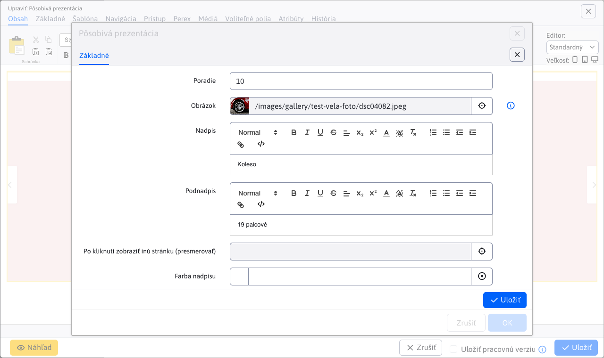
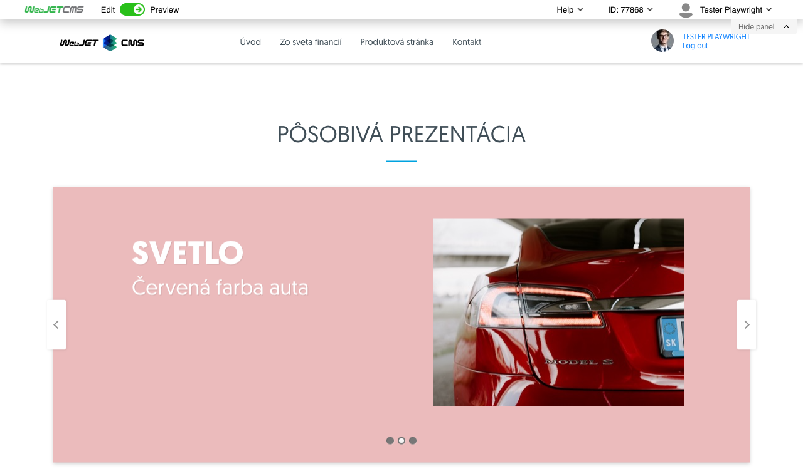

# Impressive presentation

Animated presentation display with 3D transition effect between slides. You can define a title, subtitle, font and background color, and illustrative photo for each slide.

## Application settings

**Style and Settings** and **Items** settings tabs.

### Style and settings

In this section you can set:

- Height
- Image width
- Image height

### Items

In this section you can see and manage application items, so classic actions like adding/editing/deleting...

You can set the following parameters for individual items:

- **Image**, image selection using explorer is supported, as well as direct entry of the image path
- **Title**, image title (text styling is also possible)
- **Subtitle**, image subtitle (text styling is also possible)
- **When clicked, display another page (redirect)**, select the page to which you will be redirected (direct path entry is also supported)
- **Title color**
- **Subtitle color**
- **Background color**

## View the application

