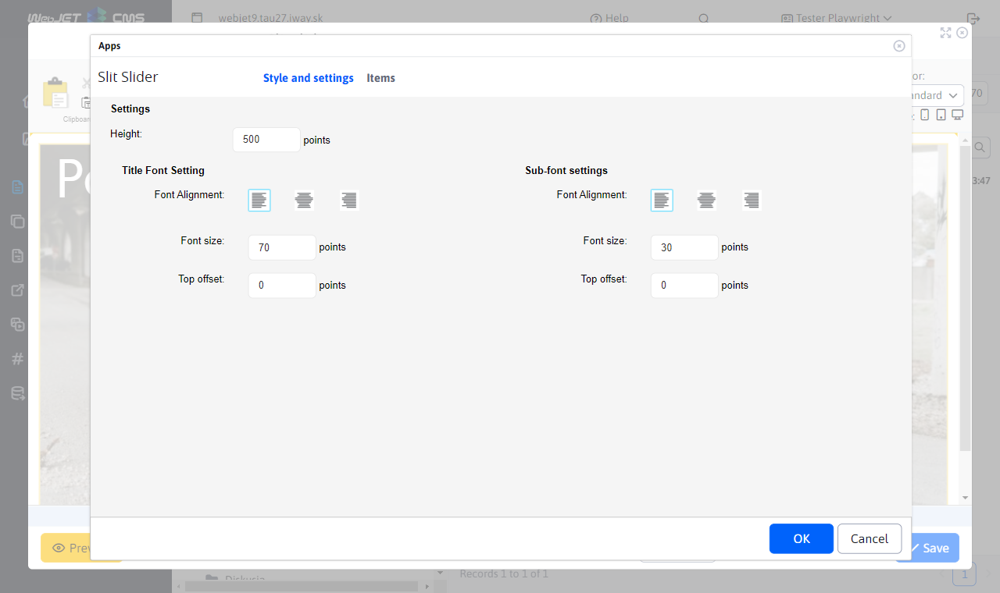
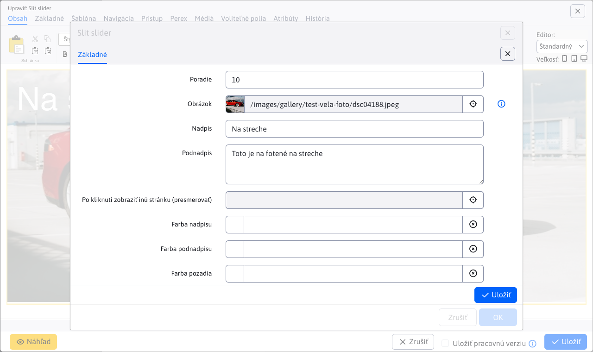
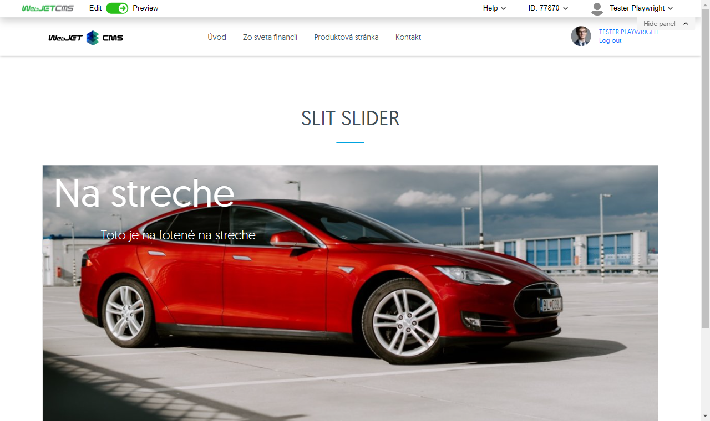

# Slit slider

Bring your page to life with a stunning animated photo slider. Take advantage of the split and open photo effect that adds dynamism and interest. Each photo can be accompanied by a caption and text, allowing for even more personalization and customer interaction.

## Application settings

### Style and settings

In this section it is possible to set:
- **Height**
- **Setting the heading font** (Font Alignment, Font Size, Top Offset)
- **Setting the subtitle font** (Font Alignment, Font Size, Top Offset)

### Items

In this section you can see and manage the application items, so classic actions like add/edit/delete...

You can set the following parameters for each item:
- **Image**, image selection using the explorer is supported, as well as direct entry of the image path
- **Title**, picture caption
- **Subtitle**, image caption
- **Click to view another page (redirect)**, select the page you will be redirected to (direct path entry is also supported)
- **Title colour**
- **Colour of the subtitle**
- **Background colour**

## View application

