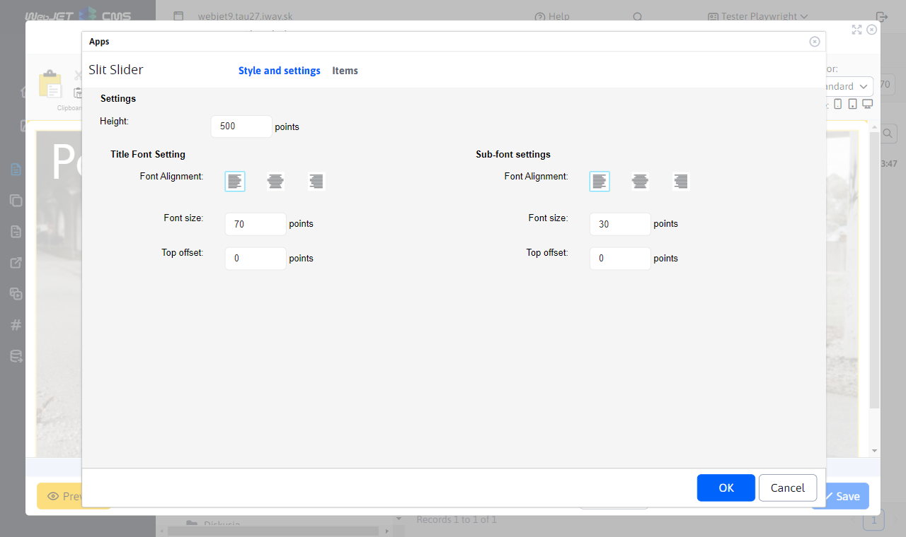
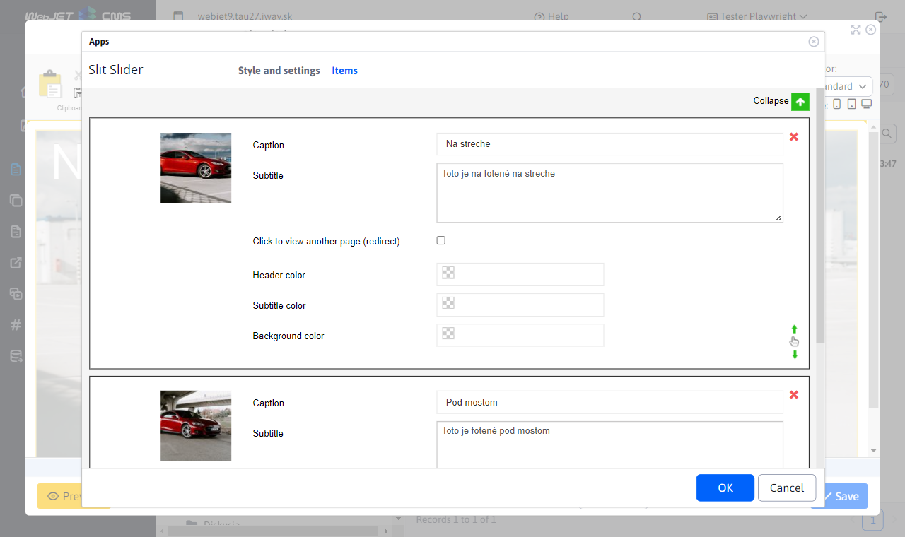
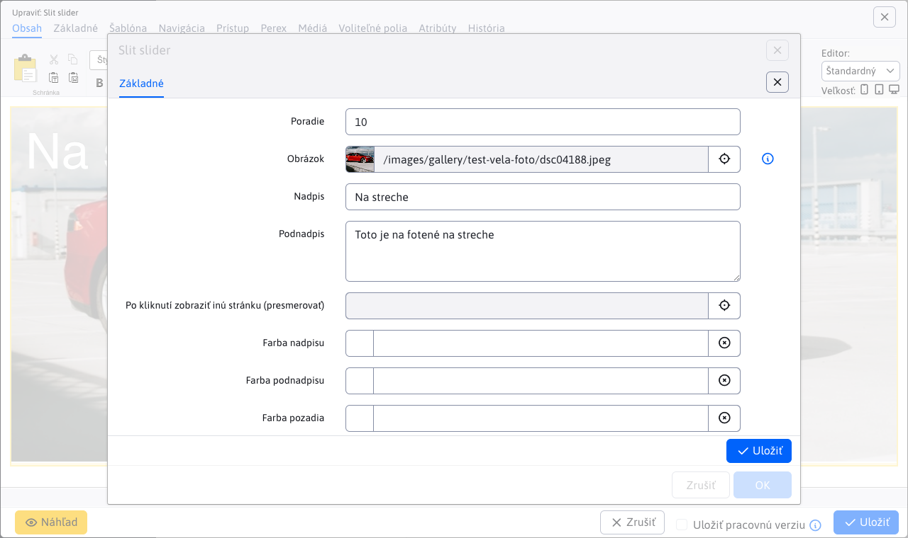
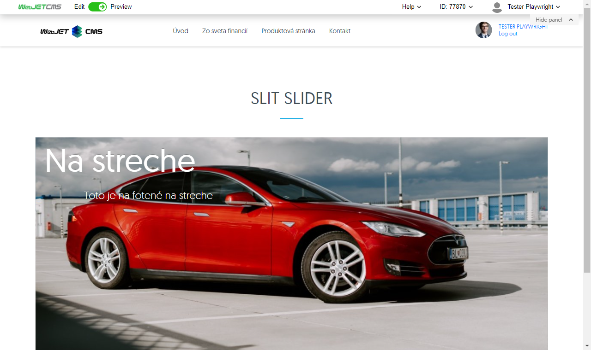

# Slit slider

Bring your site to life with a stunning animated photo slider. Use the split and open effect of photos to add dynamism and interest. Each photo can be accompanied by a title and text, allowing for even greater personalization and interaction with customers.

## Application settings

### Style and settings

In this section you can set:

- **Height**
- **Title font settings** (Font alignment, Font size, Top offset)
- **Subtitle font settings** (Font alignment, Font size, Top offset)

### Items

In this section, you can see and manage application items, so classic actions like adding/editing/deleting...

You can set the following parameters for individual items:

- **Image**, image selection using explorer is supported, as well as direct entry of the image path
- **Title**, image title
- **Subtitle**, subtitle of the image
- **When clicked, display another page (redirect)**, select the page to which you will be redirected (direct path entry is also supported)
- **Title color**
- **Subtitle color**
- **Background color**

## View the application

