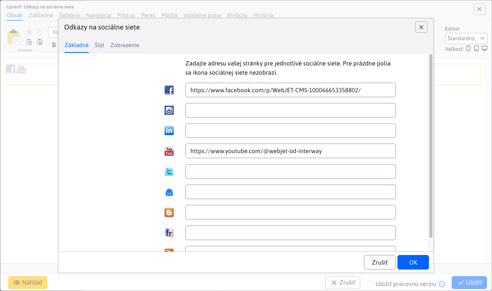
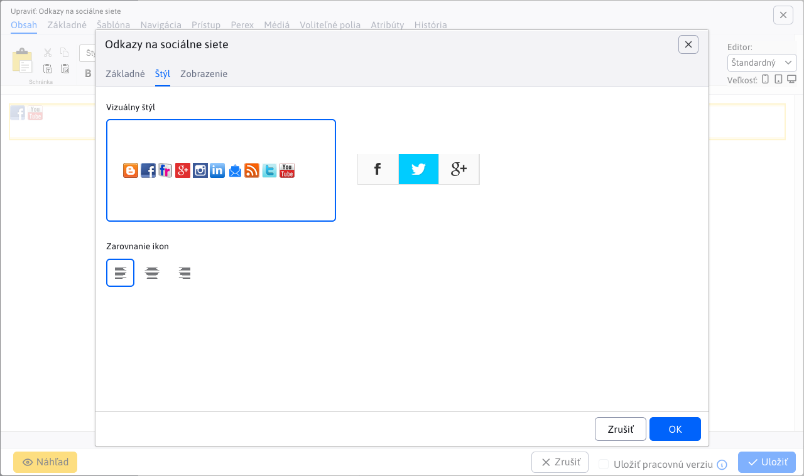
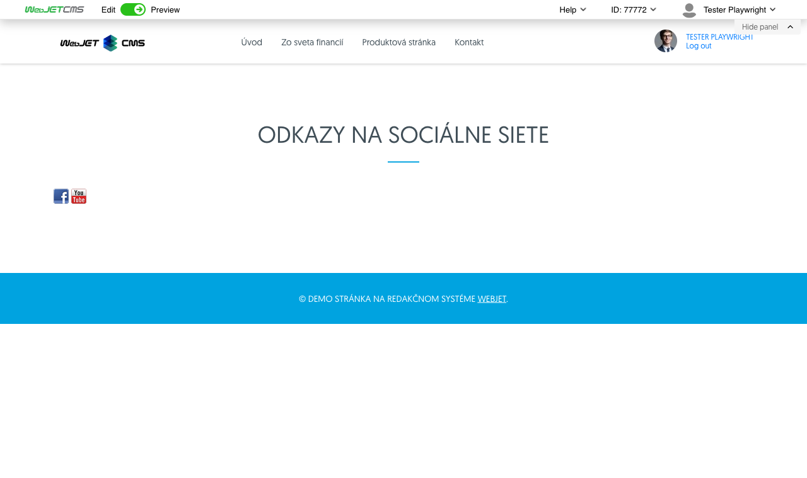

# Links to social networks

Insert icons into the page with links to social networks Facebook, Twitter, Instagram, LinkedIn, Flickr, etc.

## Application settings

The setup includes tabs:
- **Basic**
- **Style**

### Tab - Basic

In the tab, you can enter the address of your page for each social network. For empty fields, the social network icon will not appear.

### Card - Style

In the tab you can set:
- **Visual style** - icon displays
- **Alignment of icons** - left, centre, right

## View application

