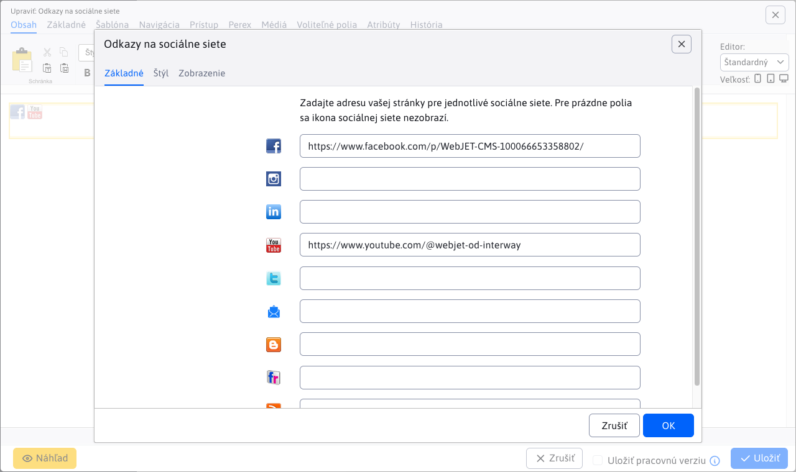
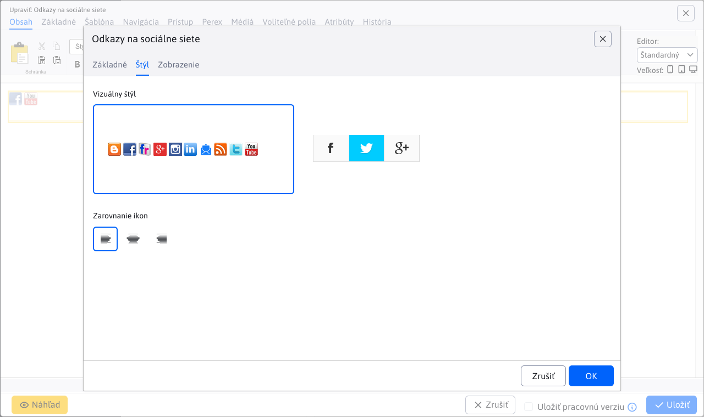
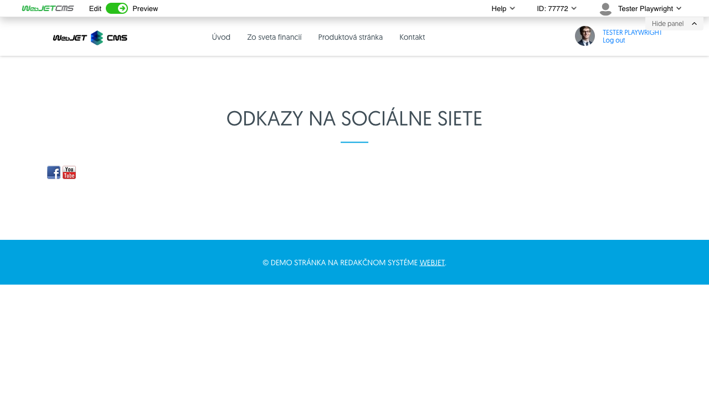

# Social media links

Inserts icons with links to social networks Facebook, Twitter, Instagram, LinkedIn, Flickr, etc. into the page.

## Application settings

The settings include the following tabs:

- **Basic**
- **Style**

### Tab - Basic

In the tab, you can enter the address of your page for each social network. For empty fields, the social network icon will not be displayed.

### Tab - Style

In the tab you can set:

- **Visual style** - icon views
- **Icon alignment** - left, center, right

## View the application

