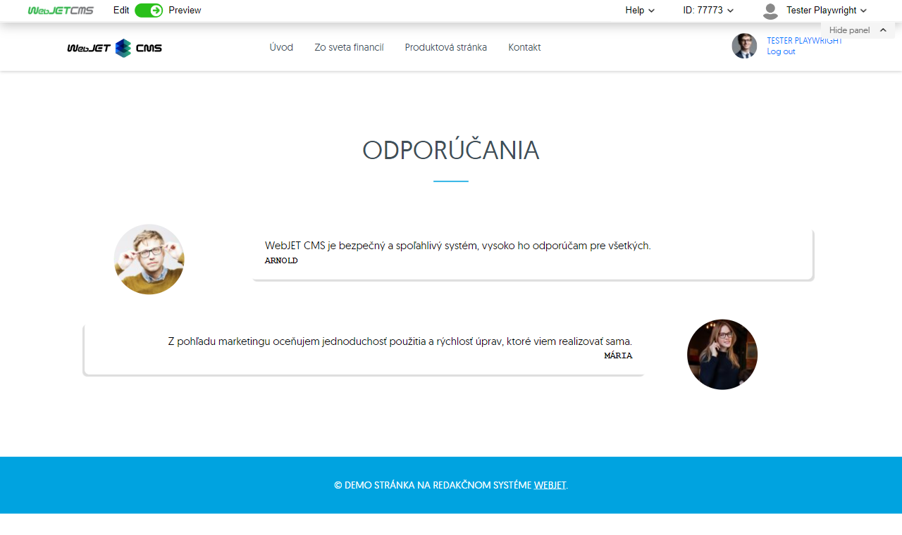
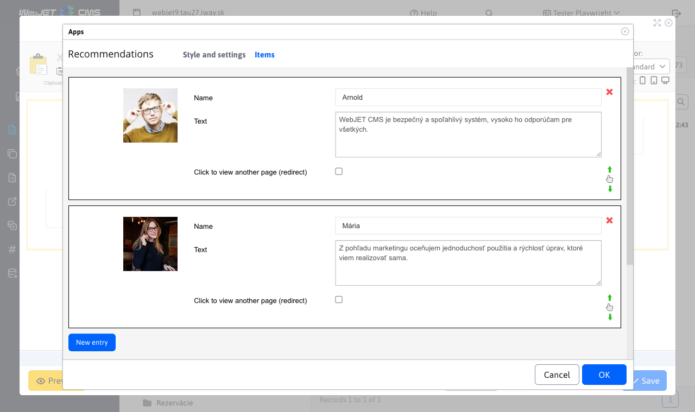

# Recommendations

Embed an app on your site that displays your customers' recommendations.
The application will increase the credibility of your website and assure potential customers of the quality of your services.

## Application settings

### Items

In this section, you can add, edit, or delete an item (recommendation). The table also supports the ability to change the sort order using the `drag&drop` action.

For each item you can set:

- **Order** - order of recommendation in the display
- **Image** - image of the customer who gave the recommendation
- **Name** - name of the customer who gave the recommendation
- **Text** - recommendation text
- **Show another page after clicking (redirect)** - if this option is selected, a field will be displayed for entering the URL address to which the user will be redirected after clicking on the item

### Style

In this section you can choose the style that is applied to the recommendations. This means you can choose how they should be displayed on the website.

### Settings

In this section you can set:

- View photos
- Display names
- Name color
- Text color
- Background color

