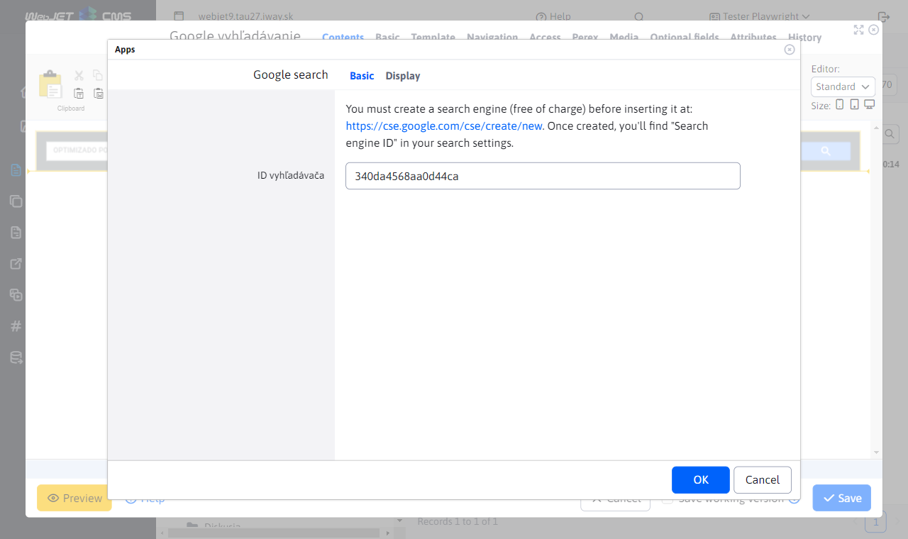
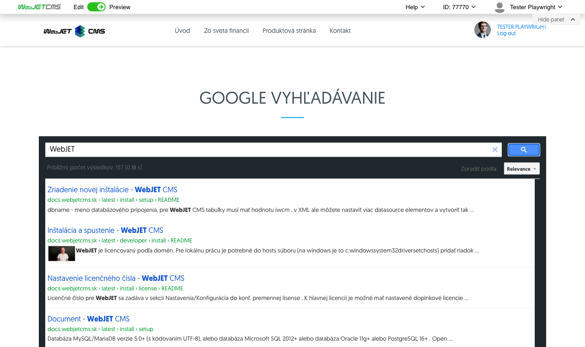

# Google search

With this app, you can place a Google search box on your page to search your site using Google Index/Google Custom Search.

You must (for free) create a search engine at the following address before embedding it in the site: [cse.google.com](https://cse.google.com/cse/create/new). Once created, you will find the "Search Engine ID" entry in the search engine settings.

## Application settings

In this section it is possible to set:
- Search engine ID - value retrieved on the page [cse.google.com](https://cse.google.com/cse/create/new)

## View application

