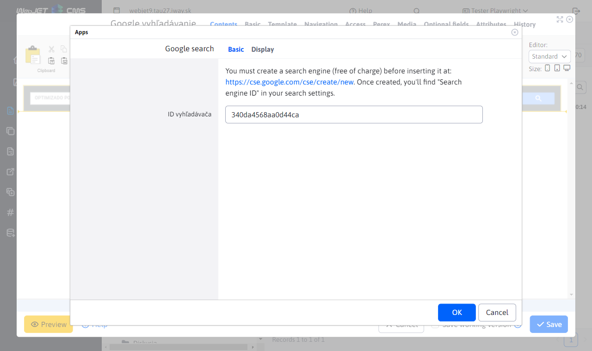

# Google search

Through this application, you can place a Google search box on your page to search your website using the Google index/Google Custom Search.

Before embedding it into your site, you must create a search engine (for free) at: [cse.google.com](https://cse.google.com/cse/create/new). Once created, you will find the "Search Engine ID" item in the search engine settings.

## Application settings

In this section you can set:

- Search Engine ID - value obtained from [cse.google.com](https://cse.google.com/cse/create/new)

## View the application

