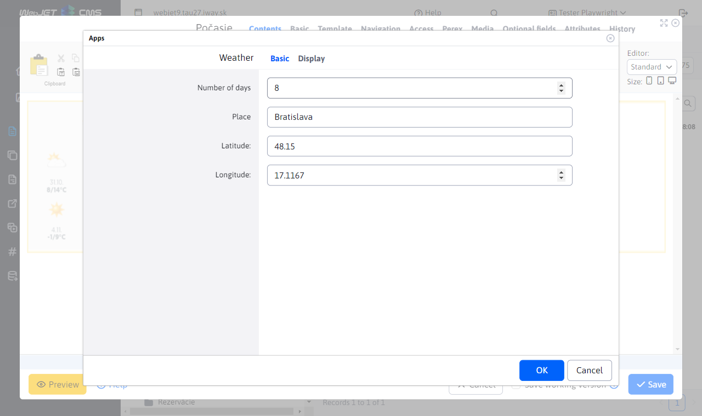
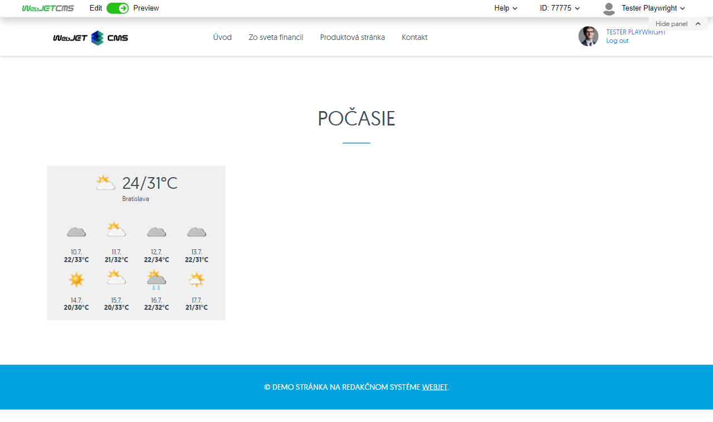

# Weather

Displays the current weather and forecast for the following days for the specified city/GPS coordinates. The weather data is provided by the service [met.no](https://www.met.no/en).

## Application settings

In this section it is possible to set:
- Number of days
- Place
- Earth. width
- Earth. length

## View application

