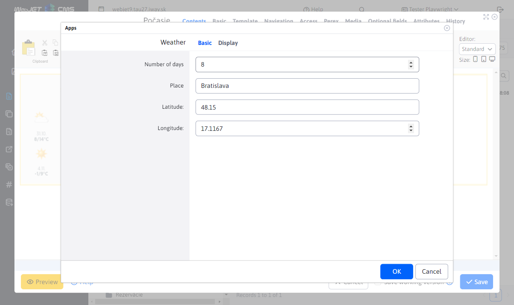
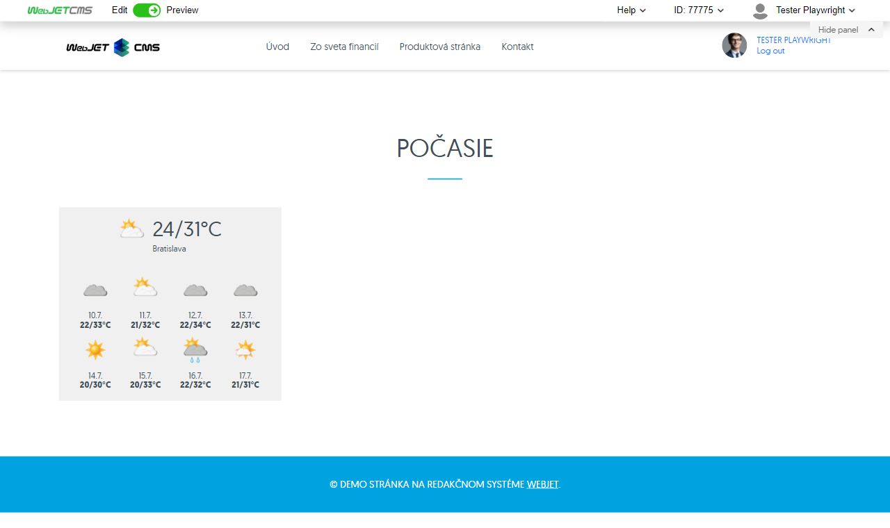

# Weather

Displays the current weather and the forecast for the next few days for the specified city/GPS coordinates. Weather data is provided by [met.no](https://www.met.no/en).

## Application settings

In this section you can set:

- Number of days
- Location
- Latitude
- Earth's length

## View the application

