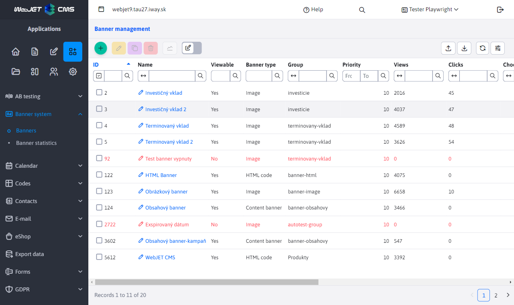
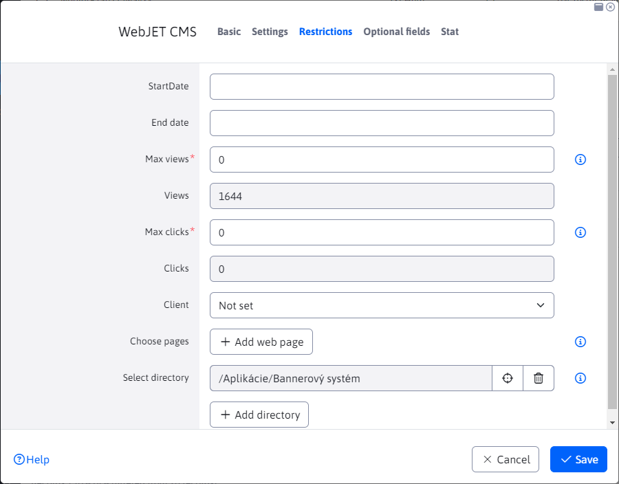
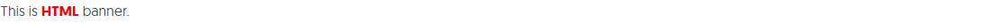
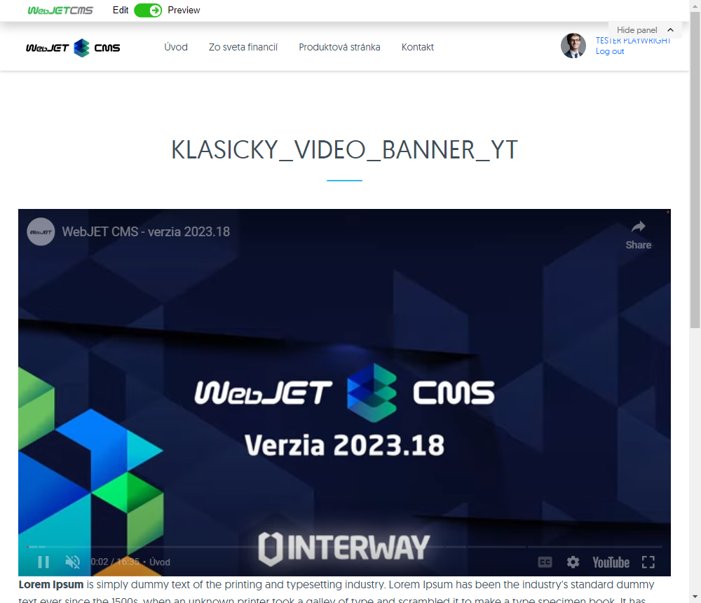
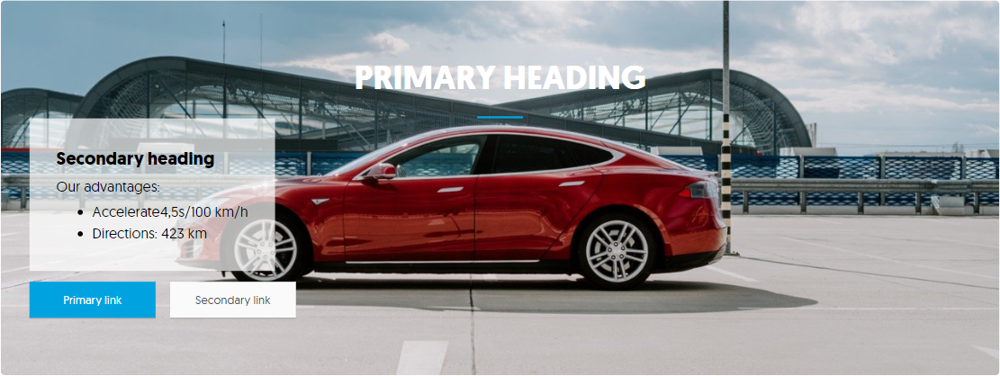
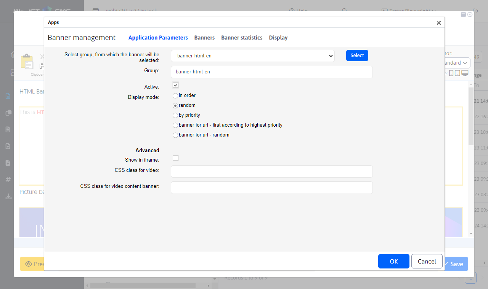
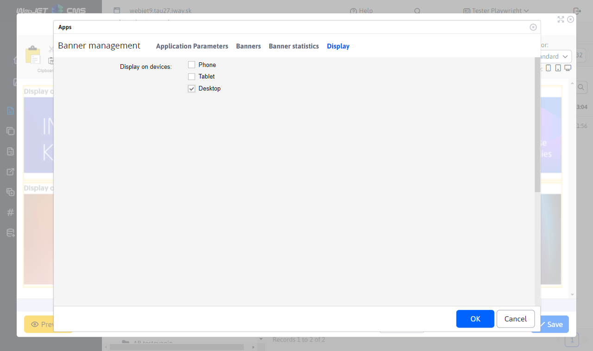
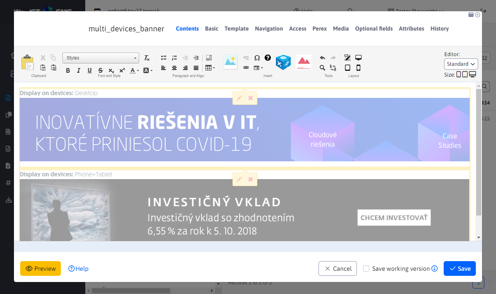
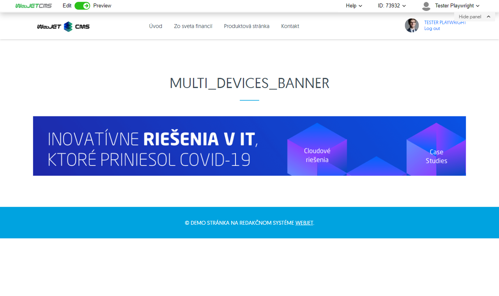

# Banner system

Banner system application, allows you to insert a banner into the page. The system supports the following types of banners:
- Image - displays a static image or an animated one `gif`. It records clicks on the banner.
- Html code - inserts the specified HTML code of the dynamic banner into the page. It does not register clicks on the banner.
- Content banner - inserts an image in the background above which text and buttons for performing an action (click to action buttons) are placed.
- Video - embeds a local video file or a YouTube video into the page.

In the table, banners that cannot be displayed are shown in red. Not only the active option is checked, but also the limitations on the number of impressions/clicks and the date limitations. You can use filtering by the Displayable column to filter the displayable banners.

## General banner parameters

The parameters in the Basic and Restrictions tabs are common to different types of banners.

- Title - your banner name (it is not displayed anywhere on the website, it is only used to identify you).
- Banner type - Image, HTML code or Content banner
- Group - group for the banner, after entering the beginning of the group name or character `*` displays the existing groups to choose from. Groups are used as a location in the design of a web page (e.g. `top-banner`, or `banner-left-menu`) and then when the page is displayed, a banner from the specified group is displayed at the given position.
- Active - you can activate/deactivate banner display.
- Priority - if you set a banner to a higher priority, it will be given priority over lower priority banners (it also depends on the settings of the application for displaying the banner).

In the restrictions tab you can set:
- Start date - the start date and time when the banner should start to be displayed (it will start to be displayed after the specified date). If the field is empty, the restriction is not applied.
- End Date - the end date and time when the banner should stop displaying (it will stop displaying after the specified date). If the field is empty, the restriction is not applied.
- Maximum number of views - the maximum number of views of the banner. Setting to 0 disables this limitation.
- Views (read-only) - displays the current number of banner views.
- Maximum number of clicks - the maximum number of clicks on the banner (only for banners that record clicks, typically Image banner). Setting it to 0 disables this limitation.
- Clicks (read-only) - shows the current number of clicks on the banner.
- Client - if the user does not have the "Show all banners" permission, only those banners where he is set as a client will be displayed in the banner list. This can be e.g. an agency that edits your banners in the system.
- Select Pages - Click Add Web Page to select one or more pages on which the banner can be displayed. If no site is selected, the banner can be displayed on all sites (unless a restriction is created by directory selection).
- Select Directory - Click Add Directory to select one or more directories in which the banner will be displayed. If a directory is set for the banner, the banner will be displayed on all pages in that directory as well as all pages in sub-directories. If no directory is selected, the banner will be displayed in all pages (unless a restriction is created by page selection).

The Optional Fields tab allows you to set field values according to the needs of your implementation, the Statistics tab displays a graph of the statistics of views and clicks on the banner.

## Banner type image

The image type banner contains the following options in the Settings tab:
- Banner placement address - the address of the banner image (e.g. `/images/banner.gif`).
- Redirect line - the address to which you are redirected after clicking on the banner (e.g. `/sk/produkty/`).
- Destination - you can select in which frame the redirect line will be opened (custom frame, new window, top frame, parent frame).

## Banner type HTML code

The HTML code banner contains the following options in the Settings tab:
- Redirect line - the address to which you are redirected after clicking on the banner (e.g. `/sk/produkty/`). In the HTML code, you must point the link to the address `/components/_common/clk.jsp?bid=ID` where ID is the ID of the banner (you have to save it first to get the ID).
- HTML code - enter the HTML code of the dynamic banner.

## Banner type video

The video banner contains the following option in the Settings tab:
- Address of the banner location, you can specify
	- MP4 video address (e.g. `/images/video/bloky.mp4`), which can be selected from the uploaded files
	- The address of any YouTube video (e.g. `https://www.youtube.com/watch?v=A5upeBuEMbg`)
- Redirect line - the address to which you are redirected after clicking on the banner (e.g. `/sk/produkty/`), only works correctly for video `mp4`, for YouTube the link is not clickable for technical reasons.
- Destination - you can select in which frame the redirect line will be opened (custom frame, new window, top frame, parent frame).

## Banner type Content banner

The image type banner contains the following options in the Settings tab:
- Address of the web page where the banner will be displayed - **ATTENTION** the content banner is not displayed based on the group, but based on the match of the displayed web page with the address specified in this field. Thus, you can configure the display of banners based on the URLs of the pages.
- Redirect line - the address to which you are redirected after clicking on the button in the banner (e.g. `/sk/produkty/`).
- Image link - address of the banner image (e.g. `/images/banner.jpg`).
- Mobile image link - address of the banner image for mobile devices (e.g. `/images/banner-lores.jpg`). This image will be used for resolutions narrower than 760 pixels.
- Primary heading - the main (largest) heading in the banner.
- Secondary heading - under the heading in the banner (can be left blank).
- Descriptive text - additional text under headings (can be left blank).
If `Odkaz na obrázok` or `Odkaz na obrázok pre mobilné zariadenia` contains the location **MP4 file or YouTube video address** video player appears in the background. The value for mobile devices will be used if the phone is detected on the server according to the value `User-Agent` containing the value `iphone` or `mobile` for Android.

Conditional display by URL parameter (campaign banner):
- URL parameter value for direct display - for advertising campaigns it is possible to set the field `Hodnota URL parametra pre priame zobrazenie`. Here you can enter a code (e.g. `webjetcms`) and then the banner is always displayed if there is a parameter match in the URL. So if you have multiple banners assigned to one page you can display them exactly according to the source of the ad campaign (e.g. by source page, or link from an email, or Facebook ad campaign).
- Banner will be available as - shows you a preview of the address to display the banner. Parameter name (default `utm_campaign`) can be set in the conf. variable `bannerCampaignParamName`.
- Display only when URL parameter is specified - if banner is selected it will not be displayed by default (e.g. if random banner display is set), but will only be displayed when a parameter is specified in the URL. Use when you have e.g. a customized banner that you want to display only when a visitor comes from an email campaign (e.g. with a discounted purchase promotion valid only for the email campaign).
In addition to headings and images, the banner also generates two buttons, which are set in the Primary link (used for the primary button) and Secondary link (for the secondary button) blocks. If you do not specify a title the button is not generated.

- Link name - the name that appears on the button (e.g. I'm interested).
- URL address of the link - the address to which the visitor is redirected after clicking the button. To measure clicks enter the address `/components/_common/clk.jsp?bid=ID` where ID is the ID of the banner (you have to save it first to get the ID). The redirect value in this case is taken from the Redirect Line field.
- Link opening method - setting whether the link opens in the current window or in a new window.

If no content banner is found for the displayed page and the page has a Perex image set, this image will be used as the campaign banner. In the conf. variable `bannerDefaultImageUrl` it is possible to define the URL of the image to be displayed if the banner is not found even in the image's perex. This will ensure that the default image/banner is displayed instead of a blank space. The title (main title) will be the title of the current page.

## Inserting an application into a page

If you want to insert a banner application into the page, choose Banner System in the page editor in the application menu. The application has the following parameters:
- Select the group from which the banner will be selected - choose the group from the menu and press the Select button.
- Group - displays the currently selected group of banners.
- Active - you can temporarily activate/deactivate the application without deleting it from the website

- How banners are displayed:
	- consecutively - banners are cyclically changing, they are arranged according to banner ID
		- Session banner index - each embedded banner application must have a unique index to distinguish the banner order.
	- random - random selection of a banner from the group
	- by weight - banners with higher priority will be displayed more often
- Show in iFrame - the banner is placed in the iFrame. Set the iFrame dimensions (suitable for HTML code banners to avoid distorting/conflicting the code of the displayed page).
	- Banner refresh interval - after the interval expires, the next banner from the group will be displayed on the page. If you enter nothing or 0, the next banner will be displayed only after manual refresh of the page.
	- width - iframe width in points
	- height - iframe height in points

To use video files in banners, you can set:
- CSS class for video - the value of the CSS styles attribute for displaying the video file, if empty it is assumed to use an aspect ratio video file `16:9` by setting the value `embed-responsive embed-responsive-16by9 ratio ratio-16x9 banner-has-video`. If the aspect ratio is different, you can change the `16by9` a `16x9` for another supported value (`21x9, 4x3, 1x1`).
- CSS class for video content banner - the value of the CSS styles attribute for displaying the video file of the content banner, by default `jumbotron-has-video`. To view the video at full screen size, set to `jumbotron-has-video-fullscreen`, this value is used automatically even if the selected banner group contains the word `fullscreen`.

## Display banner for specific device type

When inserting a banner into a page, you have the option to specify the type of device (or several) that will see the banner. This setting is provided by the variable **Display on devices** in charts **Advanced**. There are 3 types of devices to choose from.

- If you select all device types or nothing, the banner will be displayed for all devices.
- If you select only one type or combination of devices, the banner will only be displayed on that type of device.

Note: the device is detected on the server by the HTTP header `User-Agent`. The phone is detected when an expression is found `iphone` or `mobile` when detecting an expression `android`. Tablet as `ipad||tablet||kindle` or if it contains `android` and does not contain `mobile`.

In the web page editor in the preview, the banner will be displayed regardless of the device type for which they are set. The reason for this is to give you an overview of the banners used. An example is shown in the following image, where we can see the page editor with 2 banners. The first one is set exclusively for `Desktop` the second one for the combination `Telefón a Tablet`. However, both are displayed in the editor.

In the preview, text information is displayed for this case **Display on XXX devices** according to the selected devices. Text will not be displayed if all device types are selected.

To test when displaying a web page, you can use the URL parameter `?forceBrowserDetector=`that we can convince WebJET that we are accessing a specific type of device. The supported types for this parameter are `phone`, `tablet` a `pc`. For example, if we go to the previously mentioned page with the parameter set `?forceBrowserDetector=pc` we simulate access from a computer. On this page, only the first banner that has been set up on a Desktop device will be displayed.

If you display a web page with the URL parameter `?forceBrowserDetector=phone` or `?forceBrowserDetector=tablet`, you will see a banner that has been specifically defined for Phone or Tablet devices.

## Possible configuration variables

`bannerCacheTime` - if it is set to \&gt; 0 (in minutes) then the selection of banners from DB is cached, which means that the banner list is not checked every time the page is viewed (but the view limits may be exceeded). However, displaying the banner is faster and puts less load on the database server.
