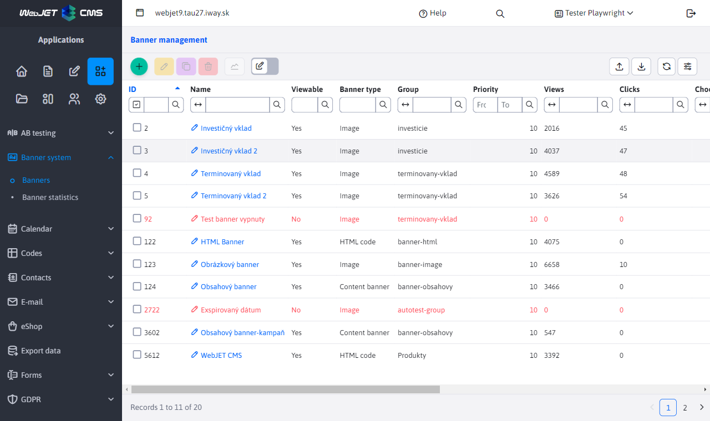
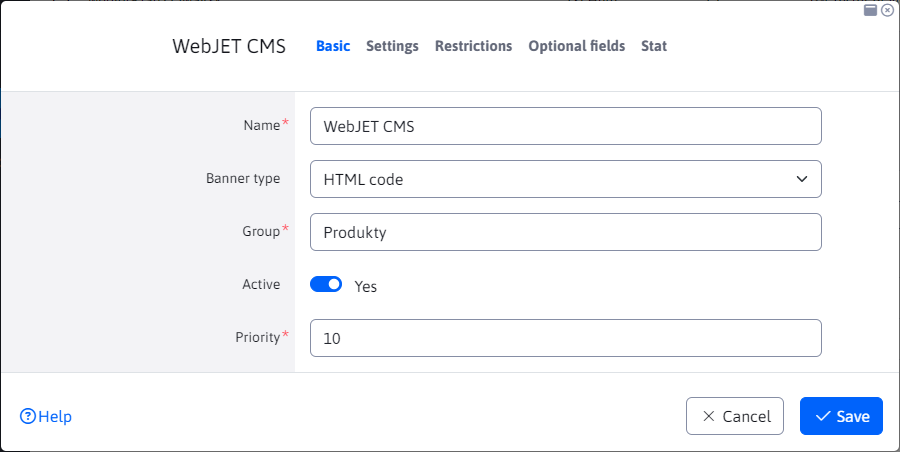
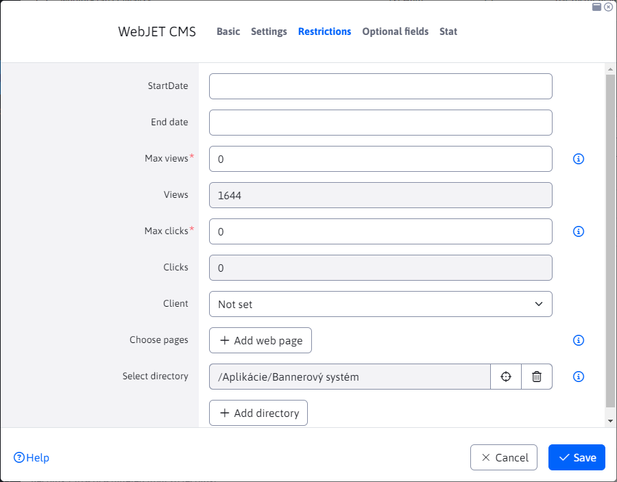
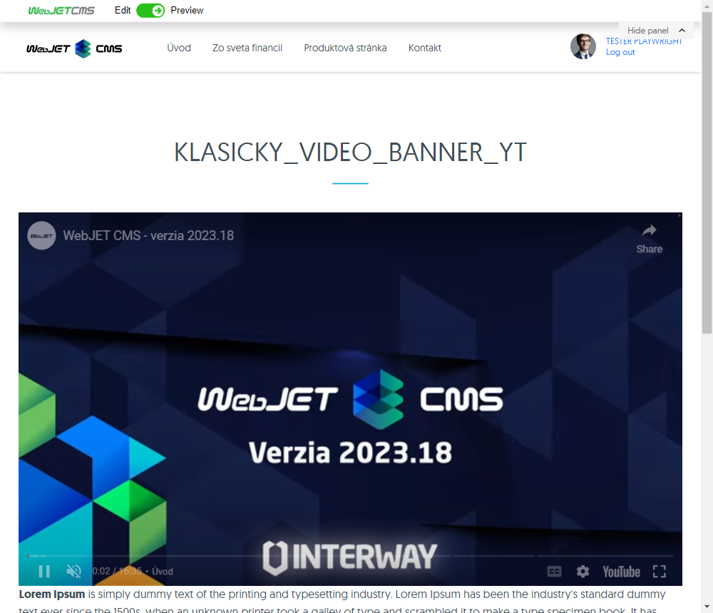
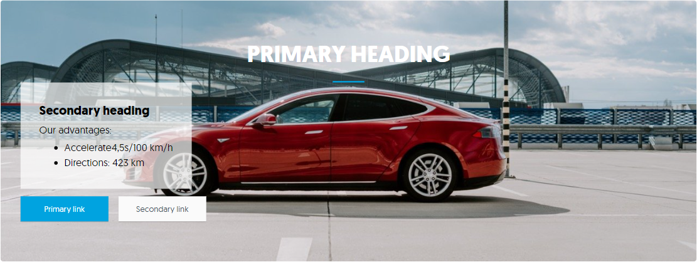
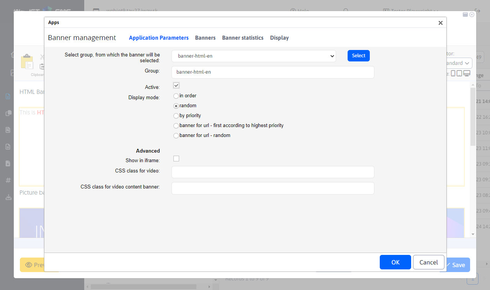
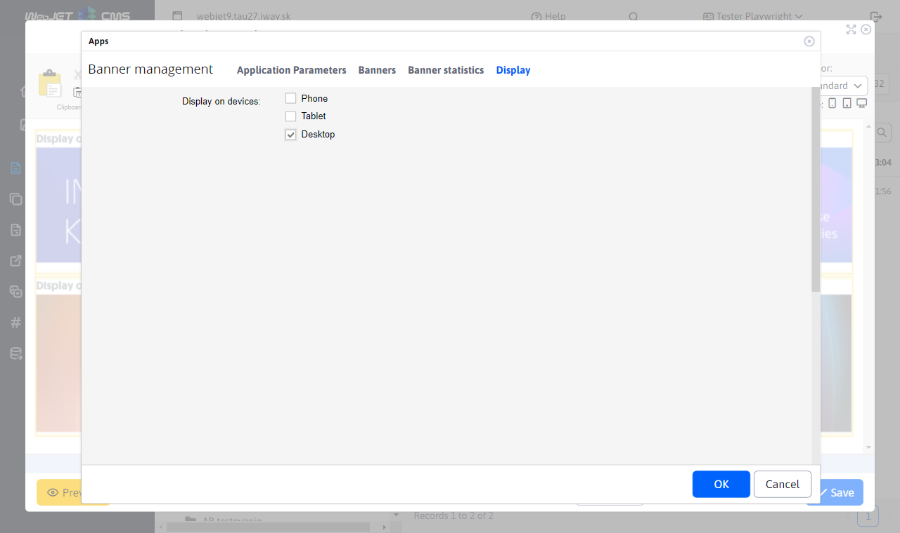
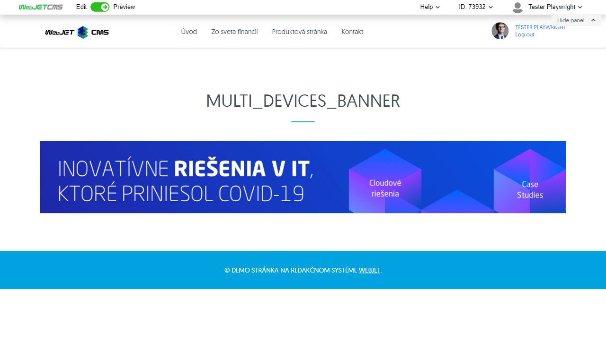

# Banner system

## Banner list

The Banner System application allows you to insert a banner into a page. The system supports the following banner types:

- Image - displays a static image or animated ```gif```. Records a click on the banner.
- Html code - inserts the specified HTML code of the dynamic banner into the page. It does not record a click on the banner.
- Content banner - inserts a background image into the page, above which there is text and buttons for performing an action (so-called `call to action` buttons).
- Video - inserts a local video file or a video from YouTube into the page.



Banners that cannot be displayed are shown in red in the table. Not only is the active option checked, but also the number of views/clicks and date restrictions are checked. You can use the filter by the Viewable column to filter the displayable banners.

## General banner parameters

The parameters in the Basic and Restrictions tabs are common to different banner types.

- Name - your banner name (it is not displayed anywhere on the website, it is only used for your identification).
- Banner type - Image, HTML code or Content banner
- Group - a group for a banner, after entering the beginning of the group name, or the character ```*```, existing groups will be displayed for selection. Groups are used to determine the location in the web page design (e.g. ```top-banner```, or ```banner-left-menu```) and then when the page is displayed, the banner from the specified group will be displayed at the given position.
- Active - you can activate/deactivate the banner display.
- Priority - if you set a higher priority for a banner, it will be prioritized over banners with a lower priority (it also depends on the application settings for displaying the banner).



In the restrictions tab, you can set:

- Start date - the start date and time when the banner should start showing (it will start showing only after the specified date). If the field is empty, the restriction is not applied.
- End date - end date and time when the banner should stop showing (it will stop showing after the specified date). If the field is empty, the restriction is not applied.
- Maximum number of views - maximum number of times the banner will be displayed. Setting it to 0 disables this limitation.
- Views (read only) - shows the current number of banner views.
- Maximum number of clicks - maximum number of clicks per banner (only for banners that record clicks, typically Image Banner). Setting to 0 disables this limitation.
- Clicks (read only) - shows the current number of clicks on the banner.
- Client - if the user does not have the right to "Show all banners" in the list of banners, only those where they are set as a client will be displayed. This could be, for example, an agency that edits banners for you in the system.
- Select sites - by clicking Add website you can select one or more sites where the banner can be displayed. If no site is selected, the banner can be displayed on all sites (unless a restriction is created using the directory selection).
- Select a directory - by clicking Add directory you can select one or more directories in which the banner will be displayed. If a directory is set for the banner, the banner will be displayed on all pages in that directory, as well as on all pages in subdirectories. If no directory is selected, the banner will be displayed on all pages (unless a restriction is created using the page selection).



In the Optional Fields tab, you can set field values ​​according to the needs of your implementation, the Statistics tab displays a graph of banner view and click statistics.

## Image banner

The image banner has the following options in the Settings tab:

- Banner location address - the address of the banner image (e.g. ```/images/banner.gif```).
- Redirect link - the address to which you are redirected after clicking on the banner (e.g. ```/sk/produkty/```).
- Target – you can choose in which frame the redirect link will open (own frame, new window, topmost frame, parent frame).


## Banner type HTML code

The HTML code banner contains the following options in the Settings tab:

- Redirect link - the address to which the user is redirected after clicking on the banner (e.g. ```/sk/produkty/```). In the HTML code, you must direct the corresponding link to the address ```/components/_common/clk.jsp?bid=ID``` where ID is the banner ID (you must save it first to get the ID).
- HTML code - enter the HTML code of the dynamic banner.


## Video banner

The video banner has the following option in the Settings tab:

- Banner location address, you can enter
  - MP4 video address (e.g. ```/images/video/bloky.mp4```), which can be selected from the uploaded files
  - Address of any YouTube video (e.g. ```https://www.youtube.com/watch?v=A5upeBuEMbg```)
- Redirect link - the address to which you are redirected after clicking on the banner (e.g. ```/sk/produkty/```), works correctly only for the video `mp4`, for YouTube the link cannot be clicked for technical reasons.
- Target – you can choose in which frame the redirect link will open (own frame, new window, topmost frame, parent frame).



## Banner type Content banner

The image banner has the following options in the Settings tab:

- Address of the web page on which the banner will be displayed - **Note:** the content banner is not displayed based on the group, but based on the correspondence of the displayed web page with the address entered in this field. This way you can set the display of banners according to the URL of the pages.
- Redirect link - the address to which you are redirected after clicking the button in the banner (e.g. ```/sk/produkty/```).
- Image link - the address of the banner image (e.g. ```/images/banner.jpg```).
- Mobile image link - the address of the mobile banner image (e.g. ```/images/banner-lores.jpg```). This image will be used for resolutions narrower than 760 pixels.
- Primary headline - the main (largest) headline in the banner.
- Secondary heading - below the headline in the banner (can be left blank).
- Descriptive text - additional text below the headings (can be left blank).

If **Image Link** or **Mobile Image Link** contains the location of an **MP4 file or YouTube video address**, a video player will be displayed in the background. The mobile value will be used if the phone is detected on the server by the value `User-Agent` containing the value `iphone` or `mobile` for Android.

Conditional display according to URL parameter (campaign banner):

- URL parameter value for direct display - for advertising campaigns, it is possible to set the field **URL parameter value for direct display**. Here, you can enter a code (e.g. ```webjetcms```) and then the banner will always be displayed if the parameter matches in the URL. So, if you have multiple banners assigned to one page, you can display them precisely according to the source of the advertising campaign (e.g. according to the source pages, or a link from an email, or an advertising campaign on Facebook).
- Banner will be available as - shows you a preview of the address for displaying the banner. The parameter name (by default ```utm_campaign```) can be set in the config variable ```bannerCampaignParamName```.
- Show only when URL parameter is specified - if selected, the banner will not be displayed by default (e.g. if random banner display is set), but will only be displayed when the parameter is specified in the URL. Use if you have, for example, a customized banner that you want to display only if a visitor comes from an email campaign (e.g. with a promotion for a discounted purchase valid only for the email campaign).

In addition to titles and images, the banner also generates two buttons, which are set in the Primary link (used for the primary button) and Secondary link (for the secondary button) blocks. If you do not enter a name, the button will not be generated.

- Link name - the name that will appear on the button (e.g. I'm interested).
- Link URL - the address to which the visitor is redirected after clicking the button. To measure clicks, enter the address ```/components/_common/clk.jsp?bid=ID``` where ID is the banner ID (you must first save it to get the ID). The redirect value in this case is taken from the Redirect link field.
- How to open the link - set whether the link opens in the current window or in a new window.



If no content banner is found for the displayed page and the page has a Perex image set, this image will be used as a campaign banner. In the conf. variable ```bannerDefaultImageUrl``` it is possible to define the URL address of the image to be displayed if the banner is not found even in the perex image. This will ensure that the default image/banner is displayed instead of an empty space. The name of the current page will be used as the title (main title).

## Embedding an app on a page

To insert a banner application into your page, select Banner System from the application menu in the page editor. The application has the following parameters:

- Select the group from which the banner will be selected - select the group from the menu and press the Select button.
- Group - displays the currently selected banner group.
- Active - you can temporarily activate/deactivate the application without having to delete it from the website
- How to display banners:
    - in a row - banners change cyclically, they are arranged by banner ID
      - Banner index in session - each inserted banner application must have a unique index to distinguish the order of banners.
    - random - random selection of a banner from the group
    - by weight - banners with higher priority will be displayed more often
- Display in iFrame - the banner will be placed in an iFrame. Set the iFrame dimensions (suitable for HTML code banners to avoid code conflicts on the displayed page).
  - Banner refresh interval - after the interval expires, the next banner from the group will be displayed on the page. If you enter nothing or 0, the next banner will be displayed only after a manual page refresh.
  - width - iframe width in points
  - height - iframe height in points

To use video files in banners, you can set:

- CSS class for video - CSS style attribute value for displaying video file, if empty it is assumed that the video file is used in aspect ratio `16:9` by setting the value `embed-responsive embed-responsive-16by9 ratio ratio-16x9 banner-has-video`. In case of other aspect ratio you can change the value `16by9` and `16x9` to another supported value (`21x9, 4x3, 1x1`).
- CSS class for content banner video - the value of the CSS style attribute for displaying the content banner video file, by default `jumbotron-has-video`. If you want to display the video in full screen size, set it to the value `jumbotron-has-video-fullscreen`, this value will be used automatically even if the selected banner group contains the word `fullscreen`.



## Display a banner for a specific device type

When inserting a banner into a page, you have the option to specify the type of device (or devices) that will see the banner. This setting is provided by the **Display on devices** variable in the **Advanced** tab. There are 3 device types to choose from.

- If you select all device types or select nothing, the banner will be displayed for all devices.
- If you select only one type or combination of devices, the banner will only be displayed to that type of device.



Note: The device is detected on the server by the HTTP header `User-Agent`. The phone is detected when the expression `iphone` is found or `mobile` when the expression `android` is detected. The tablet is detected as `ipad||tablet||kindle` or if it contains `android` and does not contain `mobile`.

In the web page editor, the banner will be displayed in the preview regardless of the set type of device for which they are intended. The reason is so that you have an overall overview of the banners used. An example is in the following image, where we see a page editor with 2 banners. The first is set exclusively for **Desktop**, the second for the combination **Phone and Tablet**. However, both are displayed in the editor.

In such a case, the preview displays the text information **Display on devices: XXX** according to the selected devices. The text will not be displayed if all device types are selected.


To test when viewing a web page, you can use the URL parameter ```?forceBrowserDetector=```, which can convince WebJET that we are accessing with a specific type of device. The supported types of this parameter are ```phone```, ```tablet``` and ```pc```. For example, if we go to the previously mentioned page with the parameter ```?forceBrowserDetector=pc``` set, we simulate access from a computer. Only the first banner that was set for Desktop devices will be displayed on this page.



If you display a web page with the URL parameter ```?forceBrowserDetector=phone``` or ```?forceBrowserDetector=tablet```, a banner that has been specifically defined for devices such as Phone or Tablet will be displayed.

## Possible configuration variables

```bannerCacheTime``` - ak je nastavené na hodnotu > 0 (v minútach) tak sa výber bannerov z DB cachuje, čo znamená, že sa nekontroluje zoznam bannerov pri každom zobrazení stránky (môže ale dôjsť k prekročeniu limitov videní). Zobrazenie bannera je ale rýchlejšie a menej zaťažuje databázový server.
