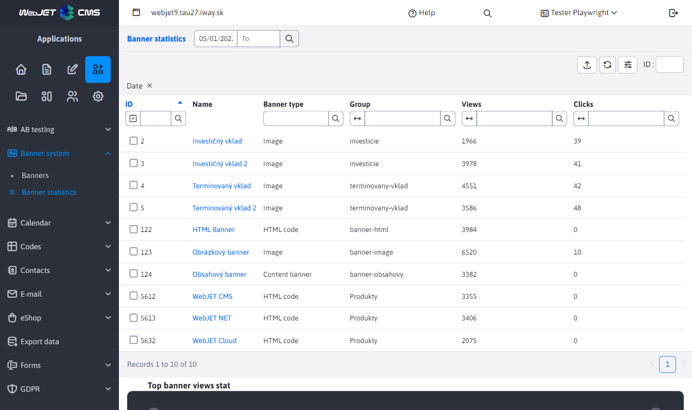
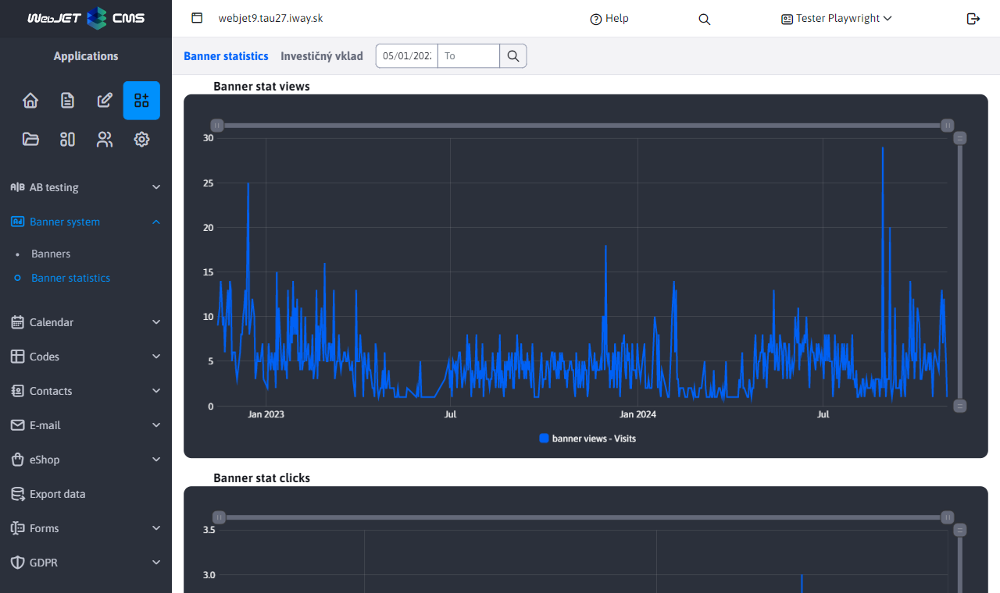
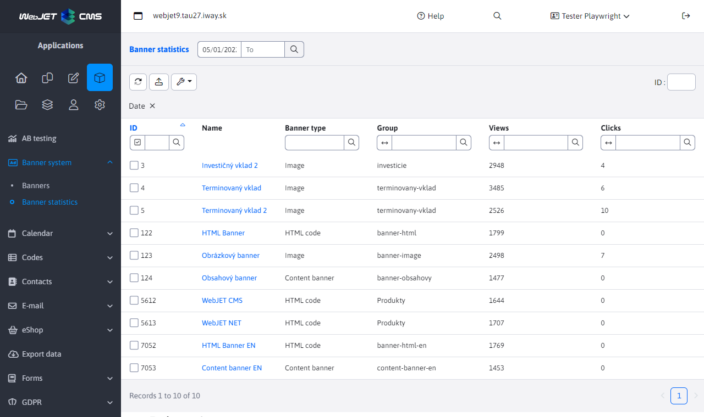

# Banner statistics

The Banner Statistics application displays an overview of the Top 10 banners for the selected period. The default period is the last month. This period can be changed using the date filter in the page header.

The application contains a data table of the Top 10 banners as well as 2 bar charts showing the "Top banner views statistics" and "Top banner clicks statistics". When you change the date range using the filter in the header of the page, the datatable as well as both graphs are updated.

The value in the "Name" column of the displayed table is a clickable link that redirects you to the detail of the banner.

## Detail of the banner

Banner Detail is a subsection of the "Banner Statistics" application and also displays a datatable and 2 line graphs. The difference is that the datatable shows only the currently viewed banner and the bar charts show the clicks and views statistics for this banner only.

This subsection also contains a date filter in the page header, which behaves the same way as in the banner statistics, with the difference that the base range is not the last month, but the set range from the banner statistics is taken over.

Also in this case, the value of the "Name" column is a clickable link. Once clicked, you will be redirected to the "Banner List" page where the editor of the banner will open.

