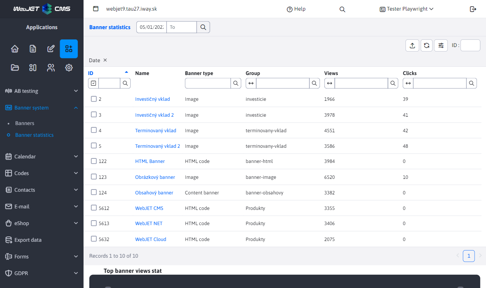
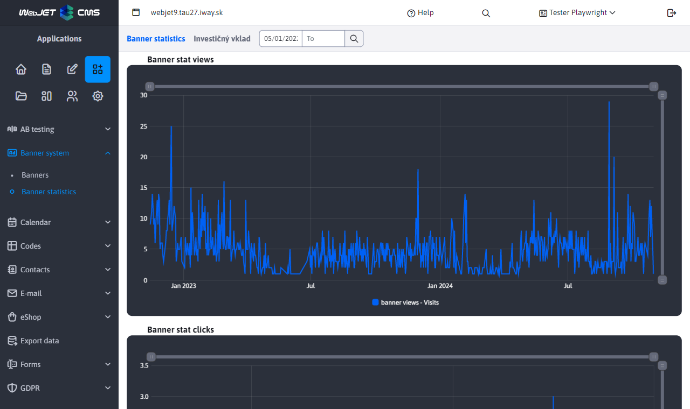
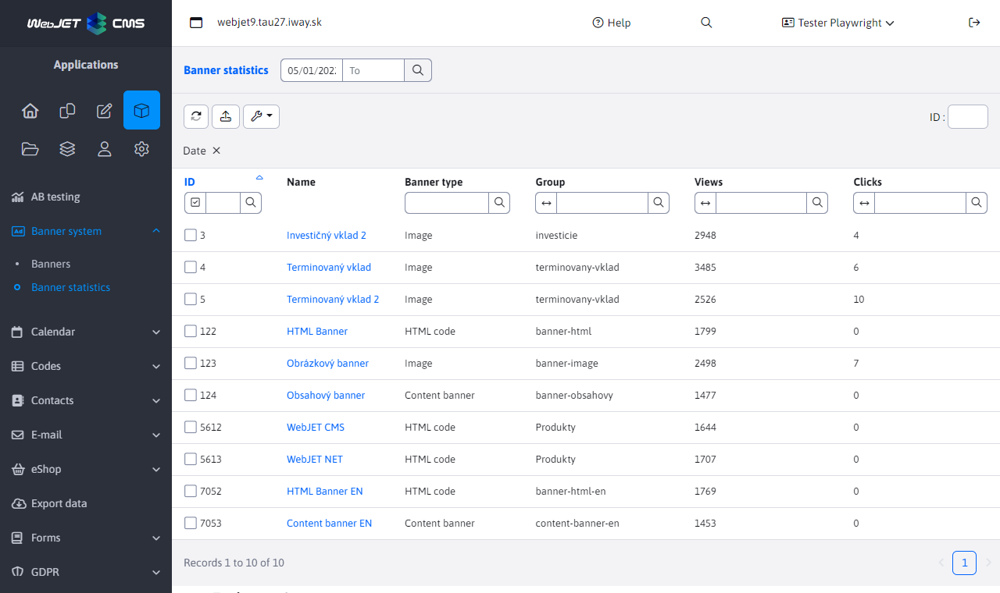

# Banner statistics

The Banner Statistics application displays an overview of the Top 10 banners for the selected period. The default period is the last month. This period can be changed using the date filter in the page header. 

The application contains a data table of Top 10 banners as well as 2 line graphs showing "Top banner view statistics" and "Top banner click statistics". When changing the date range using the filter in the page header, the data table as well as both graphs are updated.

The value in the "Name" column of the displayed table is a clickable link that will redirect you to the details of the banner.

## Banner detail

Banner detail is a subsection of the "Banner statistics" application and also displays a data table and 2 line graphs. The difference is that the data table only displays the currently viewed banner and the line graphs display click and view statistics for this banner only. 

This subsection also contains a date filter in the page header, which behaves the same as banner statistics, with the difference that the basic range is not the last month, but the set range from banner statistics is taken over.

In this case too, the value of the "Name" column is a clickable link. After clicking, you will be redirected to the "Banner List" page where the editor for the given banner will open.

