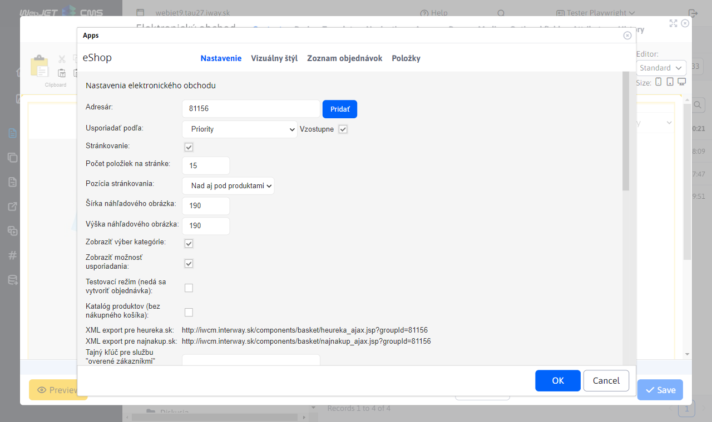
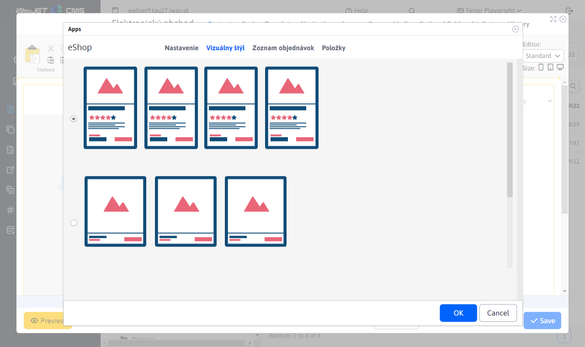
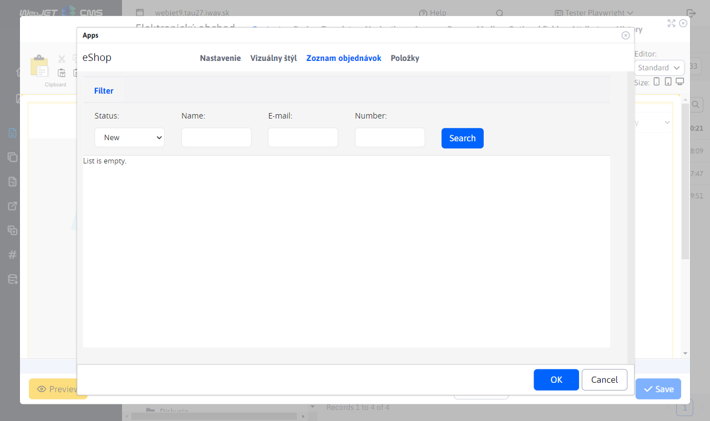
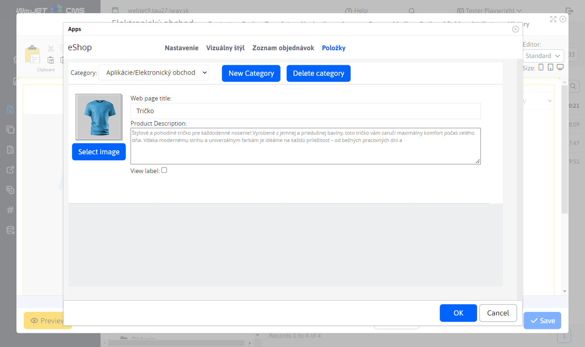
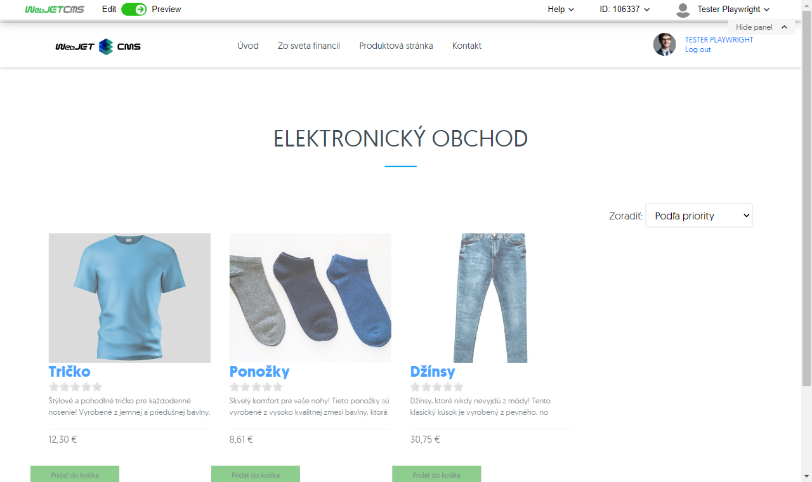

# Ecommerce

Through the E-shop application you can create and manage a simple e-shop. Within the application you define individual products and their attributes (e.g. size, colour), delivery methods or payment. The application records the list of received orders, allows you to set their status with the possibility of notifying changes in the order to the customers email.

## Application settings

### Settings tab:
- **Directory**: Enter the path to the directory.
- **Arrange by**: Select an ordering criterion, for example "Priority".
  - **Ascending**: Define whether to arrange in ascending order.
- **Pagination**: Specifies whether paging is enabled.
- **Number of items on the page**: Enter the number of items on the page, for example `15`.
- **Pagination position**: Select where to display the pagination, for example "Above and below products".
- **Thumbnail image width**: Specify the width of the thumbnail image in pixels, for example `190`.
- **Height of the preview image**: Specify the height of the thumbnail image in pixels, for example `190`.
- **View category selection**: Define whether to display the category selection.
- **Show arrangement option**: Enable the option to arrange products.
- **Test mode (no order can be created)**: Activation of test mode.
- **Product catalogue (without shopping cart)**: Catalogue view without purchase option.
- **Secret key for the service "verified by customers" (heureka.sk)**: Enter the secret key for the service.

#### Method of delivery:
- **Enter the delivery method**: Please fill in the available delivery methods.
  - When pressing **Add** can be filled in: **Price without VAT**, **Currency**, **Tax**, **Price with VAT**, **Old price with VAT**

### Visual Style tab:
- Option to choose from two styles for display.

### Order list:

When displayed, it can be filtered by:
- **Status**
- **Issued / sent**
- **Name**
- **E-mail**
- **Number**

### Item card:
- **Name of the website**: Enter the name of the web page.
- **Product description**: Enter product description.
- **View label**: Enable product label display.

#### Add a variant:
- **Variant name**: Enter the name of the product variant.
- **Variant values**: Enter the available variant values.

#### Product information:
- **Price without VAT**
- **Currency**
- **Tax**
- **Price with VAT**
- **Old price with VAT**
- **EAN**
- **Producer**

## Allowed countries

The `basketInvoiceSupportedCountries` constant is used to dynamically set the allowed countries where goods can be shipped. The constant contains a comma-separated list of `ccTLD` identifiers.

**Example** to allow the countries Slovakia, Czech Republic and Poland, the constant must be set as `.sk,.cz,.pl`.

## Application display

