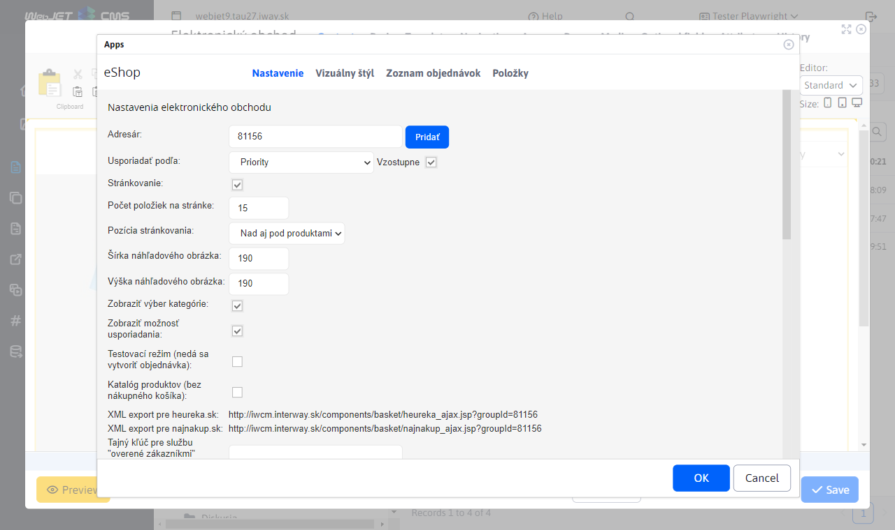
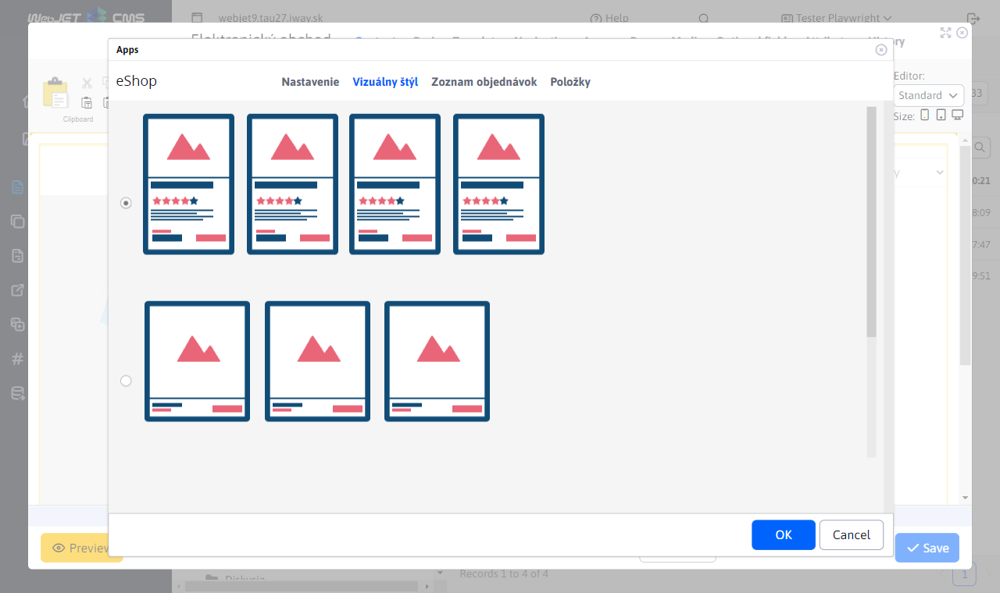
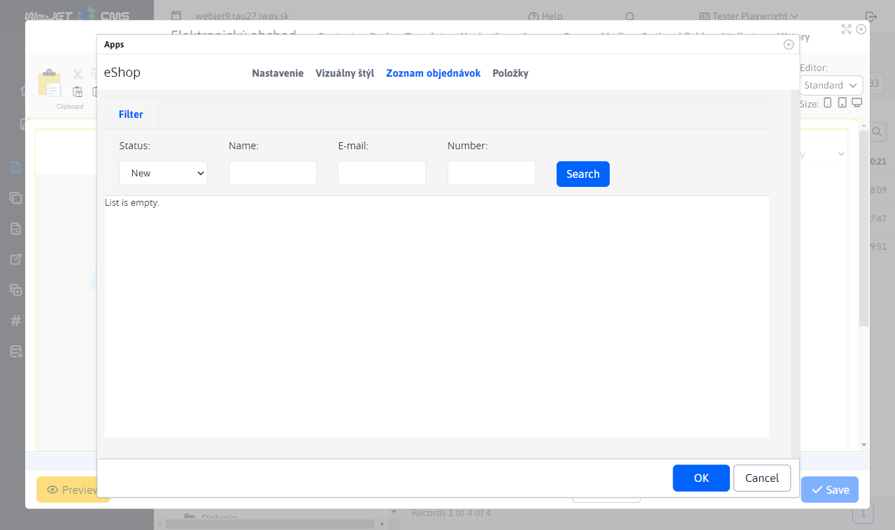
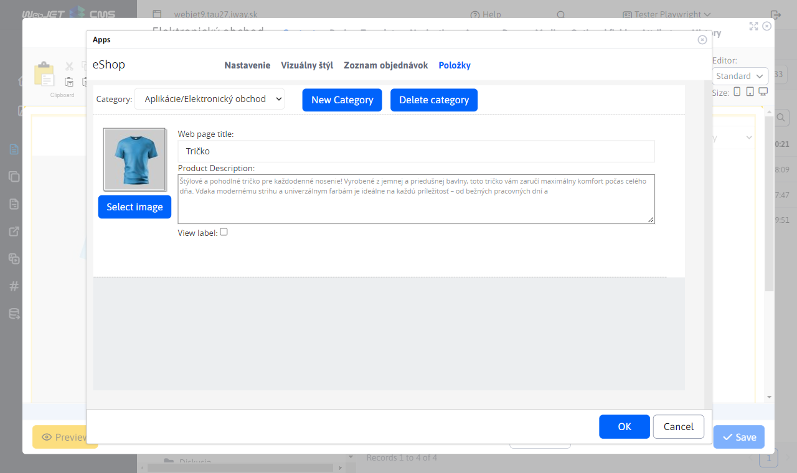
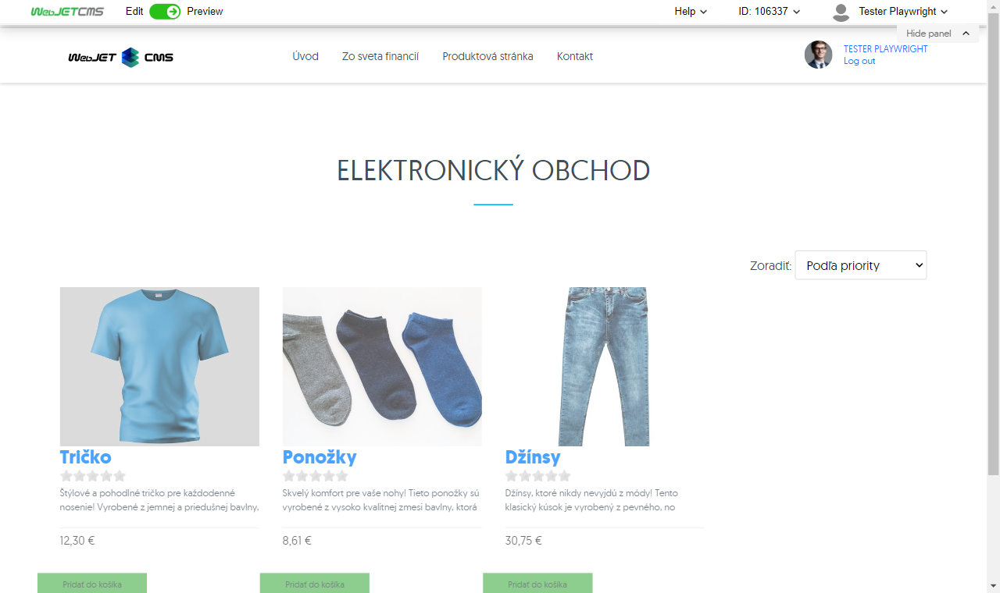

# E-commerce

You can create and manage a simple e-commerce store using the E-shop application. Within the application, you define individual products and their attributes (e.g. size, color), delivery methods, or payments. The application records a list of received orders, allows you to set their status with the option of notifying customers of changes in the order via email.

## Application settings

### Settings tab:

- **Directory**: Enter the path to the directory.
- **Sort by**: Select a sorting criterion, such as "Priority".
  - **Ascending**: Define whether to sort in ascending order.
- **Paging**: Determines whether paging is enabled.
- **Number of items per page**: Enter the number of items per page, for example `15`.
- **Pagination Position**: Choose where you want the pagination to appear, for example, "Above and below products."
- **Preview Image Width**: Enter the width of the preview image in pixels, for example `190`.
- **Preview Image Height**: Enter the height of the preview image in pixels, for example `190`.
- **Show category selection**: Define whether to show the category selection.
- **Show sorting option**: Enable the product sorting option.
- **Test mode (cannot create order)**: Activate test mode.
- **Product catalog (without shopping cart)**: View the catalog without the option to purchase.
- **Secret key for the "customer-verified" service (heureka.sk)**: Enter the secret key for the service.

#### Delivery method:

- **Enter delivery method**: Fill in the available delivery methods.
  - When pressing **Add** you can fill in: **Price excluding VAT**, **Currency**, **Tax**, **Price including VAT**, **Old price including VAT**

### Visual Style tab:

- Option to choose from two display styles.

### Order list:

When viewing, you can filter by:
- **Status**
- **Issued / Sent**
- **Name**
- **Email**
- **Number**

### Item tab:

- **Website Name**: Enter the name of the website.
- **Product Description**: Enter a product description.
- **Show label**: Enable displaying the product label.

#### Add variant:

- **Variant Name**: Enter the name of the product variant.
- **Variant Values**: Enter the available variant values.

#### Product information:

- **Price excluding VAT**
- **Currency**
- **Tax**
- **Price incl. VAT**
- **Old price with VAT**
- **EAN**
- **Manufacturer**

## Allowed countries

The constant `basketInvoiceSupportedCountries` is used to dynamically set the allowed countries where goods can be shipped. The constant contains a comma-separated list of `ccTLD` identifiers.

**Example**, to enable the countries Slovakia, Czech Republic and Poland, the constant must be set as `.sk,.cz,.pl`.

## View the application

