# List of articles

The List of Articles application lists all articles currently logged in by a user of type blogger. It allows him/her to edit the structure of his/her blog by adding additional sections (sub-folders) and create/edit/duplicate/delete articles.

The result of the application is the display of articles on a web page, with articles placed in categories/sections.

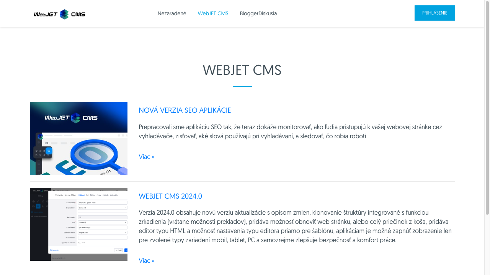

**Warning:** this application will only appear to the currently logged-in user if one of the following conditions is met:
- The currently logged-in user is the so-called **blogger**. In other words, the user must have the Blog right and also belong to the Blog user group. Such a user can create new blog posts and new sections within his blog.
- The currently logged-in user is the so-called **blogger administrator**who is an admin, must have both Blog and Manage Bloggers rights and should not belong to the Blog user group. Such a user can create new bloggers (users), delete an existing blogger, and possibly make edits to the text of any blogger.

So we know two types of users:
- **blogger** can only work with folders to which it has the right and articles that belong to its folders. More information on the user type **blogger** can be found in the section [Blogger Management](bloggers.md).
- **blogger administrator** can work with folders of all bloggers as well as with articles belonging to these folders.

## Filter by folder

The page contains an external section (sub-folder) filter in the upper left corner, which allows filtering the displayed articles only for the selected blog section (folder). Default value `Všetky sekcie`, displays all articles from all sections (sub-folders).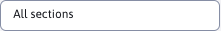The selection of sections itself is ordered as a tree structure, with deeper nested sections below. The user sees the entire path to the section, and the main folder has the same name as its&#x20;

, which in the example in the figure is `prihlasovacie meno (login)`.`bloggerPerm`Adding an article

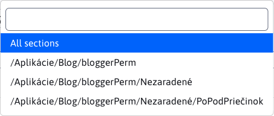

## To create a new article, use the button&#x20;

. Working with articles is similar to working with common websites[.](../../webpages/README.md)For a new article, the inclusion in the tree structure is preset according to the value in the external section filter (e.g. /Applications/Blog/bloggerPerm).

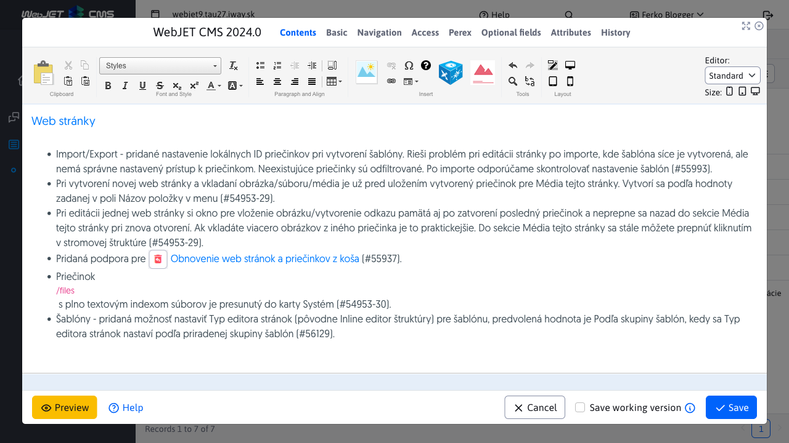

Warning:

** if you try to create a new article without selecting a section in the external filter (at its value **) the Uncategorized section is set, or the first folder the blogger has rights to. You can change the section in the editor under the Basic tab by setting the value to Parent Folder.`Všetky sekcie`The title of the article will appear in the list of articles. If you want to display a short introduction in the list, enter it in the Annotation field in the article editor in the Perex tab. We recommend that you also enter an illustration image in the Image field in the Perex tab.

The article will be displayed on the web page according to the defined design template, e.g. as follows:

Adding a section

## To create a new section, use the button&#x20;

.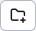If you try to create a new section without selecting the destination folder in the external filter, you will be prompted to select it.

After selecting a folder and pressing the&#x20;

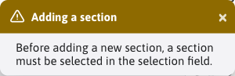

&#x20;will be prompted for the name of a new section (sub-folder).Start the process by confirming the action with the button&#x20;

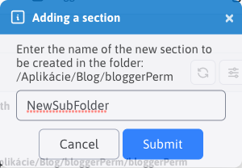

.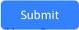If a name for the new section is not entered or an error occurs, the section creation process will be aborted and you will be notified via a notification.

If the section is successfully created, you will be notified by a notification.

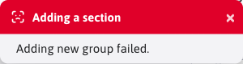

Immediately after a section is successfully created, its value is automatically added to the external filter.

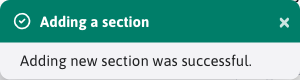

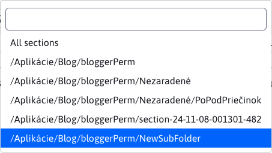
