# List of articles

The Article List application contains a list of all articles of the currently logged-in blogger user. It allows them to edit the structure of their blog by adding additional sections (sub-folders) and create/edit/duplicate/delete articles.

The result of the application is the display of articles on the website, with the articles placed in categories/sections.

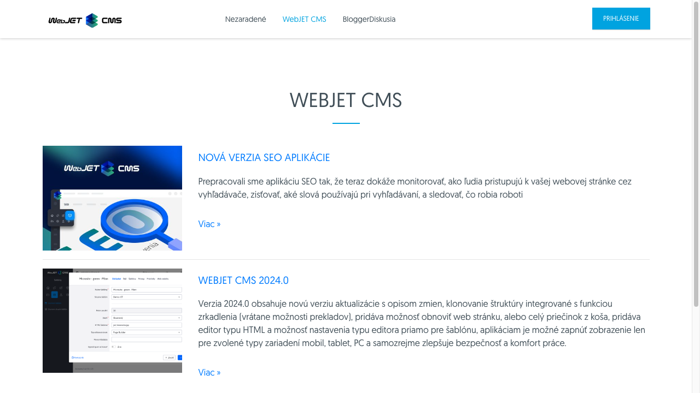

!>**Warning:** this application will only be displayed to the currently logged in user if it meets one of the following conditions:

- The currently logged in user is a so-called **blogger**. In other words, the user must have the Blog permission and must also belong to the Blog user group. Such a user can create new blog posts and new sections within his blog.
- The currently logged in user is the so-called **Blogger Administrator**, who is an admin, must have the right Blog and Manage Bloggers and should not belong to the Blog user group. Such a user creates new bloggers (users), can delete an existing blogger and possibly make edits to the text of any blogger.

So we know two types of users:

- **blogger** can only work with folders to which he has rights and articles that belong to his folders. For more information about **blogger** users, see the [Blogger Management] section (bloggers.md).
- **Blogger Administrator** can work with all bloggers' folders, as well as with articles belonging to these folders.

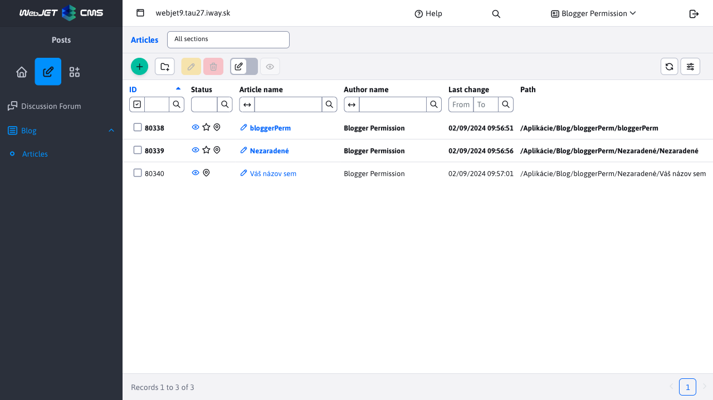

## Filter by folder

The page contains an external filter for sections (sub-folders) in the upper left corner, which allows filtering the displayed articles only for the selected blog section (folder). The default value **All sections** will display all articles from all sections (sub-folders).

The section selection itself is arranged as a tree structure, where deeper nested sections are lower. The user sees the full path to the section, and the main folder has the same name as their **login**, which in the example in the image is `bloggerPerm`.

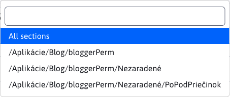

## Adding an article

You can create a new article using the . Working with articles is similar to working with [regular web pages](../../webpages/README.md).

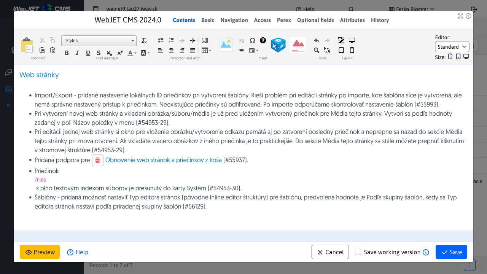

For a new article, the placement in the tree structure is preset according to the value in the external section filter (e.g. /Applications/Blog/bloggerPerm).

!>**Warning:** if you try to create a new article without selecting a section in the external filter (with its value **All sections**) the Uncategorized section will be set, or the first folder to which the blogger has rights. You can change the section in the editor on the Basic tab by setting the Parent folder value.

The article title will be displayed in the article list. If you want to also display a short introduction in the list, enter it in the Annotation field in the article editor in the Perex tab. We recommend also entering an illustrative image in the Image field in the Perex tab.

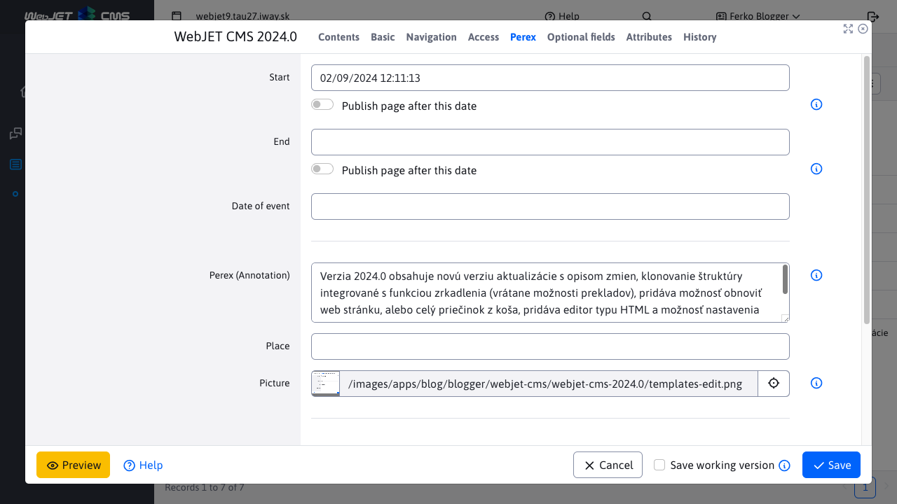

On the web page, the article will be displayed according to the defined design template, e.g. like this:

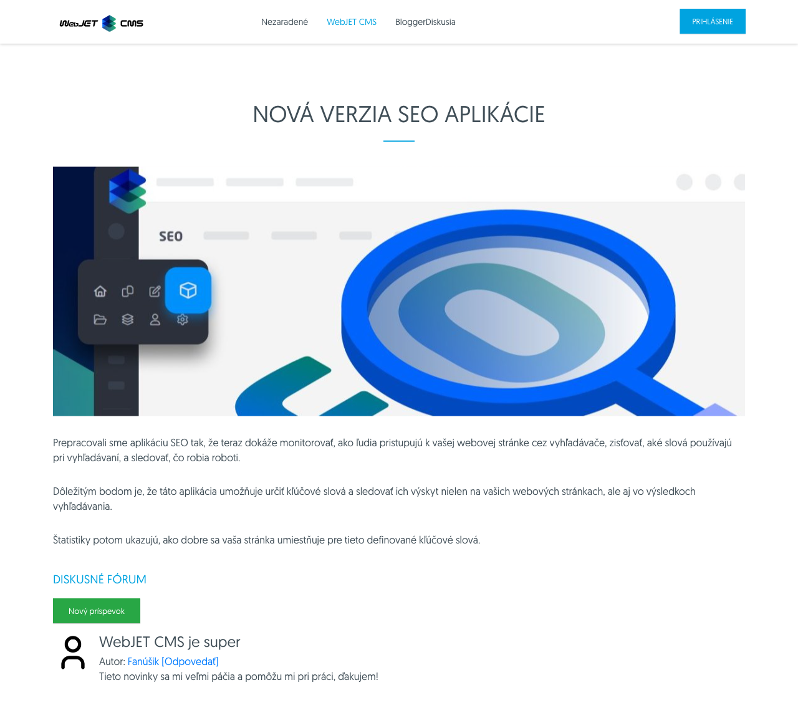

## Adding a section

You can create a new section using the 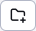 button.

If you try to create a new section without selecting a target folder in the external filter, you will be prompted to select one.

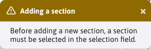

After selecting a folder and pressing the  button, you will be prompted to enter a name for the new section (sub-folder).

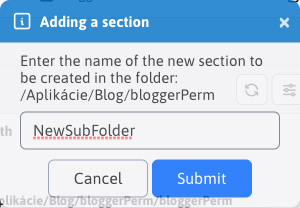

You start the process by confirming the action with the 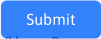 button.

If a name for the new section is not entered, or an error occurs, the section creation process will be interrupted and you will be informed via notification.

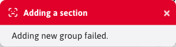

If the section is successfully created, you will be notified.

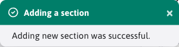

Immediately after the section is successfully created, its value is automatically filled into the external filter.

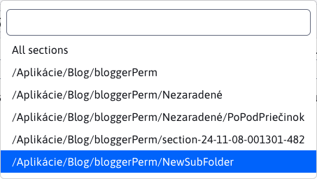