# List of articles

The Article List application contains a list of all articles of the currently logged-in blogger user. It allows them to edit the structure of their blog by adding additional sections (sub-folders) and create/edit/duplicate/delete articles.

The result of the application is the display of articles on the website, with the articles placed in categories/sections.

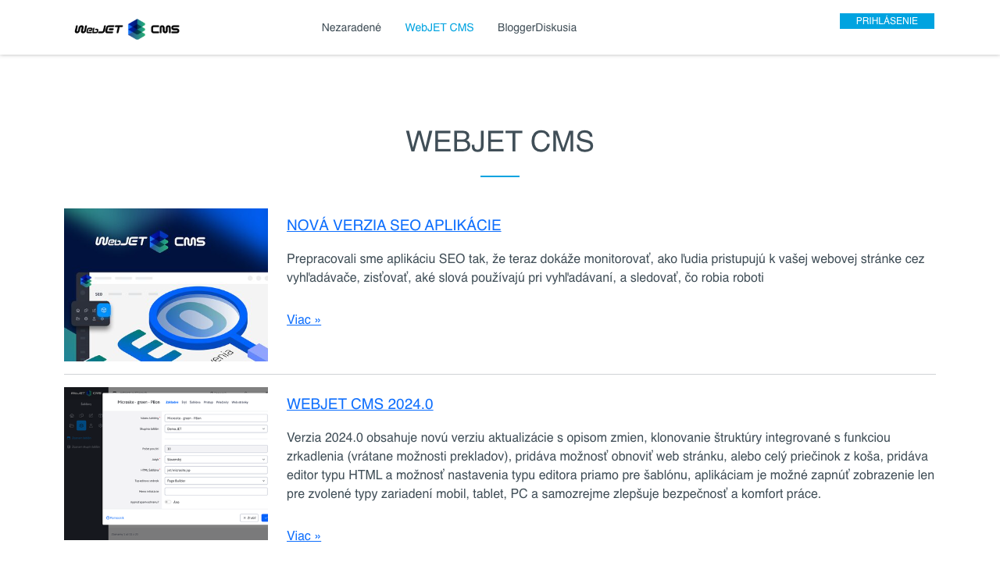

!>**Warning:** this application will only be displayed to the currently logged in user if it meets one of the following conditions:

- The currently logged in user is a so-called **blogger**. In other words, the user must have the Blog permission and must also belong to the Blog user group. Such a user can create new blog posts and new sections within his blog.
- The currently logged in user is the so-called **Blogger Administrator**, who is an admin, must have the right Blog and Manage Bloggers and should not belong to the Blog user group. Such a user creates new bloggers (users), can delete an existing blogger and possibly make edits to the text of any blogger.

So we know two types of users:

- **blogger** can only work with folders to which he has rights and articles that belong to his folders. For more information about **blogger** users, see the [Blogger Management] section (bloggers.md).
- **Blogger Administrator** can work with all bloggers' folders, as well as with articles belonging to these folders.

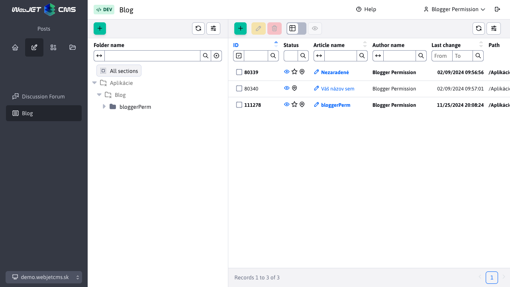

## Filter by folder

The left panel displays a folder tree, the right panel displays a list of articles. The default entry **All sections** displays articles from all available sections of the blog. Selecting a specific folder displays only its articles.

You can expand, search by name, and refresh folders using the button above the tree. Shared parent folders, such as **Applications** and **Blog**, maintain the hierarchy. If they are for navigation only, they have a different icon and cannot be selected as a section. The full path is displayed when you hover over the folder name.

You can change the ratio of the tree width to the table width or set a fixed width of the tree in pixels using the **Settings** button above the tree. The setting is saved for the logged in user separately for this application.

The blogger sees his folders, the blogger administrator the folders of bloggers in the current domain. The tree also respects the permission to display hidden folders. The section selection is preserved when searching, refreshing the tree, and reopening the address with the folder ID after the `#` character. On a narrow screen, the list of articles is displayed below the tree.

If no folders are available, an informational message is displayed and adding articles and sections is disabled.

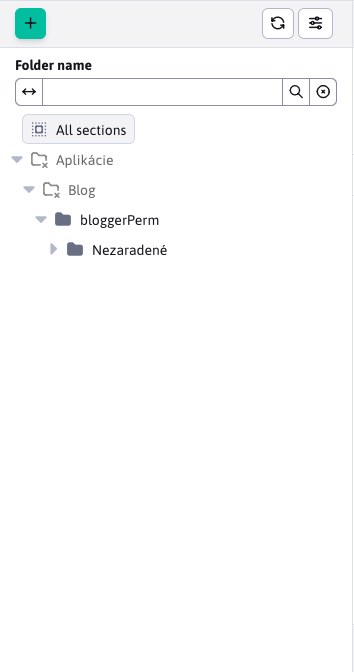

## Adding an article

Create a new article using the button <button class="btn btn-sm btn-success" type="button"><i class="ti ti-plus"></i></button> Working with articles is similar to working with [regular web pages](../../webpages/README.md).

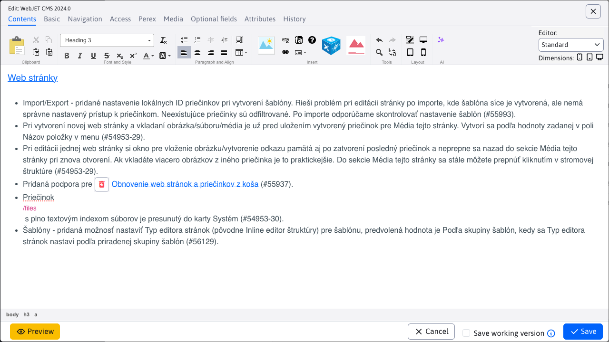

For a new article, the placement in the tree structure is preset according to the folder selected in the tree (e.g. /Applications/Blog/bloggerPerm).

!>**Warning:** if you try to create a new article with **All sections** selected, the Uncategorized section will be set, or the first folder the blogger has rights to. You can change the section in the editor on the Basic tab by setting the Parent folder value.

The article title will be displayed in the article list. If you want to also display a short introduction in the list, enter it in the Annotation field in the article editor in the Perex tab. We recommend also entering an illustrative image in the Image field in the Perex tab.

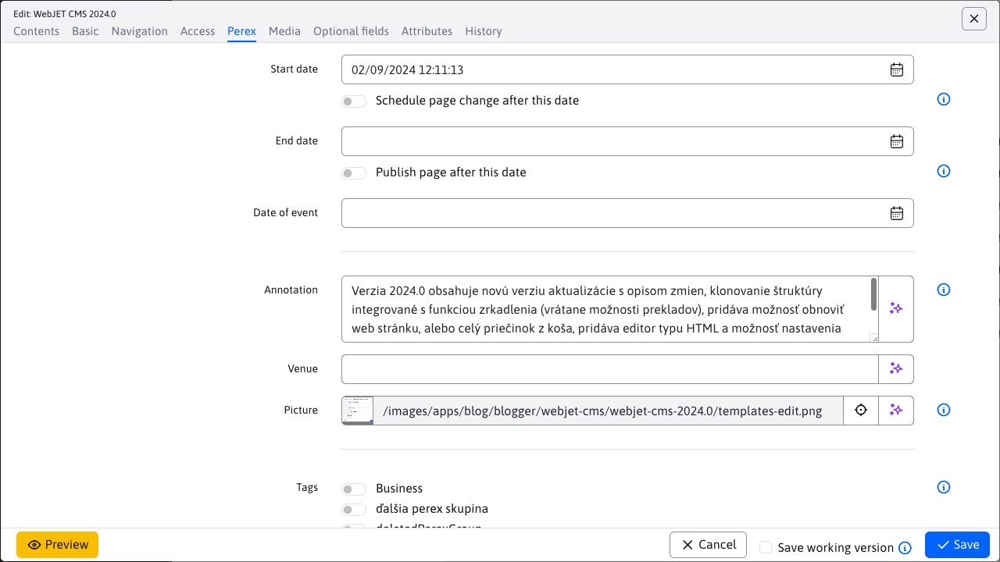

On the web page, the article will be displayed according to the defined design template, e.g. like this:

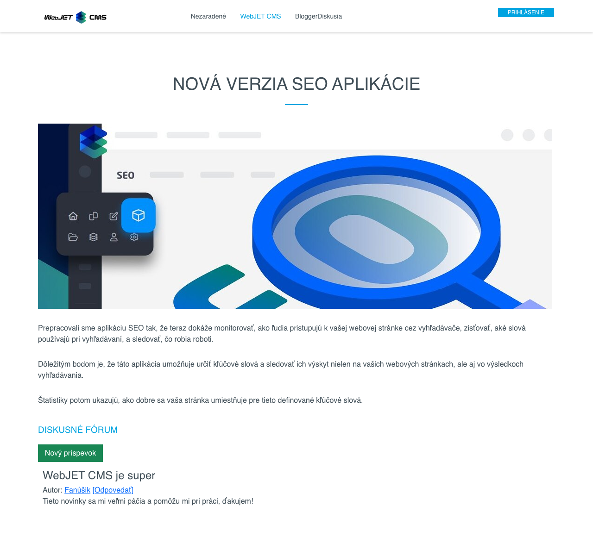

## Adding a section

Create a new section using the button above the tree. <button class="btn btn-sm btn-success" type="button"><i class="ti ti-plus"></i></button> .

If you try to create a new section without selecting a destination folder in the tree, you will be prompted to select one.

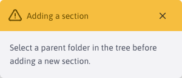

After selecting a folder and pressing the button <button class="btn btn-sm btn-success" type="button"><i class="ti ti-plus"></i></button> The **Add Section** dialog opens. It displays the selected parent folder and the required **Folder Name** field.

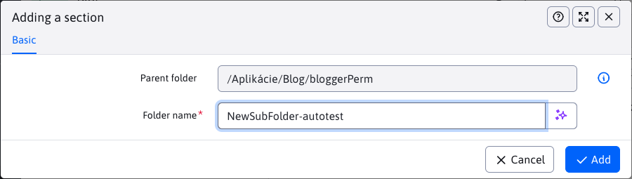

An empty name, a name containing only spaces, or the name of an existing section in the same folder cannot be saved. An error will be displayed next to the field and the dialog will remain open so you can correct the name.

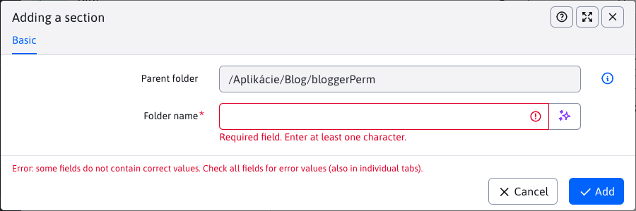

If the section is successfully created, you will be notified.

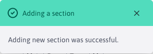

After successfully creating a section, the tree will automatically refresh. You will find the new section under the selected parent folder.

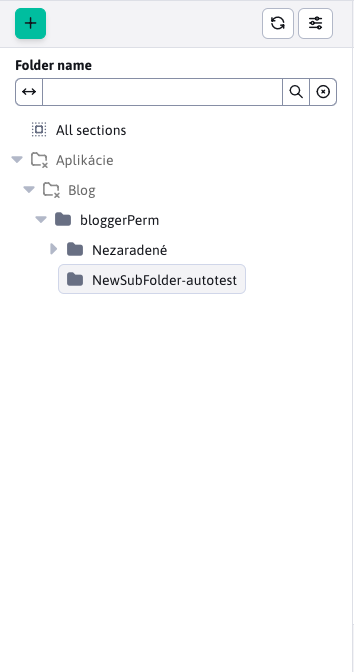