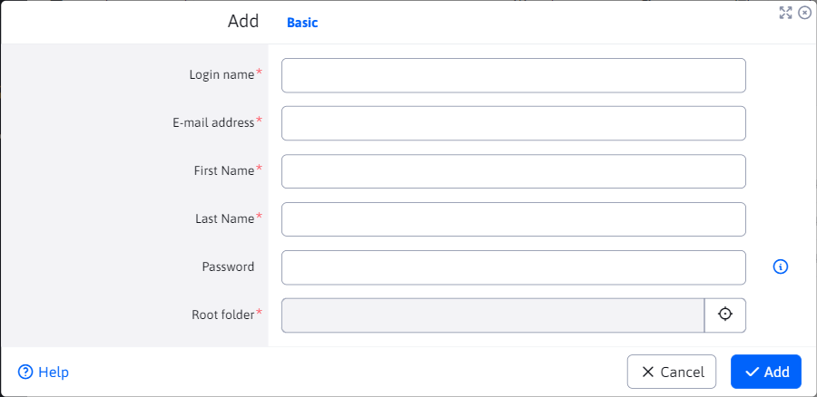

# List of bloggers

The List of bloggers section is used to create and manage users of the type **blogger**.

Access to this section is restricted to **administrators of bloggers**. The blogger administrator must have the Manage Bloggers right and should not belong to a user group **Blog**. In the process of creating a blogger, a new user with the necessary rights to create articles is created.

In addition, there must be [user group](../../../admin/users/user-groups.md) called `Blog`. If it doesn't exist, create it before adding the first blogger.

**Warning:** admin bloggers do not add to the Blog user group.
If you want the blogger administrator to also have the ability to interfere with the structure and articles of individual bloggers ([List of articles](./README.md)) must also have the Blog/Article List right.

## Adding and editing a blogger

The blogger is added directly through the editor, it contains the following fields:
- Login name - this name must be unique among all users (not just bloggers).
- Email address - email address of the blogger.
- Name.
- Last name.
- Password - for a newly created user, leave the password blank, WebJET will generate the password and send it to the email. You can edit the email text by setting the page ID with the email text in the Blog user group.
- Root folder - the parent (or root) directory where the blogger's folders will be added, e.g. `/Blog`. A folder is then created for the newly created user `/Blog/LOGIN`.



You can edit the created Blogger, but you can no longer change the Website Directory and Login Name values.

If you want to see/set more information about the blogger, you can do so in the [List of users](../../../admin/users/README.md)where it is **blogger** is treated like any other user.

For security reasons, a blogger can only be deleted in the Users section as a standard user and then his articles must also be deleted.

### Basic settings

1. In addition to using basic information such as First Name, Last Name, Password ... the blogger is automatically set as an ``Approved User''.
2. Since it is a **blogger** user, it is added to the **Blog** User Group.
3. Gets access rights to the admin section (website management).
4. Gets rights to Upload files to directories
  `/images/blog/LOGIN`
  `/files/blog/LOGIN`
  `/images/gallery/blog/LOGIN`
1. Obtains access rights, such as certain rights to websites and directories. Specifically, he needs these rights to work with articles. You can read more about the articles in [List of articles](./README.md).
2. Bonus rights can be added if, before creating a blogger, you modify the ``bloggerAppPermissions'' constant about the rights you want to be allowed after creation.

### Blogger structure

A folder structure is automatically created for each new **blogger** user created, where he can add new articles or expand this structure further.

The folder where this structure will be created was given by the parameter Root folder when creating the blogger. In this folder, a sub-folder will be created with a name corresponding to the value of the blogger's Login name. Since each user must have a unique login, a situation with a collision of folder names cannot occur. For each such created folder, one more sub-folder/section called `Uncategorized` is created.

Example:

If `/Applications/Blog/` was selected as the Root folder, then after creating a blogger with the `bloggerPerm' login, such a structure will be created in the website section:

```
- /Aplikácie/Blog/
  - /Aplikácie/Blog/bloggerPerm
    - /Aplikácie/Blog/bloggerPerm/Nezaradené
```

3 web pages (articles) will be automatically created in these folders. 2 will have the same name as the folders in which they will be created, with the fact that they will contain an application for listing articles in the given section, one page is a sample blog article.

In the main page of each folder there is an article list application, which is technically a [news list](../news/README.md). Standard parameters can be modified in [Translation Keys](../../../admin/settings/translation-keys/README.md) with `components.blog.atricles-code` key.

### Rights to directories and pages

Since a blogger must be able to see the directories and articles created for him, he automatically gets the right to his main folder. This means that he will be able to see and edit the existing structure that was created for him, but he will not be able to get anywhere else. Its main folder is the one whose name is the same as the login name.

You can learn more about editing the structure and the article here [List of Articles](./README.md).

### Enter the Discussion section

Every blogger type user is also allowed to enter the [Discussion](../forum/README.md) section to manage the discussion under individual articles.

## Template settings

Individual articles are created in the standard tree structure of web pages. We recommend preparing a separate template for the blog. If you want to use the discussion as well, insert it in a free field/footer in the template so that the discussion appears in every article.

Paste the following code into the discussion page:

```html
!INCLUDE(/components/forum/forum.jsp, type=open, noPaging=true, sortAscending=true, isBlog=true)!
```

The `isBlog=true` parameter causes discussion to be disabled for the main pages of the folder (where the list of articles in the folder is typically located).

In the header page, you can use code to generate a menu offset from the root folder by the startOffset parameter:

```html
!INCLUDE(/components/menu/menu_ul_li.jsp, rootGroupId=1, startOffset=1, maxLevel=1, menuIncludePerex=false, classes=basic, generateEmptySpan=false, openAllItems=false, onlySetVariables=false, rootUlId=menu, menuInfoDirName= )!
```

this will cause the menu to be generated with an offset of the specified number of folders, so only the sections/folders for the currently displayed blog will be displayed in the menu.

In the Blog section, the Template tab is not displayed when editing an article, so the blogger cannot change/set the template by default. The default for the root folder will be used.

