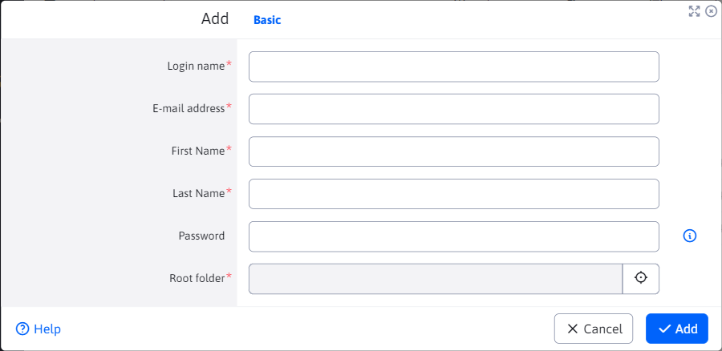

# Bloggers' report

The Bloggers List section is used to create and manage **blogger** users.

Only **Blogger administrators** have access to this section. The blogger administrator must have the Manage bloggers right and should not belong to the **Blog** user group. During the blogger creation process, a new user is created with the necessary rights to create articles.

Additionally, there must be a [user group](../../../admin/users/user-groups.md) named `Blog`. If it doesn't exist, create it before adding the first blogger.

!>**Warning:** Do not add the blogger administrator to the Blog user group.

If you want the blogger administrator to also have the ability to intervene in the structure and articles of individual bloggers ([Article List](./README.md)), he must also have the Blog/Article List right.

## Adding and editing blogger

The blogger is added directly through the editor, it contains the following fields:

- Login name - this name must be unique among all users (not just bloggers).
- E-mail address - blogger's e-mail address.
- Name.
- Last name.
- Password - leave blank for the newly created user, WebJET will generate the password and send it to the email. You can edit the email text by setting the page ID with the email text in the Blog user group.
- Root folder - the parent (or `root`) folder where blogger folders are added, e.g. `/Blog`. A folder `/Blog/LOGIN` will then be created for the newly created user.



The created Blogger can be edited, but it is no longer possible to change the Website Directory and Login values.

If you want to see/set more information about the blogger, you can do so in the [User List](../../../admin/users/README.md) section, where **blogger** is listed like any other user.

For security reasons, a blogger can only be deleted in the Users section as a standard user, and then their articles must also be deleted.

### Basic settings

- In addition to using basic information such as First Name, Last Name, Password..., the blogger is automatically set as an **Approved User**.
- Since this is a **blogger** user, he is added to the **Blog** User Group.
- Gains access to the admin section (website administration).
- Gets rights to Upload files to directories
  - ``/images/blog/LOGIN``
  - ``/files/blog/LOGIN``
  - ``/images/gallery/blog/LOGIN``
- It obtains access rights, such as some rights to websites and directories. Specifically, it needs these rights to work with articles. You can read more about articles in [Article List](./README.md).
- Bonus rights can be added if, before creating a blogger, you edit the constant ``bloggerAppPermissions`` about the right you want to allow them after creation.

### Blogger structure

For each new user of type **blogger** created, a folder structure is automatically created where they can add new articles or further expand this structure.

The folder where this structure will be created was given when creating the blogger by the Root Folder parameter. In this folder, a subfolder will be created with a name corresponding to the value of the given blogger's Login Name. Since each user must have a unique login name (`login`), there cannot be a situation with a collision of folder names. For each such created folder, one more subfolder/section will be created with the name **Uncategorized**.

Example:

If `/Aplikácie/Blog/` was selected as the **Root folder**, then after creating a blogger with the login name `bloggerPerm`, the following structure will be created in the website section:

```
- /Aplikácie/Blog/
  - /Aplikácie/Blog/bloggerPerm
    - /Aplikácie/Blog/bloggerPerm/Nezaradené
```

3 web pages (articles) will be automatically created in these folders. 2 will have the same name as the folders in which they will be created, but they will contain an application for listing articles in a given section, one page is a sample blog article.

The main page of each folder contains an application with a list of articles, which is technically a [news list](../news/README.md). The default parameters can be edited in [Translation keys](../../../admin/settings/translation-keys/README.md) with the key `components.blog.atricles-code`.

### Rights to directories and pages

Since a blogger must be able to see the directories and articles that have been created for them, they automatically gain access to their main folder. This means they will be able to see and edit the existing structure that has been created for them, but they will not be able to access anything else. Their main folder is the one whose name matches their login name.

You can learn more about editing the structure and article here [List of articles](./README.md).

### Enter the Discussion section

Each blogger user is also allowed to enter the [Discussion](../forum/README.md) section to manage discussions under individual articles.

## Template setup

Individual articles are created in the standard tree structure of web pages. We recommend preparing a separate template for the blog. If you want to use a discussion, insert it in a free field/footer in the template so that the discussion is displayed in each article.

Insert the following code into the talk page:

```html
!INCLUDE(/components/forum/forum.jsp, type=open, noPaging=true, sortAscending=true, isBlog=true)!
```

The parameter `isBlog=true` will disable discussion for the main pages of the folder (where the list of articles in the folder is typically located).

In the header page, you can use code to generate a menu offset from the root folder with the `startOffset` parameter:

```html
!INCLUDE(/components/menu/menu_ul_li.jsp, rootGroupId=1, startOffset=1, maxLevel=1, menuIncludePerex=false, classes=basic, generateEmptySpan=false, openAllItems=false, onlySetVariables=false, rootUlId=menu, menuInfoDirName=)!
```

This will generate a menu shifted by the specified number of folders, so only the sections/folders for the currently displayed blog will be displayed in the menu.

In the Blog section, the Template tab is not displayed when editing an article, so the blogger cannot change/set the template by default. The default one for the root folder is used.