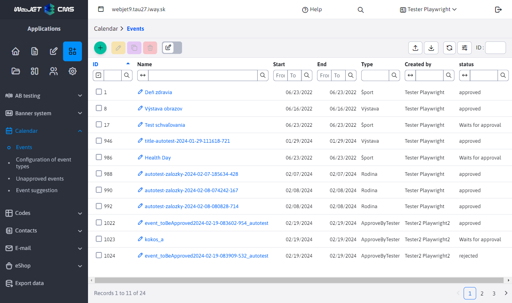
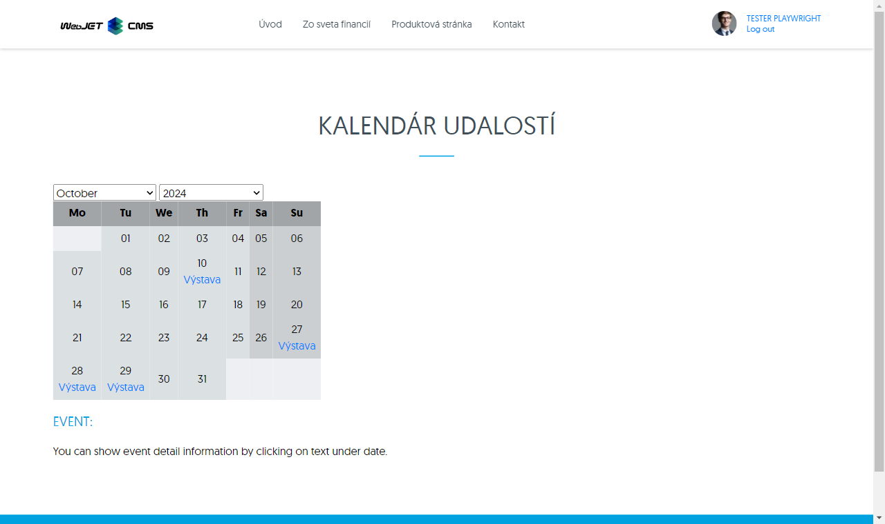
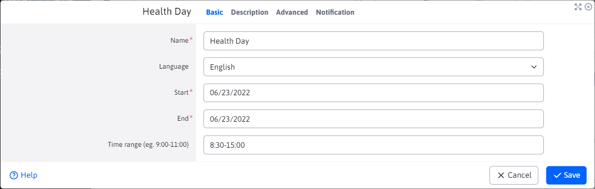
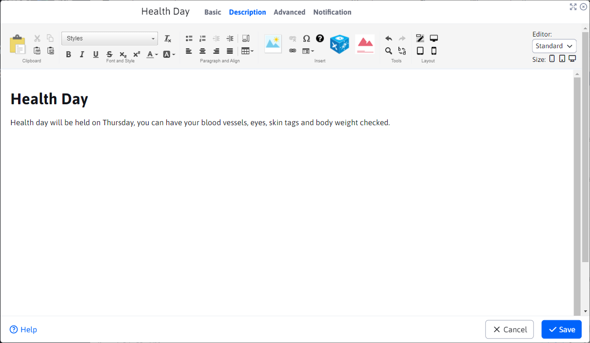
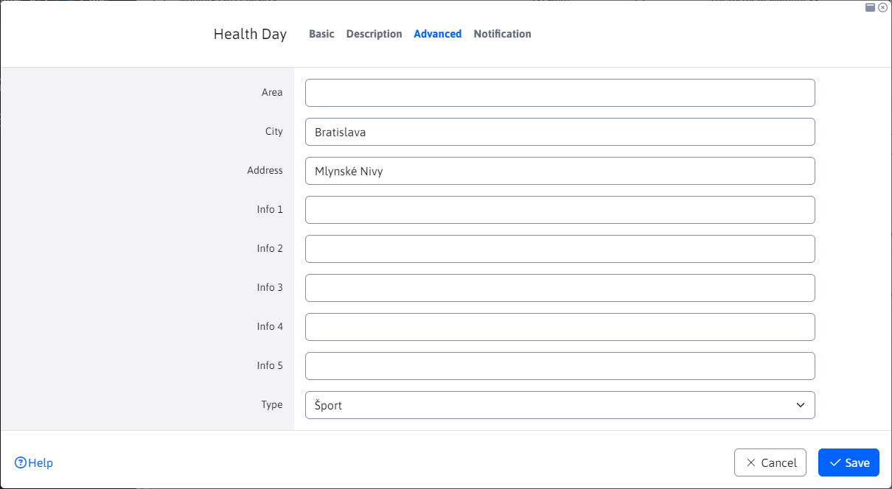
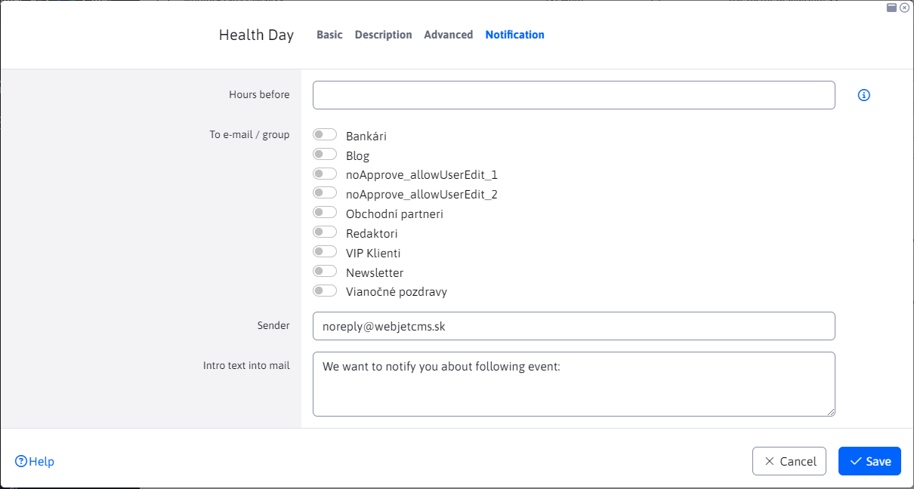

# Calendar of events

## List of events

The event calendar allows you to record and display various events that you want to inform your website visitors about.

The entered events are displayed in the calendar application on the web page:

## Basic

The Basic tab is filled with basic information about the event. Only the name is required. The start and end of the event is automatically pre-filled according to the current day.

## Description

The tab contains an editor in which you can enter a description of the event, attach images and applications to the text.

## Advanced

In the advanced tab you can set more detailed information about the events. It also includes [optional fields](../../../frontend/webpages/customfields/README.md) "Info 1" to "Info 5".

The choice of event type is also important. If the selected event type requires approval, an email will be sent requesting approval before the event is displayed on the web page.

## Notification

The Notifications tab allows you to set up a notification to be sent to a group of users a preset number of hours before the event starts.

