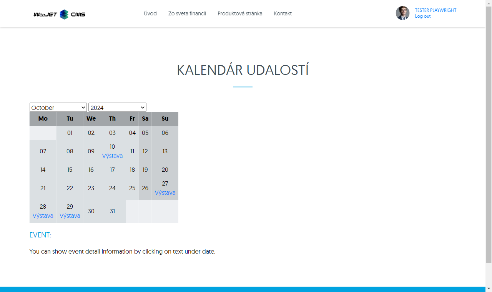
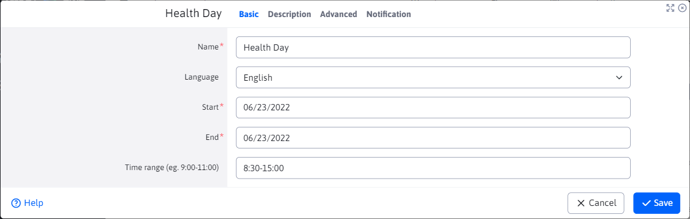
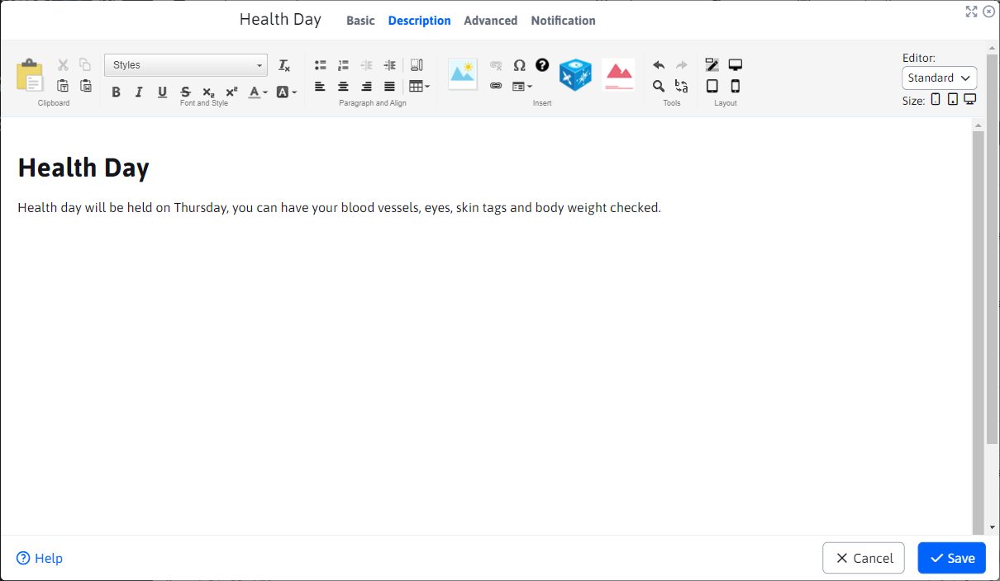
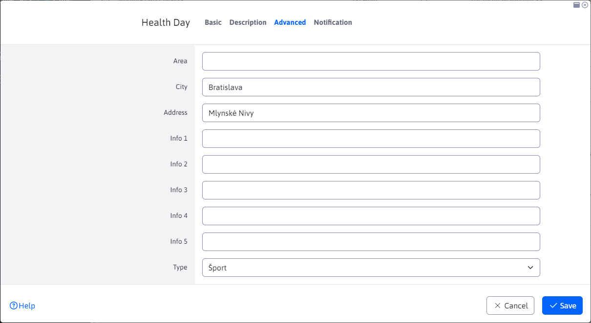
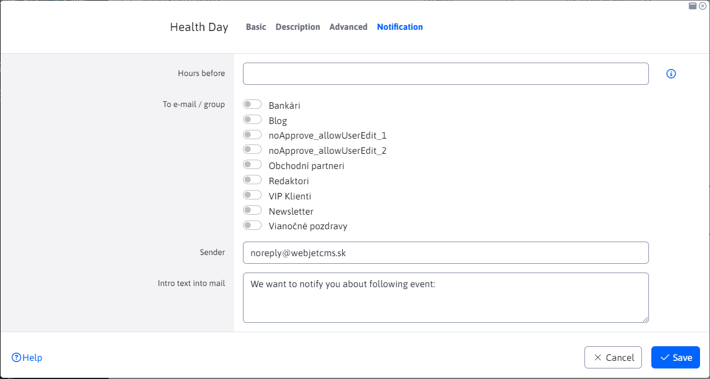

# Event calendar

## List of events

The event calendar allows you to record and display various events that you want to inform website visitors about.

The entered events will appear in the calendar application on the website:

## Basic

In the Basic tab, fill in the basic information about the event. Only the name is required. The start and end of the event are automatically pre-filled based on the current day.

## Description

The card contains an editor where you can enter a description of the event, attach images and applications to the text.

## Advanced

In the advanced tab you can set more detailed information about events. It also contains [optional fields](../../../frontend/webpages/customfields/README.md) "Info 1" to "Info 5".

The event type you select is also important. If the selected event type requires approval, an email will be sent requesting approval before the event is displayed on the website.

## Notification

The notification tab allows you to set a notification to be sent to a group of users a preset number of hours before the event begins.

