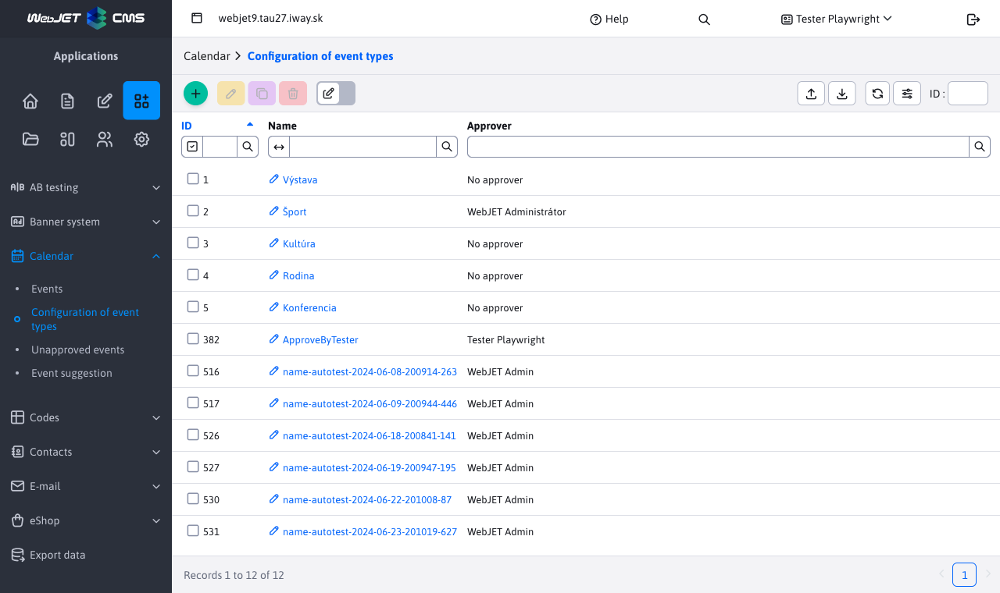
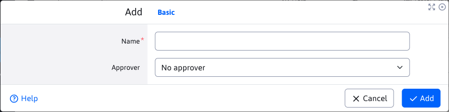

# Configure event types

In the event types configuration, you set the event types into which the event calendar entries can be categorized.

Warning: do not use the character in the event type name `,` or `+`.

In addition to the event type name, you can also set the approver. If it is specified, after creating a new event in the given type, the event does not start appearing immediately on the web page, but waits for its approval by the selected approver.

