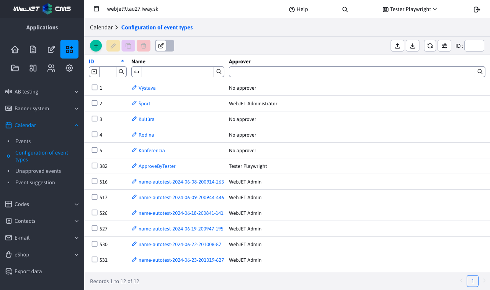
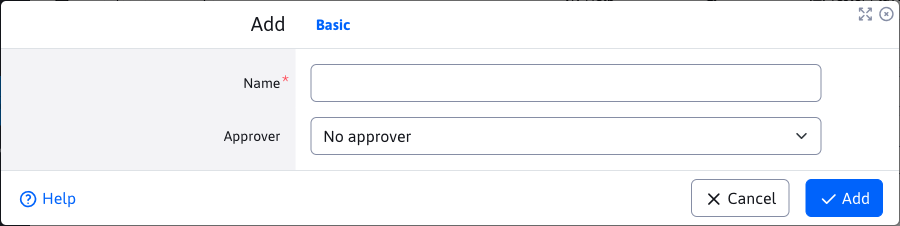

 # Configuring event types

 In the event type configuration, you set the event types into which entries in the event calendar can be categorized.

 

 Warning: do not use the `,` or `+` character in the event type name.

# Approval

 In addition to the event type name, it is possible to [set an approver](../non-approved-events/README.md). If specified, after creating a new event of a given type, the event will not start appearing on the website immediately, but will wait for approval by the selected approver.

 