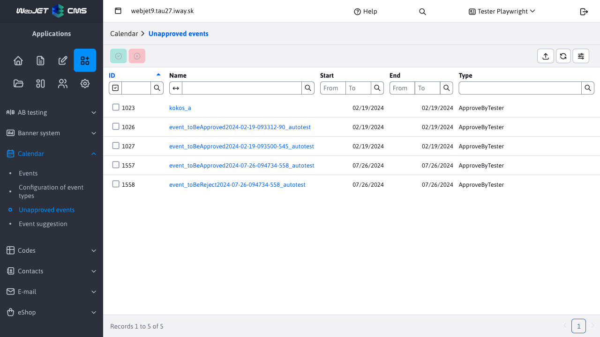
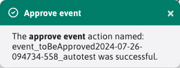
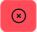
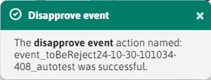

# Unauthorised events

The Calendar Events -> Unapproved Events section is used for the calendar approval/rejection process [events](../README.md)pending approval. The currently logged in user can only see/approve events that are pending approval and at the same time he is the approver. Who is approving the event is determined by [event type](../calendar-types/README.md).

**Warning:** after the event has been approved/disapproved, the event is no longer **will not display** in the Unapproved Events section, so you won't be able to change your selection. However, the event will still be visible in the [List of events](../README.md).
## Event Approval

Event approval is triggered by the button . After successful approval, an informative message will be displayed.

## Disapproval (rejection) of an event

Event rejection is triggered by the button . After a successful rejection, an informative message will be displayed.

